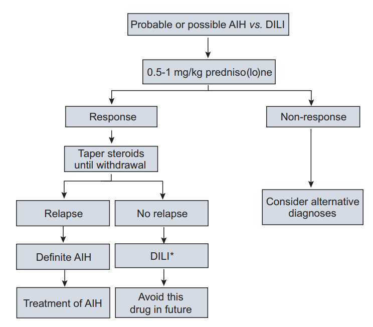
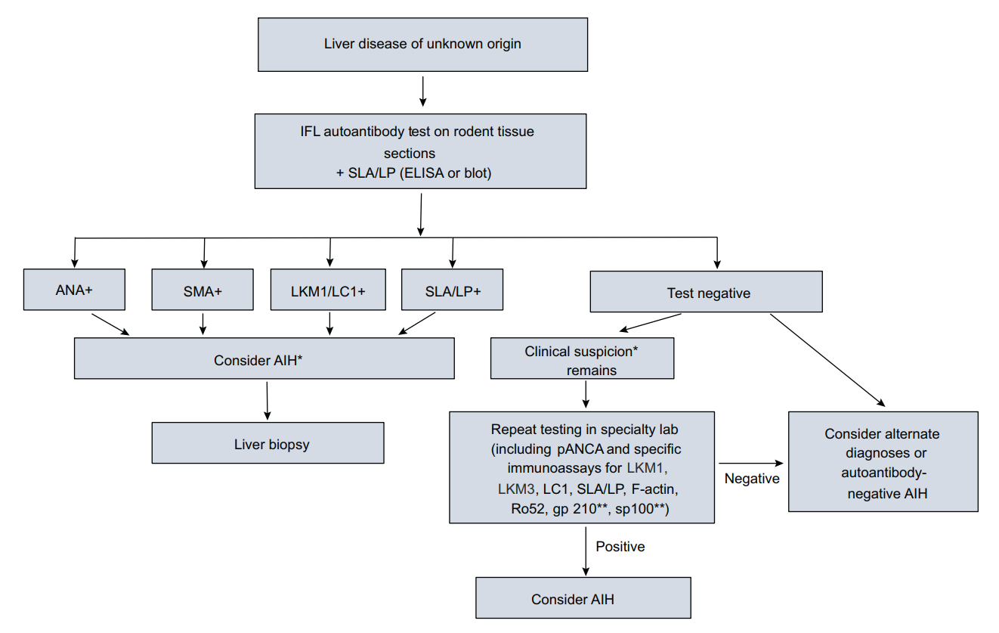
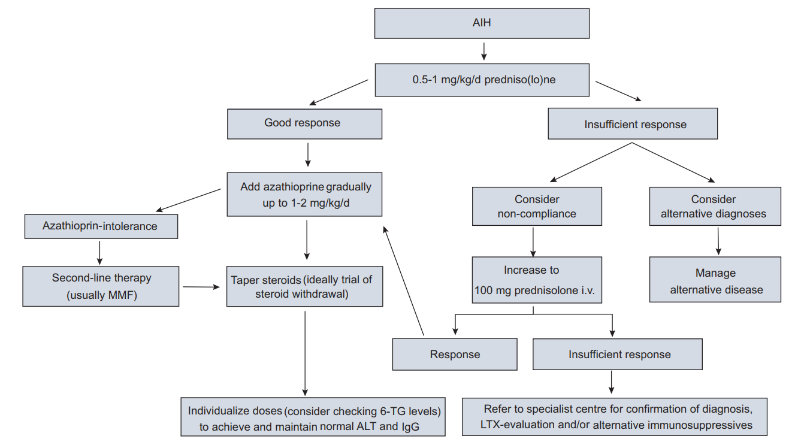
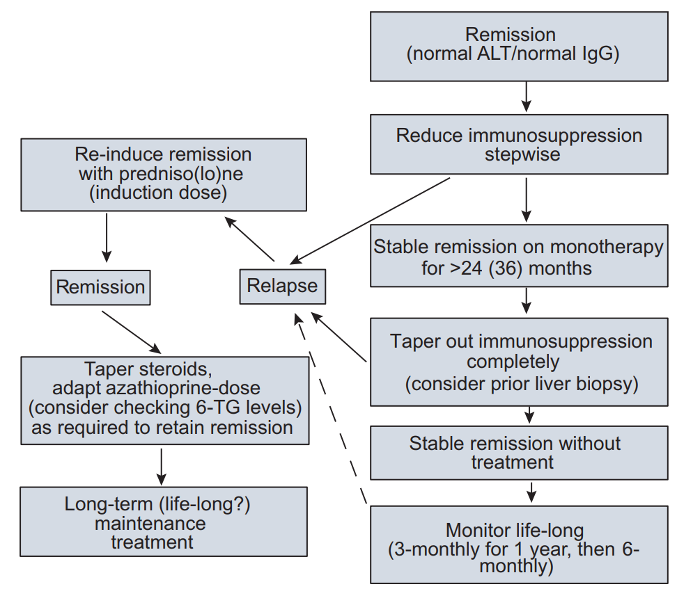

  

    

      
Nữ:Nam ≈ 3:1

      
Tỷ lệ ưu thế nữ giới đặc trưng &amp; Phân bố 2 đỉnh tuổi (Bimodal)

    

    

      
IAIHG ≥ 7 Điểm

      
Chẩn đoán xác định AIH chắc chắn (Definite AIH) theo thang điểm 2008

    

    

      
Bình Thường Hóa ALT &amp; IgG

      
Tiêu chuẩn vàng đạt lui bệnh sinh hóa hoàn toàn (Complete Remission)

    

    

      
Tối Thiểu ≥ 3 Năm

      
Thời gian ức chế miễn dịch bắt buộc (và ≥ 24 tháng sau lui bệnh sinh hóa)

    

  

  

    

      
🔬

      

        
Sinh Thiết Gan Là Bắt Buộc

        
Không thể chẩn đoán AIH nếu không có sinh thiết gan; nhận diện hoại tử giao diện, tương bào thâm nhiễm và phân giai đoạn xơ hóa.

      

    

    

      
⚖️

      

        
Kiểm Soát Tấn Công Hai Pha

        
Phối hợp steroid liều cao tấn công (Prednisolone hoặc Budesonide) kết hợp thiopurine (Azathioprine) sau 2 tuần để hạn chế độc tính.

      

    

    

      
🛡️

      

        
Duy Trì &amp; Cảnh Giác Tái Phát

        
Tái phát xảy ra ở 50–90% trường hợp sau ngưng thuốc; bắt buộc kiểm tra mô học trước khi giảm liều và chuyển duy trì suốt đời khi tái phát.

      

    

  

  

    <a href="#sec-1" class="quickmenu-item active">1. Dịch Tễ &amp; Miễn Dịch</a>
    <a href="#sec-2" class="quickmenu-item">2. Phổ Lâm Sàng &amp; 3 Thể Bệnh</a>
    <a href="#sec-3" class="quickmenu-item">3. Phân Biệt &amp; Biến Thể</a>
    <a href="#sec-4" class="quickmenu-item">4. Tự Kháng Thể &amp; Mô Học</a>
    <a href="#sec-5" class="quickmenu-item">5. Thang Điểm IAIHG</a>
    <a href="#sec-6" class="quickmenu-item">6. Điều Trị Tấn Công</a>
    <a href="#sec-7" class="quickmenu-item">7. Duy Trì &amp; Tái Phát</a>
    <a href="#sec-8" class="quickmenu-item">8. TPMT &amp; Thuốc Hàng Hai</a>
    <a href="#sec-9" class="quickmenu-item">9. Tình Huống Đặc Biệt</a>
    <a href="#sec-10" class="quickmenu-item">10. Khuyến Cáo &amp; Y Văn</a>
  

  <!-- ==================== SECTION 1 ==================== -->
  

    
🧬 <h2 class="sec-title">1. Khái Niệm, Dịch Tễ Học &amp; Yếu Tố Di Truyền Miễn Dịch</h2>

    

      

        💡
        

          <strong>Bản chất bệnh học:</strong> Viêm gan tự miễn (Autoimmune Hepatitis - AIH) là bệnh lý hoại tử và viêm gan mãn tính tiến triển không tự khỏi, ưu thế rõ rệt ở nữ giới (nữ:nam ≈ 3:1). Bệnh đặc trưng bởi tình trạng <strong>tăng gammaglobulin máu (hypergammaglobulinemia) chọn lọc nồng độ IgG</strong> ngay cả khi chưa xuất hiện xơ gan, sự hiện diện của các <strong>tự kháng thể lưu hành</strong> trong huyết thanh, liên quan chặt chẽ với kháng nguyên bạch cầu người <strong>HLA-DR3 hoặc HLA-DR4</strong>, hình ảnh tổn thương <strong>hoại tử giao diện (interface hepatitis)</strong> trên sinh thiết gan và có đáp ứng thuận lợi ngoạn mục với điều trị ức chế miễn dịch. Nếu không được chẩn đoán và điều trị kịp thời, bệnh sẽ tiến triển nhanh chóng thành xơ gan mất bù, suy gan và tử vong.
        

      

      

        

          

          

            
📊

            
Dịch Tễ Học Toàn Cầu Đang Gia Tăng

          

          

            <ul style="margin-left: 1rem; line-height: 1.7;">
              <li><strong>Tỷ lệ lưu hành (Prevalence):</strong> Trước đây từng được xem là bệnh hiếm gặp, tuy nhiên các khảo sát hiện đại tại Châu Âu ghi nhận tỷ lệ lưu hành dao động từ <strong>15 đến 25 ca / 100.000 dân</strong>.</li>
              <li><strong>Nghiên cứu đoàn hệ Đan Mạch (1994–2012):</strong> Tỷ lệ mắc mới (incidence) tăng gần gấp đôi trong vòng 20 năm, đưa tỷ lệ lưu hành điểm năm 2012 lên 24/100.000 dân (đặc biệt lên đến <strong>35/100.000 ở nữ giới</strong>).</li>
              <li><strong>Quần thể có tỷ lệ rất cao:</strong> Người bản địa Alaska (Alaska Natives) có tỷ lệ lưu hành lên tới 42.9/100.000 dân; New Zealand ghi nhận 24.5/100.000 dân.</li>
            </ul>
          

          
Gia tăng nhận diện toàn cầu

        

        

          

          

            
🌍

            
Sự Khác Biệt Chủng Tộc &amp; Địa Lý

          

          

            <ul style="margin-left: 1rem; line-height: 1.7;">
              <li><strong>Bệnh nhân da đen / gốc Phi:</strong> Thường khởi phát ở độ tuổi trẻ hơn, tỷ lệ đã xơ gan tại thời điểm chẩn đoán cao hơn đáng kể, nguy cơ thất bại điều trị và tử vong cao hơn người da trắng.</li>
              <li><strong>Bệnh nhân gốc Tây Ban Nha / Mỹ Latinh (Hispanic/Mestizo):</strong> Xuất hiện triệu chứng lâm sàng rầm rộ, tỷ lệ xơ gan cao và thường kèm theo tính chất ứ mật (cholestatic features).</li>
              <li><strong>Bệnh nhân Châu Á:</strong> Có xu hướng tiến triển thầm lặng nhưng tiên lượng xấu và suy gan nhanh nếu bị bỏ sót chẩn đoán hoặc can thiệp ức chế miễn dịch muộn.</li>
            </ul>
          

          
Tính nhạy cảm di truyền đa dạng

        

      

    

  

  <!-- ==================== SECTION 2 ==================== -->
  

    
🩺 <h2 class="sec-title">2. Phổ Biểu Hiện Lâm Sàng &amp; Phân Loại 3 Thể Bệnh AIH</h2>

    

      

        ⚠️
        

          <strong>Phân bố tuổi tác kiểu hai đỉnh (Bimodal Distribution):</strong> AIH xuất hiện ở mọi nhóm tuổi từ trẻ sơ sinh đến người già trên 80 tuổi, nhưng tập trung ở hai đỉnh tuổi rõ rệt: đỉnh thứ nhất ở lứa tuổi <strong>thanh thiếu niên / dậy thì (10–20 tuổi)</strong> và đỉnh thứ hai ở lứa tuổi <strong>trung niên (thập kỷ thứ 4 đến thứ 6, tức 40–60 tuổi)</strong>.
        

      

      

        

          
Khởi Phát Âm Thầm (Insidious Onset)

          
Chiếm khoảng 65–70% trường hợp

          
Bệnh nhân hoàn toàn không có triệu chứng hoặc chỉ than phiền các dấu hiệu toàn thân mơ hồ: mệt mỏi mạn tính không giải thích được, chán ăn, sút cân nhẹ, đau tức âm ỉ hạ sườn phải, đau các khớp nhỏ ngoại vi (không biến dạng khớp), sẩn ngứa thoáng qua hoặc vàng da vàng mắt dao động từng đợt kéo dài nhiều tháng, nhiều năm.

        

        

          
Khởi Phát Cấp Tính (Acute Onset)

          
Chiếm khoảng 25–30% trường hợp

          
Biểu hiện rầm rộ tương tự như viêm gan vi-rút cấp hoặc tổn thương gan do thuốc (DILI) với sốt nhẹ, vàng da đậm, mệt lả và men gan tăng vọt. Gồm 2 phân nhóm: (1) Đợt bùng phát cấp tính của một AIH mãn tính âm thầm từ trước; hoặc (2) AIH cấp thực sự (genuine acute AIH) với mô học chưa xơ hóa. Lưu ý: Tự kháng thể và IgG có thể hoàn toàn bình thường trong giai đoạn cấp.

        

        

          
Xơ Gan Ngay Khi Chẩn Đoán

          
Chiếm 30% người lớn &amp; 50% trẻ em

          
Do tiến trình viêm giao diện diễn ra thầm lặng trong nhiều năm trước khi phát hiện, khoảng 1/3 người trưởng thành và 1/2 trẻ em đã có bằng chứng xơ gan trên sinh thiết mô học ngay tại thời điểm khám đầu tiên, thậm chí nhập viện trong bệnh cảnh biến chứng tăng áp lực tĩnh mạch cửa (cổ trướng, xuất huyết tiêu hóa do giãn vỡ tĩnh mạch).

        

      

      <!-- TABLE 2: Phổ lâm sàng AIH -->
      

        

          

            <i class="fa-solid fa-table-list"></i> Table 2. Phổ biểu hiện lâm sàng &amp; Đặc trưng của Viêm gan tự miễn (EASL 2015 / Clinical Spectrum of AIH)
          

          Dân số học &amp; Phổ bệnh
        

        

          <table class="comparison-table">
            <thead>
              <tr>
                <th style="width: 25%;">Đặc Điểm Phổ Bệnh</th>
                <th style="width: 40%;">Mô Tả Chi Tiết Theo Tiêu Chuẩn EASL</th>
                <th style="width: 35%;">Ý Nghĩa Lâm Sàng &amp; Tiên Lượng</th>
              </tr>
            </thead>
            <tbody>
              <tr>
                <td class="source-cell"><strong>Dân số học (Demographics)</strong></td>
                <td>Mọi lứa tuổi (trẻ nhũ nhi đến &gt; 80 tuổi). Tỷ lệ Nữ:Nam ≈ 3:1. Đỉnh tuổi bimodal (10–20 tuổi và 40–60 tuổi). Mọi chủng tộc trên toàn thế giới.</td>
                <td>Luôn cảnh giác AIH ở mọi phụ nữ có tăng men gan kéo dài không rõ căn nguyên.</td>
              </tr>
              <tr>
                <td class="source-cell"><strong>Hình thái khởi phát (Modes of Onset)</strong></td>
                <td>
                  • Không triệu chứng (Asymptomatic): Khám sức khỏe tình cờ. 
                  • Âm thầm (Insidious): Mệt mỏi, đau khớp nhỏ, vàng da dao động. 
                  • Cấp tính (Acute-severe): Vàng da cấp, suy gan tối cấp (fulminant). 
                  • Xơ gan tiềm tàng: Xuất hiện biến chứng tăng áp lực tĩnh mạch cửa.
                </td>
                <td>Hình thái cấp tính dễ nhầm lẫn với viêm gan vi-rút hoặc DILI; cần xét nghiệm tự kháng thể và sinh thiết gan sớm.</td>
              </tr>
              <tr>
                <td class="source-cell"><strong>Bệnh lý đi kèm (Associated Conditions)</strong></td>
                <td>Hội chứng mệt mỏi mãn tính, đau cơ khớp, viêm tuyến giáp tự miễn (Hashimoto/Graves), bệnh Celiac, đái tháo đường tuýp 1, bạch biến, viêm loét đại tràng (UC).</td>
                <td>Tầm soát toàn diện chức năng tuyến giáp và kháng thể Celiac cho 100% bệnh nhân AIH.</td>
              </tr>
              <tr>
                <td class="source-cell"><strong>Biến chứng dài hạn (Long-term Outcomes)</strong></td>
                <td>Tiến triển xơ gan mất bù, tăng áp cửa, suy mòn tế bào gan, nguy cơ phát triển ung thư biểu mô tế bào gan (HCC) ở bệnh nhân đã xơ gan (tỷ lệ 1–3%/năm).</td>
                <td>Bệnh nhân AIH đã có xơ gan bắt buộc phải siêu âm gan và AFP định kỳ mỗi 6 tháng để tầm soát HCC.</td>
              </tr>
            </tbody>
          </table>
        

      

      <!-- Phân loại 3 thể bệnh AIH -->
      <h3 style="font-size: 1.15rem; font-weight: 700; margin: 1.5rem 0 0.75rem 0; color: var(--color-primary, #0284c7);">
        <i class="fa-solid fa-layer-group"></i> Phân Loại 3 Thể Bệnh Viêm Gan Tự Miễn (AIH Subtypes)
      </h3>

      

        

          

          

            
1️⃣

            
AIH Thể 1 (AIH-1) — Cổ Điển (~90%)

          

          

            <ul style="margin-left: 1rem; line-height: 1.7;">
              <li><strong>Dấu ấn tự kháng thể:</strong> Dương tính với <strong>ANA</strong> (Kháng thể kháng nhân) và/hoặc <strong>SMA</strong> (Kháng thể kháng cơ trơn - đặc hiệu khi kháng F-actin). Có thể kèm pANCA không điển hình (p-ANNA).</li>
              <li><strong>Liên kết HLA:</strong> HLA-DR3 (thể nặng, khởi phát trẻ), HLA-DR4 (khởi phát người lớn, đáp ứng điều trị rất tốt), HLA-DR13.</li>
              <li><strong>Đặc điểm:</strong> Gặp ở mọi lứa tuổi (chủ yếu người lớn). Chiếm đa số tuyệt đối ca bệnh. Đáp ứng rất tốt với corticoid nhưng tỷ lệ tái phát biến thiên sau khi ngưng thuốc.</li>
            </ul>
          

          
Thể phổ biến nhất trên lâm sàng

        

        

          

          

            
2️⃣

            
AIH Thể 2 (AIH-2) — Nhi Khoa (~10%)

          

          

            <ul style="margin-left: 1rem; line-height: 1.7;">
              <li><strong>Dấu ấn tự kháng thể:</strong> Dương tính với <strong>anti-LKM1</strong> (Kháng thể kháng microsome gan-thận tuýp 1, đích là CYP2D6) và/hoặc <strong>anti-LC1</strong> (Kháng cytosol gan tuýp 1, đích là FTCD), hiếm hơn là anti-LKM3.</li>
              <li><strong>Liên kết HLA:</strong> HLA-DR3, HLA-DR7.</li>
              <li><strong>Đặc điểm:</strong> Thường khởi phát ở trẻ em, nhũ nhi và thanh thiếu niên. Diễn tiến cực kỳ bùng phát, dễ suy gan cấp, tỷ lệ thất bại điều trị và tái phát rất cao. Hầu như <strong>bắt buộc điều trị duy trì suốt đời</strong>.</li>
            </ul>
          

          
Tiến triển nặng &amp; Khó dừng thuốc

        

        

          

          

            
3️⃣

            
AIH Thể 3 (AIH-3) — Đặc Hiệu Cao

          

          

            <ul style="margin-left: 1rem; line-height: 1.7;">
              <li><strong>Dấu ấn tự kháng thể:</strong> Dương tính chọn lọc với <strong>anti-SLA/LP</strong> (Kháng thể kháng kháng nguyên hòa tan gan/tụy, đích phân tử SepSecS). Thường đi kèm tự kháng thể anti-Ro52.</li>
              <li><strong>Đặc điểm lâm sàng:</strong> Biểu hiện kiểu hình lâm sàng và mô học tương tự AIH-1 nhưng có khuynh hướng diễn tiến nghiêm trọng hơn, tỷ lệ tái phát sau ngưng thuốc cao hơn đáng kể.</li>
              <li><strong>Độ đặc hiệu:</strong> Anti-SLA/LP đạt độ đặc hiệu tới ~100% cho AIH, đặc biệt hữu ích trong các ca ANA/SMA âm tính.</li>
            </ul>
          

          
Dấu ấn chẩn đoán xác quyết

        

      

    

  

  <!-- ==================== SECTION 3 ==================== -->
  

    
🔄 <h2 class="sec-title">3. Chẩn Đoán Phân Biệt &amp; Các Thể Biến Thể Chồng Lấp (Overlap)</h2>

    

      <!-- TABLE 3: Differential diagnosis -->
      

        

          

            <i class="fa-solid fa-code-compare"></i> Table 3. Bảng Chẩn Đoán Phân Biệt Toàn Diện Của Viêm Gan Tự Miễn (EASL 2015)
          

          Chẩn đoán phân biệt
        

        

          <table class="comparison-table">
            <thead>
              <tr>
                <th style="width: 25%;">Nhóm Bệnh Lý</th>
                <th style="width: 40%;">Các Bệnh Cần Phân Biệt Cụ Thể</th>
                <th style="width: 35%;">Đặc Điểm Phân Định Cốt Lõi</th>
              </tr>
            </thead>
            <tbody>
              <tr>
                <td class="source-cell"><strong>Bệnh Gan Tự Miễn Khác</strong></td>
                <td>
                  • Viêm xơ đường mật nguyên phát (PBC) 
                  • Viêm đường mật xơ hóa nguyên phát (PSC) 
                  • Bệnh đường mật liên quan IgG4 (IgG4-SC)
                </td>
                <td>Tăng ALP/GGT ưu thế; AMA (+) trong PBC; Hình ảnh chuỗi hạt trên MRCP trong PSC; Nồng độ IgG4 huyết thanh &gt; 2x ULN và thâm nhiễm IgG4+ trên mô học trong IgG4-SC.</td>
              </tr>
              <tr>
                <td class="source-cell"><strong>Viêm Gan Vi-rút Mãn Tính</strong></td>
                <td>
                  • Viêm gan B mạn tính (± Viêm gan Delta - HDV) 
                  • Viêm gan C mạn tính (HCV) 
                  • Bệnh lý đường mật liên quan nhiễm HIV
                </td>
                <td>HBsAg, Anti-HCV, HCV RNA, Anti-HDV, HIV huyết thanh học. Chú ý: Nhiễm HCV có thể kích hoạt tự kháng thể ANA/SMA hoặc anti-LKM1 giả tự miễn.</td>
              </tr>
              <tr>
                <td class="source-cell"><strong>Bệnh Chuyển Hóa &amp; Độc Chất</strong></td>
                <td>
                  • Tổn thương gan do rượu (Alcohol-related liver disease) 
                  • Bệnh gan nhiễm mỡ liên quan chuyển hóa (MASLD / NASH) 
                  • Bệnh ứ sắt mô (Hereditary Hemochromatosis) 
                  • Bệnh Wilson (Thoái hóa bộc nhân) 
                  • Thiếu hụt Alpha-1 antitrypsin (AATD)
                </td>
                <td>Tăng IgA máu và AST/ALT &gt; 2 trong rượu; Độ bão hòa Transferrin &gt; 45% và Ferritin tăng cao; Ceruloplasmin &lt; 20 mg/dL, đồng niệu 24h &gt; 40 µg, vòng K-F trong Wilson; Định lượng nồng độ Alpha-1 antitrypsin huyết thanh.</td>
              </tr>
              <tr>
                <td class="source-cell"><strong>Bệnh Toàn Thân &amp; Khác</strong></td>
                <td>
                  • Lupus ban đỏ hệ thống (Lupus Hepatitis trong SLE) 
                  • Bệnh Celiac (Tổn thương gan do Celiac) 
                  • Viêm gan u hạt (Granulomatous hepatitis do Lao/Sarcoidosis)
                </td>
                <td>Kháng thể Anti-dsDNA (+), giảm bổ thể C3/C4 trong SLE; Kháng thể anti-tTG IgA (+) và teo nhung mao ruột non trong Celiac; U hạt biểu mô không bã đậu trên sinh thiết gan.</td>
              </tr>
            </tbody>
          </table>
        

      

      <!-- Các thể biến thể và tình huống lâm sàng đặc biệt -->
      <h3 style="font-size: 1.15rem; font-weight: 700; margin: 1.5rem 0 0.75rem 0; color: var(--color-primary, #0284c7);">
        <i class="fa-solid fa-shuffle"></i> Các Thể Biến Thể (Variant Forms) &amp; Hội Chứng Chồng Lấp
      </h3>

      

        

          

          

            
🧬

            
Hội Chứng Chồng Lấp AIH-PBC (Tiêu Chuẩn Paris)

          

          

            
Gặp ở 8–10% bệnh nhân AIH hoặc PBC. Chẩn đoán xác định khi thỏa mãn <strong>ít nhất 2 trong 3 tiêu chuẩn của mỗi bệnh</strong> (Tiêu chuẩn Paris đạt độ nhạy 92%, độ đặc hiệu 97%):

            <ul style="margin-left: 1rem; line-height: 1.7; margin-top: 0.5rem;">
              <li><strong>Tiêu chuẩn PBC:</strong> (1) ALP ≥ 2x ULN hoặc GGT ≥ 5x ULN; (2) Dương tính với AMA (kháng thể kháng ty thể); (3) Sinh thiết gan thấy tổn thương ống mật phá hủy dạng hoa (florid bile duct lesion).</li>
              <li><strong>Tiêu chuẩn AIH:</strong> (1) ALT ≥ 5x ULN; (2) Serum IgG ≥ 2x ULN hoặc dương tính với SMA; (3) Sinh thiết gan thấy viêm hoại tử giao diện từ trung bình đến nặng.</li>
              <li><strong>Điều trị bắt buộc:</strong> Phối hợp <strong>Axit Ursodeoxycholic (UDCA 13–15 mg/kg/ngày)</strong> cùng phác đồ <strong>Ức chế miễn dịch (Prednisolone + Azathioprine)</strong>.</li>
            </ul>
          

          
Paris Criteria: Nhạy 92%, Đặc hiệu 97%

        

        

          

          

            
🧒

            
Biến Thể AIH-PSC &amp; AISC Ở Trẻ Em

          

          

            <ul style="margin-left: 1rem; line-height: 1.7;">
              <li><strong>Tần suất ở người lớn:</strong> Gặp ở 7–14% ca, thường kèm theo viêm loét đại tràng (IBD).</li>
              <li><strong>Đặc quyền nghiêm trọng ở trẻ em:</strong> Dạng này được định danh là <strong>Viêm đường mật xơ hóa tự miễn (Autoimmune Sclerosing Cholangitis - AISC)</strong>, xuất hiện ở <strong>tới 50% trẻ em</strong> được chẩn đoán AIH ban đầu.</li>
              <li><strong>Khuyến cáo EASL bắt buộc:</strong> Phải tiến hành <strong>chụp cộng hưởng từ đường mật (MRCP)</strong> cho <strong>100% trẻ em</strong> có biểu hiện lâm sàng của AIH để tầm soát tổn thương xơ hóa đường mật phối hợp.</li>
              <li><strong>Xử trí:</strong> Phối hợp UDCA cùng ức chế miễn dịch; tiên lượng phụ thuộc mức độ tổn thương đường mật.</li>
            </ul>
          

          
MRCP bắt buộc cho 100% trẻ em

        

        

          

          

            
💊

            
AIH Do Thuốc (DILI-induced AIH)

          

          

            <ul style="margin-left: 1rem; line-height: 1.7;">
              <li>Chiếm khoảng <strong>9–12%</strong> các trường hợp biểu hiện lâm sàng và mô học giống hệt AIH vô căn cổ điển.</li>
              <li><strong>Thuốc thủ phạm hàng đầu:</strong> Kháng sinh Nitrofurantoin, Minocycline, thuốc hạ áp Dihydralazine, Tienilic acid, thuốc ức chế sinh học TNF-α (Infliximab, Adalimumab), Interferon-α.</li>
              <li><strong>Điểm phân biệt cốt lõi:</strong> DILI-induced AIH hiếm khi có xơ gan tại thời điểm khởi phát, đáp ứng ngoạn mục với corticosteroid và điểm mấu chốt là <strong>CÓ THỂ NGƯNG THUỐC HOÀN TOÀN MÀ KHÔNG BỊ TÁI PHÁT</strong> (trong khi AIH thực sự sẽ tái phát gần như chắc chắn).</li>
            </ul>
          

          
Ngưng steroid thành công = Bằng chứng DILI

        

      

      <!-- TABLE 4: Specific characteristics -->
      

        

          

            <i class="fa-solid fa-list-check"></i> Table 4. Đặc Điểm Bệnh Học Trong Các Tình Huống Lâm Sàng Đặc Biệt (EASL 2015)
          

          Tình huống đặc biệt
        

        

          <table class="comparison-table">
            <thead>
              <tr>
                <th style="width: 25%;">Tình Huống Đặc Biệt</th>
                <th style="width: 45%;">Đặc Trưng Sinh Bệnh Học &amp; Biểu Hiện</th>
                <th style="width: 30%;">Xử Trí Khuyến Cáo Của EASL</th>
              </tr>
            </thead>
            <tbody>
              <tr>
                <td class="source-cell"><strong>Hội chứng chồng lấp (Overlap)</strong></td>
                <td>Biểu hiện hỗn hợp tổn thương tế bào gan và ứ mật (AIH-PBC hoặc AIH-PSC/AISC).</td>
                <td>Áp dụng tiêu chuẩn Paris; phối hợp UDCA (13–15 mg/kg) + Prednisolone + Azathioprine.</td>
              </tr>
              <tr>
                <td class="source-cell"><strong>Thai kỳ &amp; Thời kỳ hậu sản</strong></td>
                <td>AIH thường thuyên giảm tự nhiên trong thai kỳ do miễn dịch dung thứ nhưng bùng phát dữ dội sau sinh (post-partum flare) do tái lập miễn dịch.</td>
                <td>Duy trì liên tục Azathioprine ± Prednisolone trong thai kỳ; chống chỉ định MMF; theo dõi sát sau sinh.</td>
              </tr>
              <tr>
                <td class="source-cell"><strong>AIH Khởi phát sau nhiễm vi-rút</strong></td>
                <td>Khởi phát đợt cấp AIH sau nhiễm Vi-rút Viêm gan A (HAV), Epstein-Barr virus (EBV), Herpesvirus 6 (HHV-6) do hiện tượng bắt chước phân tử (molecular mimicry).</td>
                <td>Đo nồng độ IgG và tự kháng thể nếu men gan không hồi phục sau viêm gan vi-rút cấp thông thường.</td>
              </tr>
              <tr>
                <td class="source-cell"><strong>De novo AIH sau ghép gan</strong></td>
                <td>Phát triển ở 2–7% bệnh nhân ghép gan vì các chỉ định không tự miễn ban đầu, do hiện tượng miễn dịch dị ghép tạo tự kháng thể mới.</td>
                <td>Điều trị đáp ứng tốt với tăng liều Corticosteroids và bổ sung Azathioprine hoặc MMF.</td>
              </tr>
              <tr>
                <td class="source-cell"><strong>Hội chứng APECED / APS-1</strong></td>
                <td>Bệnh tự miễn đa tuyến nội tiết do đột biến gen AIRE; AIH xuất hiện ở 10–20% ca (thường dương tính kháng thể kháng CYP1A2).</td>
                <td>Điều trị ức chế miễn dịch tích cực kết hợp quản lý suy thượng thận, suy cận giáp và nấm candida mạn tính.</td>
              </tr>
            </tbody>
          </table>
        

      

    

  

  <!-- ==================== SECTION 4 ==================== -->
  

    
🔬 <h2 class="sec-title">4. Cận Lâm Sàng: Tự Kháng Thể, Định Lượng IgG &amp; Mô Bệnh Học Bắt Buộc</h2>

    

      

        

          

          

            
🧪

            
Xét Nghiệm Sinh Hóa &amp; Serum IgG Chọn Lọc

          

          

            <ul style="margin-left: 1rem; line-height: 1.7;">
              <li><strong>Mô hình men gan:</strong> Tăng transaminase ưu thế (ALT và AST có thể dao động từ tăng nhẹ 2–3x đến tăng vọt &gt; 50x ULN trong thể cấp tính). ALP bình thường hoặc chỉ tăng nhẹ; GGT có thể tăng độc lập.</li>
              <li><strong>Tăng IgG huyết thanh chọn lọc:</strong> Xuất hiện ở <strong>~85% bệnh nhân AIH</strong> ngay cả khi cấu trúc gan chưa chuyển sang xơ gan.</li>
              <li><strong>Giá trị phân định:</strong> Tăng chọn lọc phân đoạn IgG (trong khi nồng độ IgA và IgM vẫn trong giới hạn bình thường) là dấu ấn then chốt định hướng AIH (tăng IgA thường gặp trong viêm gan do rượu; tăng IgM đặc trưng cho PBC).</li>
              <li><strong>Mục tiêu theo dõi:</strong> Nồng độ IgG huyết thanh cùng với ALT trở về mức bình thường là chỉ số quyết định để xác lập <strong>Lui bệnh sinh hóa hoàn toàn</strong>.</li>
            </ul>
          

          
IgG tăng chọn lọc ở ~85% ca bệnh

        

        

          

          

            
🎯

            
Kỹ Thuật Xét Nghiệm Tự Kháng Thể Chuẩn Mực

          

          

            <ul style="margin-left: 1rem; line-height: 1.7;">
              <li><strong>Phương pháp vàng thường quy:</strong> Kỹ thuật <strong>Miễn dịch huỳnh quang gián tiếp (IFL)</strong> trên lát cắt mô tươi gặm nhấm (gan, thận, dạ dày chuột) là phương pháp chuẩn để phát hiện ANA, SMA, anti-LKM1, anti-LC1.</li>
              <li><strong>Ngưỡng hiệu giá dương tính (Titer):</strong>
                 • <strong>Người lớn:</strong> Hiệu giá pha loãng <strong>≥ 1:40</strong>.
                 • <strong>Trẻ em:</strong> Ngưỡng nhạy cảm hơn: <strong>≥ 1:20</strong> đối với ANA, SMA; và <strong>≥ 1:10</strong> đối với anti-LKM1.
              </li>
              <li><strong>Kháng thể đặc hiệu cao:</strong> Xét nghiệm <strong>Anti-SLA/LP</strong> bằng kỹ thuật ELISA hoặc Western Blot / Line Immunoblot. Kháng thể này có độ đặc hiệu đạt xấp xỉ 100% cho AIH.</li>
            </ul>
          

          
IFL mô chuột là kỹ thuật nền tảng

        

      

      <!-- Sinh thiết gan bắt buộc -->
      

        🛑
        

          <strong>Sinh thiết mô học gan là điều kiện bắt buộc (Mandatory Liver Biopsy):</strong>
          Không thể thiết lập chẩn đoán AIH xác định nếu không có kết quả mô bệnh học gan. Sinh thiết giúp: (1) Xác nhận các tổn thương miễn dịch đặc trưng; (2) Loại trừ các bệnh lý mô học khác (u hạt, tích tụ mỡ, ứ đồng, viêm ống mật); (3) Đánh giá mức độ hoạt động viêm giao diện (độ hoạt động mô học HAI); và (4) Đánh giá chính xác giai đoạn xơ hóa (Fibrosis staging).
        

      

      

        

          

          

            
🔬

            
4 Dấu Hiệu Mô Học Kinh Điển Của AIH

          

          

            <ol style="margin-left: 1.25rem; line-height: 1.8;">
              <li><strong>Viêm hoại tử giao diện (Interface Hepatitis / Piecemeal Necrosis):</strong> Thâm nhiễm tế bào viêm xuyên qua tấm giới hạn (limiting plate) đi vào nhu mô gan, gây tổn thương thoái hóa và hoại tử các tế bào gan quanh khoảng cửa.</li>
              <li><strong>Thâm nhiễm phong phú tương bào (Plasma Cell Infiltration):</strong> Khoảng cửa và vùng hoại tử giao diện dày đặc tế bào tương bào (plasma cells) xen lẫn lympho bào.</li>
              <li><strong>Hiện tượng Emperipolesis:</strong> Hiện tượng các tế bào lympho sống chui vào bên trong bào tương của tế bào gan nguyên vẹn (phát hiện rõ trên kính hiển vi điện tử hoặc nhuộm hóa mô miễn dịch).</li>
              <li><strong>Tạo quầng tế bào gan (Hepatic Rosettes):</strong> Tế bào gan thoái hóa tái sinh sắp xếp theo cấu trúc hình nan hoa hoặc quầng tròn quanh một lòng nhỏ rỗng.</li>
            </ol>
          

          
4 trụ cột mô học kinh điển

        

        

          

          

            
⚠️

            
Hình Thái Mô Học Trong Thể Cấp Tính

          

          

            <ul style="margin-left: 1rem; line-height: 1.7;">
              <li>Trong thể AIH cấp tính thực sự (Genuine Acute AIH) hoặc suy gan cấp (ALF), tổn thương hoại tử giao diện kinh điển có thể chưa hình thành rõ nét.</li>
              <li>Thay vào đó, tổn thương mô học chủ đạo là <strong>Hoại tử trung tâm tiểu thùy quanh tĩnh mạch trung tâm (Centrilobular / Zone 3 necrosis)</strong>.</li>
              <li>Có thể kèm theo hoại tử bắc cầu (bridging necrosis) hoặc hoại tử lan tỏa diện rộng (panlobular / submassive necrosis).</li>
              <li><strong>Lưu ý:</strong> Bệnh nhân có hình ảnh hoại tử trung tâm tiểu thùy không rõ nguyên nhân cần được tầm soát tự kháng thể chuyên sâu ngay để phát hiện AIH cấp.</li>
            </ul>
          

          
Hoại tử Zone 3 trong thể cấp tính

        

      

      <!-- FIGURE 1 & FIGURE 2 -->
      <h3 style="font-size: 1.15rem; font-weight: 700; margin: 2rem 0 0.75rem 0; color: var(--color-primary, #0284c7);">
        <i class="fa-solid fa-diagram-project"></i> Sơ Đồ Thuật Toán Chẩn Đoán &amp; Tiếp Cận Nghi Ngờ AIH / DILI
      </h3>

      <!-- Fig 1 Card -->
      

        
        

          
Figure 1. Thuật toán chẩn đoán phân biệt AIH và tổn thương gan do thuốc (DILI) dựa trên thử nghiệm đáp ứng điều trị (Response-Guided Approach)

          Sơ đồ hướng dẫn quy trình lâm sàng phân biệt giữa Viêm gan tự miễn thực sự và DILI có kiểu hình giả tự miễn: Thử nghiệm điều trị ban đầu bằng Prednisolone (0.5–1.0 mg/kg/ngày). Sau khi đạt lui bệnh sinh hóa, tiến hành giảm liều dần tới khi ngừng hẳn thuốc. Nếu bệnh nhân <strong>không bị tái phát (No relapse)</strong> → Xác lập chẩn đoán <strong>DILI</strong>. Nếu men gan và IgG <strong>bùng phát tái phát (Relapse)</strong> → Khẳng định chẩn đoán <strong>Viêm gan tự miễn xác định (Definite AIH)</strong> và chuyển sang điều trị duy trì lâu dài.
        

      

      <!-- Visual Flowchart for Fig 1 -->
      

        

          
Bước 1: Tiếp Nhận Nghi Ngờ

          
Bệnh nhân tổn thương gan cấp/bán cấp có tự kháng thể (+) và IgG tăng cao, có tiền sử dùng thuốc (Nitrofurantoin, Minocycline, Dihydralazine, Anti-TNF...).

        

        

          
Bước 2: Thử Nghiệm Steroid

          
Điều trị tấn công bằng Prednisolone 0.5–1.0 mg/kg/ngày → Men gan và IgG giảm ngoạn mục đạt lui bệnh hoàn toàn → Bắt đầu giảm liều có kiểm soát.

        

        

          
Nhánh A: Không Tái Phát

          
Sau khi ngừng steroid hoàn toàn, men gan và IgG tiếp tục bình thường lâu dài → <strong>Chẩn đoán DILI</strong> (Không cần duy trì thuốc ức chế miễn dịch).

        

        

          
Nhánh B: Tái Phát Bùng Phát

          
Men gan và IgG tăng vọt trở lại khi giảm hoặc ngưng steroid → <strong>Chẩn đoán AIH Xác Định</strong> → Tái lập điều trị và duy trì suốt đời.

        

      

      <!-- Fig 2 Card -->
      

        
        

          
Figure 2. Sơ đồ tiếp cận chẩn đoán ca bệnh nghi ngờ Viêm gan tự miễn hoặc DILI từ xét nghiệm thường quy đến phòng thí nghiệm chuyên sâu

          Lưu đồ tiếp cận đa tầng: Bệnh nhân tổn thương gan không rõ nguyên nhân được làm xét nghiệm thường quy (ANA, SMA, LKM1/LC1 bằng IFL trên mô chuột + SLA/LP bằng ELISA/Blot + định lượng IgG). Nếu dương tính → Đánh giá AIH và bắt buộc <strong>Sinh thiết gan</strong>. Nếu âm tính nhưng lâm sàng vẫn nghi ngờ cao → Chuyển mẫu tới Trung tâm/Phòng thí nghiệm chuyên sâu để thực hiện xét nghiệm tự kháng thể mở rộng (pANCA, Anti-F-actin, Ro52, gp210, sp100) để phát hiện thể AIH âm tính tự kháng thể thường quy.
        

      

      <!-- Code Visual cho Fig 2 -->
      

        

          <i class="fa-solid fa-sitemap"></i> Lưu Đồ Tiếp Cận Đa Tầng Cho Bệnh Nhân Tổn Thương Gan Chưa Rõ Căn Nguyên
        

        

          

            <strong>Tầng 1 — Xét nghiệm Ban đầu:</strong> IFL trên mô chuột (ANA, SMA, LKM1, LC1) + SLA/LP (ELISA/Blot) + Định lượng Serum IgG + Huyết thanh loại trừ vi-rút.
          

          

            

              [KẾT QUẢ DƯƠNG TÍNH]
              
Nghi ngờ cao AIH → Bắt buộc tiến hành <strong>Sinh thiết gan (Liver Biopsy)</strong> để xác định mô học và phân độ xơ hóa.

            

            

              [KẾT QUẢ ÂM TÍNH]
              
Nếu lâm sàng vẫn nghi ngờ cao AIH → Gửi phòng xét nghiệm chuyên sâu làm <strong>Bộ Tự Kháng Thể Nâng Cao</strong>.

            

          

          

            <strong>Tầng 2 — Thử nghiệm Chuyên sâu:</strong> Định lượng pANCA (p-ANNA), Anti-F-actin, Anti-Ro52, Anti-gp210, Anti-sp100 (tầm soát thể PBC tiềm ẩn). Nếu dương tính → Sinh thiết gan. Nếu âm tính → Cân nhắc chẩn đoán khác hoặc thể AIH âm tính tự kháng thể (Seronegative AIH).
          

        

      

    

  

  <!-- ==================== SECTION 5 ==================== -->
  

    
📊 <h2 class="sec-title">5. Tiêu Chuẩn &amp; Thang Điểm Chẩn Đoán IAIHG (1999 &amp; 2008)</h2>

    

      

        💡
        

          <strong>Lịch sử tiến hóa thang điểm IAIHG:</strong> Nhóm Nghiên cứu Viêm gan Tự miễn Quốc tế (IAIHG) đã ban hành hai hệ thống thang điểm chẩn đoán:
          (1) <strong>Thang điểm hiệu chỉnh 1999 (Revised IAIHG Score)</strong>: Rất chi tiết và toàn diện, tối ưu hóa cho nghiên cứu khoa học;
          (2) <strong>Thang điểm giản đơn 2008 (Simplified IAIHG Score)</strong>: Thu gọn vào 4 thông số cốt lõi, dễ áp dụng nhanh chóng tại giường bệnh với độ nhạy 88% và độ đặc hiệu 97%.
        

      

      <!-- TABLE 6: Simplified IAIHG Score 2008 -->
      

        

          

            <i class="fa-solid fa-calculator"></i> Table 6. Thang Điểm Chẩn Đoán Giản Đơn IAIHG 2008 (Simplified IAIHG Criteria — EASL 2015)
          

          Thang điểm chẩn đoán
        

        

          <table class="diagnostic-table">
            <thead>
              <tr>
                <th style="width: 32%;">Thông Số / Tiêu Chí</th>
                <th style="width: 48%;">Ngưỡng Giá Trị &amp; Biểu Hiện Lâm Sàng</th>
                <th style="width: 20%; text-align: center;">Điểm Số</th>
              </tr>
            </thead>
            <tbody>
              <tr>
                <td class="criteria-title" rowspan="2">
                  <strong>1. Tự Kháng Thể Lưu Hành</strong> 
                  ANA, SMA, Anti-LKM1 hoặc Anti-SLA/LP
                </td>
                <td>ANA hoặc SMA ≥ 1:40 (người lớn)</td>
                <td style="text-align: center;">+1 điểm</td>
              </tr>
              <tr>
                <td>ANA hoặc SMA ≥ 1:80 HOẶC Anti-LKM1 ≥ 1:40 HOẶC Anti-SLA/LP dương tính</td>
                <td style="text-align: center;">+2 điểm</td>
              </tr>
              <tr>
                <td class="criteria-title" rowspan="2">
                  <strong>2. Nồng Độ Serum IgG</strong> 
                  So sánh với giới hạn trên bình thường (ULN)
                </td>
                <td>&gt; Giới hạn trên bình thường (&gt; ULN)</td>
                <td style="text-align: center;">+1 điểm</td>
              </tr>
              <tr>
                <td>&gt; 1.1 lần giới hạn trên bình thường (&gt; 1.1x ULN)</td>
                <td style="text-align: center;">+2 điểm</td>
              </tr>
              <tr>
                <td class="criteria-title" rowspan="2">
                  <strong>3. Mô Bệnh Học Gan</strong> 
                  Sinh thiết gan bắt buộc
                </td>
                <td><strong>Tương thích với AIH (Compatible):</strong> Có viêm gan mạn với hoại tử giao diện lymphocyte nhưng thiếu các đặc điểm kinh điển khác.</td>
                <td style="text-align: center;">+1 điểm</td>
              </tr>
              <tr>
                <td><strong>Điển hình cho AIH (Typical):</strong> Hoại tử giao diện + thâm nhiễm tương bào phong phú + hiện tượng emperipolesis + tạo quầng tế bào gan (rosettes).</td>
                <td style="text-align: center;">+2 điểm</td>
              </tr>
              <tr>
                <td class="criteria-title" rowspan="2">
                  <strong>4. Loại Trừ Viêm Gan Vi-rút</strong> 
                  Huyết thanh học HBV, HCV
                </td>
                <td>Không (chưa loại trừ hoặc dương tính với HBV, HCV)</td>
                <td style="text-align: center;">0 điểm</td>
              </tr>
              <tr>
                <td>Có (Âm tính hoàn toàn với HBsAg, Anti-HCV, HCV RNA)</td>
                <td style="text-align: center;">+2 điểm</td>
              </tr>
              <tr class="total-row">
                <td colspan="2" style="font-size: 0.95rem;">
                  <strong>ĐÁNH GIÁ CHẨN ĐOÁN (EASL 2015):</strong> 
                  • <strong>6 Điểm:</strong> Chẩn đoán AIH <strong>Có Thể (Probable AIH)</strong> 
                  • <strong>≥ 7 Điểm:</strong> Chẩn đoán AIH <strong>Chắc Chắn (Definite AIH)</strong>
                </td>
                <td style="text-align: center; font-weight: 800; font-size: 1.1rem; color: var(--color-primary, #0284c7);">Tối đa 8đ</td>
              </tr>
            </tbody>
          </table>
        

      

      <!-- TABLE 5: Revised IAIHG Score 1999 Summary -->
      

        

          

            <i class="fa-solid fa-scale-balanced"></i> Table 5. Tóm Tắt Tiêu Chuẩn Thang Điểm Hiệu Chỉnh IAIHG 1999 (Revised 1999 Criteria)
          

          Thang điểm nghiên cứu
        

        

          <table class="score-table">
            <thead>
              <tr>
                <th style="width: 25%;">Hạng Mục Đánh Giá</th>
                <th style="width: 45%;">Tiêu Chuẩn Đạt Điểm Dương (+)</th>
                <th style="width: 30%;">Tiêu Chuẩn Bị Trừ Điểm (-)</th>
              </tr>
            </thead>
            <tbody>
              <tr>
                <td class="source-cell"><strong>Giới tính &amp; Yếu tố nền</strong></td>
                <td>Nữ giới (+2 điểm).</td>
                <td>Nam giới (0 điểm).</td>
              </tr>
              <tr>
                <td class="source-cell"><strong>Tỷ lệ men gan (ALP:ALT)</strong></td>
                <td>ALP:ALT &lt; 1.5 (+2 điểm); ALP:ALT 1.5–3.0 (0 điểm).</td>
                <td>ALP:ALT &gt; 3.0 (-2 điểm, định hướng ứ mật).</td>
              </tr>
              <tr>
                <td class="source-cell"><strong>Serum IgG / Gamma-globulin</strong></td>
                <td>&gt; 2.0x ULN (+3); 1.5–2.0x ULN (+2); 1.0–1.5x ULN (+1).</td>
                <td>Bình thường (0 điểm).</td>
              </tr>
              <tr>
                <td class="source-cell"><strong>Tự kháng thể (ANA, SMA, LKM1)</strong></td>
                <td>&gt; 1:80 (+3); 1:80 (+2); 1:40 (+1); Anti-SLA/LP (+) (+3).</td>
                <td>Dương tính với AMA (kháng thể kháng ty thể: -4 điểm).</td>
              </tr>
              <tr>
                <td class="source-cell"><strong>Viêm gan vi-rút &amp; Thuốc</strong></td>
                <td>Âm tính huyết thanh vi-rút (+3); Không dùng thuốc gây độc gan (+1).</td>
                <td>Vi-rút (+) (-3); Tiền sử dùng thuốc độc gan gần đây (-4).</td>
              </tr>
              <tr>
                <td class="source-cell"><strong>Rượu &amp; Mô bệnh học gan</strong></td>
                <td>Rượu &lt; 25 g/ngày (+2); Hoại tử giao diện (+3), tương bào (+1), rosettes (+1).</td>
                <td>Rượu &gt; 60 g/ngày (-2); Mô học có tổn thương đường mật (-3), u hạt (-3).</td>
              </tr>
              <tr>
                <td class="source-cell"><strong>Đáp ứng điều trị Steroid</strong></td>
                <td>Lui bệnh hoàn toàn sau điều trị thử nghiệm (+2). Tái phát sau khi ngừng thuốc (+3).</td>
                <td>Không đáp ứng hoặc tiến triển xấu đi khi dùng steroid.</td>
              </tr>
              <tr class="total-row">
                <td colspan="3">
                  <strong>Ngưỡng đánh giá trước điều trị:</strong> 10–15 điểm = Probable AIH; &gt; 15 điểm = Definite AIH. 
                  <strong>Ngưỡng đánh giá sau điều trị:</strong> 12–17 điểm = Probable AIH; &gt; 17 điểm = Definite AIH.
                </td>
              </tr>
            </tbody>
          </table>
        

      

    

  

  <!-- ==================== SECTION 6 ==================== -->
  

    
💊 <h2 class="sec-title">6. Chiến Lược Điều Trị Khởi Đầu: Prednisolone, Budesonide &amp; Azathioprine</h2>

    

      

        🎯
        

          <strong>Mục tiêu điều trị cốt lõi (Core Therapeutic Endpoints):</strong>
          (1) <strong>Lui bệnh sinh hóa hoàn toàn (Complete Biochemical Remission):</strong> Bình thường hóa hoàn toàn nồng độ men gan (ALT, AST về dưới ULN) VÀ nồng độ Serum IgG về dưới ULN.
          (2) <strong>Lui bệnh mô học (Histological Remission):</strong> Hình ảnh sinh thiết gan trở về bình thường hoặc chỉ còn tình trạng viêm tối thiểu (Chỉ số hoạt động mô học HAI &lt; 4/18).
          (3) <strong>Ngăn ngừa tiến triển:</strong> Đảo ngược xơ hóa gan, phòng ngừa xơ gan mất bù, suy gan cấp và hạn chế tối đa nguy cơ sinh ung thư tế bào gan (HCC).
        

      

      

        

          

          

            
🥇

            
Phác Đồ Hàng Đầu: Prednisolone + Azathioprine

          

          

            <ul style="margin-left: 1rem; line-height: 1.7;">
              <li><strong>Khởi đầu bằng Prednisolone:</strong> Bắt đầu liều tấn công <strong>0.5 – 1.0 mg/kg/ngày</strong> (thường là <strong>40 – 60 mg/ngày</strong>). Liều khởi đầu cao giúp dập tắt phản ứng viêm giao diện nhanh chóng và hạ men gan cấp tốc.</li>
              <li><strong>Chiến lược bổ sung Azathioprine sau 2 tuần:</strong> Khuyến cáo bổ sung Azathioprine <strong>sau 2 tuần dùng steroid</strong> (khi nồng độ Bilirubin huyết thanh đã giảm xuống &lt; 6 mg/dL hay &lt; 100 µmol/L).</li>
              <li><strong>Ý nghĩa của khoảng trì hoãn 2 tuần:</strong> Giúp bác sĩ phân định rạch ròi: nếu men gan tăng hoặc không giảm, đó là do bệnh chưa đáp ứng steroid hay do độc tính gan của Azathioprine.</li>
              <li><strong>Liều Azathioprine:</strong> Bắt đầu 50 mg/ngày, sau đó tăng dần lên liều đích duy trì <strong>1 – 2 mg/kg/ngày</strong>.</li>
            </ul>
          

          
Phác đồ chuẩn vàng kinh điển

        

        

          

          

            
🌿

            
Phác Đồ Budesonide: An Toàn Cho Bệnh Nhân Chưa Xơ Gan

          

          

            <ul style="margin-left: 1rem; line-height: 1.7;">
              <li><strong>Chỉ định:</strong> Dành cho bệnh nhân AIH chưa bị xơ gan và có nguy cơ cao chịu tác dụng phụ của steroid toàn thân (đái tháo đường, béo phì, tăng huyết áp khó kiểm soát, loãng xương nặng, rối loạn tâm thần).</li>
              <li><strong>Liều dùng:</strong> <strong>Budesonide 9 mg/ngày</strong> (uống 3 mg x 3 lần/ngày) phối hợp cùng <strong>Azathioprine 1 – 2 mg/kg/ngày</strong>.</li>
              <li><strong>Ưu thế vượt trội:</strong> Budesonide chuyển hóa qua gan lần đầu (first-pass hepatic metabolism) tới 90%, nồng độ thuốc trong huyết tương thấp, đạt tỷ lệ lui bệnh sinh hóa không kèm tác dụng phụ cushingoid cao hơn rõ rệt so với Prednisolone (<strong>47% vs 18.4%</strong>).</li>
              <li><strong>CHỐNG CHỈ ĐỊNH TUYỆT ĐỐI:</strong> Bệnh nhân đã có <strong>xơ gan</strong> hoặc luồng thông cửa-chủ (portosystemic shunt) vì thuốc không được chuyển hóa qua gan, gây tràn ngập vào tuần hoàn toàn thân và tăng độc tính nghiêm trọng.</li>
            </ul>
          

          
47% lui bệnh không tác dụng phụ

        

      

      <!-- FIGURE 3 (Fig 4 trong tài liệu gốc) -->
      <h3 style="font-size: 1.15rem; font-weight: 700; margin: 2rem 0 0.75rem 0; color: var(--color-primary, #0284c7);">
        <i class="fa-solid fa-diagram-project"></i> Chiến Lược Phối Hợp &amp; Tối Ưu Hóa Liều Điều Trị Tấn Công AIH
      </h3>

      

        
        

          
Figure 3. Sơ đồ chiến lược điều trị Viêm gan tự miễn (EASL 2015): Tấn công khởi đầu, duy trì, xử trí không dung nạp và thuốc hàng hai

          Lưu đồ toàn diện: Khởi đầu bằng Predniso(lo)ne 0.5–1.0 mg/kg/ngày. Nếu đáp ứng tốt → Bổ sung dần Azathioprine đến 1–2 mg/kg/ngày và giảm dần liều steroid để đạt lui bệnh bền vững. Nếu không dung nạp Azathioprine → Chuyển sang Mycophenolate Mofetil (MMF). Nếu không đáp ứng hoặc đáp ứng kém → Đánh giá lại sự tuân thủ điều trị / Chẩn đoán phân biệt, nếu kháng trị thực sự → Tăng liều hoặc truyền Methylprednisolone tĩnh mạch 100 mg, chuyển viện chuyên sâu, xem xét phác đồ hàng hai (Tacrolimus, Cyclosporine A) hoặc đánh giá chỉ định Ghép gan.
        

      

      <!-- TABLE 7: Treatment proposal -->
      

        

          

            <i class="fa-solid fa-calendar-days"></i> Table 7. Lịch Trình Giảm Liều Prednisolone &amp; Phối Hợp Azathioprine Mẫu Cho Người Lớn 60 kg (EASL 2015)
          

          Phác đồ phân liều
        

        

          <table class="regimen-table">
            <thead>
              <tr>
                <th style="width: 20%;">Thời Gian Điều Trị</th>
                <th style="width: 35%;">Liều Prednisolone (mg/ngày)</th>
                <th style="width: 30%;">Liều Azathioprine (mg/ngày)</th>
                <th style="width: 15%;">Mục Tiêu Lâm Sàng</th>
              </tr>
            </thead>
            <tbody>
              <tr>
                <td class="source-cell"><strong>Tuần 1</strong></td>
                <td><strong>60 mg/ngày</strong> (tương đương 1.0 mg/kg)</td>
                <td><em>Chưa sử dụng</em></td>
                <td>Khởi phát ức chế miễn dịch</td>
              </tr>
              <tr>
                <td class="source-cell"><strong>Tuần 2</strong></td>
                <td>50 mg/ngày</td>
                <td>Bắt đầu <strong>50 mg/ngày</strong></td>
                <td>Đánh giá dung nạp ban đầu</td>
              </tr>
              <tr>
                <td class="source-cell"><strong>Tuần 3</strong></td>
                <td>40 mg/ngày</td>
                <td>50 mg/ngày</td>
                <td>Hạ men gan &gt; 50%</td>
              </tr>
              <tr>
                <td class="source-cell"><strong>Tuần 4</strong></td>
                <td>30 mg/ngày</td>
                <td>50 mg/ngày</td>
                <td>Giám sát công thức máu</td>
              </tr>
              <tr>
                <td class="source-cell"><strong>Tuần 5</strong></td>
                <td>25 mg/ngày</td>
                <td>Tăng lên <strong>100 mg/ngày</strong> (1.5–2 mg/kg)</td>
                <td>Nâng liều thiopurine đích</td>
              </tr>
              <tr>
                <td class="source-cell"><strong>Tuần 6</strong></td>
                <td>20 mg/ngày</td>
                <td>100 mg/ngày</td>
                <td>Giảm tác dụng phụ steroid</td>
              </tr>
              <tr>
                <td class="source-cell"><strong>Tuần 7 &amp; 8</strong></td>
                <td>15 mg/ngày</td>
                <td>100 mg/ngày</td>
                <td>Theo dõi ALT &amp; IgG</td>
              </tr>
              <tr>
                <td class="source-cell"><strong>Tuần 9 &amp; 10</strong></td>
                <td>12.5 mg/ngày</td>
                <td>100 mg/ngày</td>
                <td>Duy trì đà hạ sinh hóa</td>
              </tr>
              <tr>
                <td class="source-cell"><strong>Từ Tuần 11 trở đi</strong></td>
                <td><strong>10 mg/ngày</strong> (giảm tiếp về 7.5 mg rồi 5 mg/ngày nếu ALT bình thường)</td>
                <td><strong>100 mg/ngày</strong> (1–2 mg/kg/ngày)</td>
                <td>Tiến tới đơn trị Azathioprine</td>
              </tr>
            </tbody>
          </table>
        

      

    

  

  <!-- ==================== SECTION 7 ==================== -->
  

    
🛡️ <h2 class="sec-title">7. Điều Trị Duy Trì, Tiêu Chuẩn Ngưng Thuốc &amp; Quản Lý Tái Phát</h2>

    

      

        

          

          

            
⏳

            
Thời Gian Duy Trì Tối Thiểu Bắt Buộc

          

          

            <ul style="margin-left: 1rem; line-height: 1.7;">
              <li>Liệu pháp ức chế miễn dịch duy trì phải kéo dài <strong>ít nhất 3 năm</strong> tính từ ngày bắt đầu điều trị.</li>
              <li>Đồng thời, bắt buộc phải duy trì <strong>ít nhất 24 tháng liên tục sau khi bệnh nhân đã đạt được lui bệnh sinh hóa hoàn toàn</strong> (nồng độ ALT và Serum IgG hoàn toàn bình thường).</li>
              <li><strong>Khuyến cáo EASL:</strong> Việc ngưng thuốc vội vã trước 2–3 năm là nguyên nhân trực tiếp dẫn tới thất bại điều trị và làm tỷ lệ tái phát bùng phát gần như 100%.</li>
            </ul>
          

          
Tối thiểu 3 năm &amp; 24 tháng sau lui bệnh

        

        

          

          

            
🔬

            
Điều Kiện Cần Trước Khi Thử Nghiệm Ngưng Thuốc

          

          

            <ul style="margin-left: 1rem; line-height: 1.7;">
              <li><strong>Sinh thiết gan kiểm chứng là bắt buộc:</strong> Trước khi quyết định thử nghiệm ngừng thuốc, khuyến cáo thực hiện sinh thiết gan.</li>
              <li>Nếu trên mô bệnh học vẫn còn hoạt động hoại tử giao diện (chỉ số hoạt động mô học <strong>HAI &gt; 3</strong>), <strong>tuyệt đối KHÔNG được ngưng thuốc</strong> vì nguy cơ bùng phát bệnh tái phát là 100%.</li>
              <li><strong>Dấu hiệu dự báo ngừng thuốc thành công:</strong> Nồng độ ALT nằm dưới 50% giới hạn trên bình thường (<strong>ALT &lt; 0.5x ULN</strong>) kết hợp với nồng độ <strong>Serum IgG &lt; 12 g/L</strong>.</li>
            </ul>
          

          
HAI &gt; 3: Cấm tuyệt đối ngưng thuốc

        

      

      <!-- FIGURE 4 (Fig 5 trong tài liệu gốc) -->
      <h3 style="font-size: 1.15rem; font-weight: 700; margin: 2rem 0 0.75rem 0; color: var(--color-primary, #0284c7);">
        <i class="fa-solid fa-diagram-project"></i> Sơ Đồ Theo Dõi Sau Lui Bệnh &amp; Chiến Lược Thử Nghiệm Ngừng Thuốc
      </h3>

      

        
        

          
Figure 4. Quy trình theo dõi bệnh nhân Viêm gan tự miễn sau khi đạt lui bệnh sinh hóa và hướng xử trí bùng phát tái phát (EASL 2015)

          Sau khi đạt lui bệnh sinh hóa (ALT và IgG bình thường hoàn toàn), tiến hành giảm liều dần thuốc ức chế miễn dịch. Khi bệnh nhân đạt lui bệnh ổn định trên đơn trị liệu trong hơn 24–36 tháng, cân nhắc thực hiện sinh thiết gan đánh giá mô học. Nếu mô học đạt lui bệnh hoàn toàn (HAI ≤ 3) → Tiến hành thử nghiệm ngừng thuốc có giám sát định kỳ chặt chẽ (mỗi 3–6 tháng). Nếu xuất hiện đợt bùng phát (Relapse / Flare: ALT &gt; 3x ULN hoặc IgG tăng lại) → Tái lập điều trị tấn công bằng Prednisolone và <strong>chuyển sang phác đồ điều trị duy trì suốt đời (Life-long maintenance)</strong>.
        

      

      

        ⚠️
        

          <strong>Tỷ lệ tái phát rất cao (50–90%):</strong>
          Đa số bệnh nhân AIH sẽ bị tái phát trong vòng 12 tháng đầu tiên sau khi ngừng thuốc. Định nghĩa tái phát: ALT tăng &gt; 3x ULN hoặc nồng độ Serum IgG tăng vượt giới hạn bình thường. Khi tái phát xảy ra: Tấn công lại bằng Prednisolone kết hợp Azathioprine; sau khi đạt lui bệnh lần 2, bệnh nhân <strong>bắt buộc phải điều trị duy trì suốt đời (Permanent / Life-long maintenance therapy)</strong> bằng Azathioprine liều 2 mg/kg/ngày hoặc Prednisolone liều tối thiểu duy trì (≤ 5–7.5 mg/ngày).
        

      

    

  

  <!-- ==================== SECTION 8 ==================== -->
  

    
🧪 <h2 class="sec-title">8. Độc Tính TPMT, Bảo Vệ Xương &amp; Thuốc Hàng Hai (MMF, CNIs, Biologics)</h2>

    

      

        

          

          

            
🧬

            
Xét Nghiệm Enzym TPMT &amp; Theo Dõi 6-TGN

          

          

            <ul style="margin-left: 1rem; line-height: 1.7;">
              <li><strong>Cơ chế:</strong> Enzym Thiopurine S-methyltransferase (TPMT) chuyển hóa Azathioprine thành dạng bất hoạt. Tình trạng thiếu hụt đồng hợp tử TPMT (chiếm 0.3–0.5% dân số) làm ứ đọng chất chuyển hóa độc hại 6-thioguanine nucleotides (6-TGN), gây suy tủy xương cấp tính nghiêm trọng đe dọa tử vong.</li>
              <li><strong>Khuyến cáo:</strong> Nên xét nghiệm kiểu gen hoặc hoạt độ enzym TPMT trước khi khởi đầu Azathioprine nếu cơ sở y tế có điều kiện. Trường hợp đột biến thiếu hụt đồng hợp tử TPMT, chống chỉ định Azathioprine và chuyển sang phác đồ Prednisolone đơn trị hoặc MMF.</li>
              <li><strong>Mục tiêu nồng độ 6-TGN:</strong> Nồng độ 6-TGN trong hồng cầu đạt từ <strong>220 đến 450 pmol / 8x10⁸ hồng cầu</strong> giúp tối ưu hóa hiệu quả ức chế miễn dịch và kiểm soát tuân thủ điều trị.</li>
            </ul>
          

          
Sàng lọc phòng ngừa suy tủy xương

        

        

          

          

            
🦴

            
Phòng Ngừa Loãng Xương Do Dùng Steroid Dài Ngày

          

          

            <ul style="margin-left: 1rem; line-height: 1.7;">
              <li><strong>Đo mật độ xương (DEXA Scan):</strong> Bắt buộc thực hiện đo mật độ xương tại cột sống thắt lưng và cổ xương đùi ngay tại thời điểm chẩn đoán ban đầu cho tất cả bệnh nhân bắt đầu dùng corticosteroid.</li>
              <li><strong>Bổ sung nền tảng cho 100% bệnh nhân:</strong>
                 • <strong>Calcium nguyên tố:</strong> 1.000 – 1.200 mg/ngày.
                 • <strong>Vitamin D:</strong> 800 – 1.000 IU/ngày (duy trì nồng độ 25-OH-vitamin D &gt; 30 ng/mL).
              </li>
              <li><strong>Điều trị đặc hiệu:</strong> Chỉ định Bisphosphonates đường uống (Alendronate 70 mg/tuần hoặc Risedronate 35 mg/tuần) khi có bằng chứng loãng xương (T-score ≤ -2.5) hoặc tiền sử gãy xương bệnh lý do thiếu xương.</li>
            </ul>
          

          
DEXA scan nền &amp; Calcium + Vitamin D

        

      

      <!-- Thuốc hàng 2 -->
      

        

          

            <i class="fa-solid fa-capsules"></i> Xử Trí Thất Bại Điều Trị &amp; Các Thuốc Hàng Hai (Second-line Therapies)
          

          Thuốc hàng hai &amp; Cứu vãn
        

        

          <table class="regimen-table">
            <thead>
              <tr>
                <th style="width: 25%;">Thuốc Hàng Hai</th>
                <th style="width: 25%;">Liều Lượng &amp; Cách Dùng</th>
                <th style="width: 30%;">Chỉ Định Lâm Sàng</th>
                <th style="width: 20%;">Tỷ Lệ Đáp Ứng &amp; Lưu Ý</th>
              </tr>
            </thead>
            <tbody>
              <tr>
                <td class="source-cell">Lựa chọn số 1 <strong>Mycophenolate Mofetil (MMF)</strong></td>
                <td><strong>1.5 – 2.0 g/ngày</strong> (chia 2 lần sáng - tối)</td>
                <td>Chỉ định hàng đầu cho bệnh nhân <strong>không dung nạp Azathioprine</strong> (do nôn ói dữ dội, nổi ban, đau khớp hoặc suy giảm bạch cầu).</td>
                <td>Đạt lui bệnh <strong>58–88%</strong> ở nhóm không dung nạp Azathioprine. Ít hiệu quả ở nhóm kháng steroid thực sự. <em>Chống chỉ định tuyệt đối trong thai kỳ</em>.</td>
              </tr>
              <tr>
                <td class="source-cell">Cứu vãn CNI <strong>Tacrolimus</strong></td>
                <td><strong>1 – 6 mg/ngày</strong> (Mục tiêu nồng độ đáy: <strong>5 – 6 ng/mL</strong>)</td>
                <td>Bệnh nhân AIH kháng trị với corticosteroid liều cao hoặc thất bại với phác đồ phối hợp hàng một.</td>
                <td>Đạt lui bệnh sinh hóa ở phần lớn ca kháng thuốc. Cần theo dõi sát chức năng thận, huyết áp và nồng độ thuốc trong máu.</td>
              </tr>
              <tr>
                <td class="source-cell">Cứu vãn CNI <strong>Cyclosporine A</strong></td>
                <td><strong>2 – 3 mg/kg/ngày</strong> (Mục tiêu nồng độ đáy: 100 – 150 ng/mL)</td>
                <td>Thay thế Tacrolimus trong các trường hợp kháng steroid cấp tính hoặc trẻ em không đáp ứng điều trị thông thường.</td>
                <td>Theo dõi sát nguy cơ độc thận, phì đại lợi và rậm lông.</td>
              </tr>
              <tr>
                <td class="source-cell">Trung tâm chuyên sâu <strong>Sinh Học &amp; mTOR:</strong> Infliximab / Rituximab / Sirolimus</td>
                <td>Theo phác đồ chuyên khoa chuyên sâu</td>
                <td>Ca bệnh đại kháng trị, thất bại với cả Corticosteroids, Azathioprine, MMF và Calcineurin Inhibitors.</td>
                <td>Chỉ thực hiện tại các trung tâm ghép gan và nghiên cứu chuyên sâu; nguy cơ nhiễm trùng cơ hội cao.</td>
              </tr>
            </tbody>
          </table>
        

      

    

  

  <!-- ==================== SECTION 9 ==================== -->
  

    
👥 <h2 class="sec-title">9. Quản Lý Đối Tượng Đặc Biệt: Trẻ Em, Thai Kỳ, Suy Gan Cấp &amp; Ghép Gan</h2>

    

      

        

          

          

            
🤰

            
Phụ Nữ Mang Thai &amp; Cho Con Bú

          

          

            <ul style="margin-left: 1rem; line-height: 1.7;">
              <li><strong>An toàn mang thai:</strong> AIH được kiểm soát ổn định không phải là chống chỉ định mang thai.</li>
              <li><strong>Duy trì thuốc liên tục:</strong> Bắt buộc <strong>tiếp tục duy trì phác đồ điều trị (Azathioprine ± Prednisolone)</strong> trong suốt toàn bộ thai kỳ. Ngừng thuốc đột ngột làm tăng vọt nguy cơ bùng phát bệnh nặng, đe dọa tính mạng cho cả mẹ và thai nhi.</li>
              <li><strong>CHỐNG CHỈ ĐỊNH TUYỆT ĐỐI MMF:</strong> Mycophenolate Mofetil gây quái thai và sảy thai tự nhiên (phải ngừng thuốc trước khi thụ thai ít nhất 6 tuần).</li>
              <li><strong>Cảnh giác bùng phát sau sinh (Post-partum flare):</strong> Hệ miễn dịch người mẹ tái lập mạnh mẽ sau sinh khiến nguy cơ bùng phát bệnh rất cao → Giám sát men gan mỗi 4 tuần trong 6 tháng đầu sau sinh. Azathioprine nồng độ trong sữa mẹ rất thấp, an toàn khi cho con bú.</li>
            </ul>
          

          
Duy trì Azathioprine — Cấm dùng MMF

        

        

          

          

            
🧒

            
Trẻ Em &amp; Thanh Thiếu Niên

          

          

            <ul style="margin-left: 1rem; line-height: 1.7;">
              <li><strong>Bệnh cảnh rầm rộ:</strong> Hơn <strong>50% trẻ em</strong> đã có biến chứng xơ gan ngay tại thời điểm chẩn đoán ban đầu. AIH-2 chiếm tỷ lệ cao hơn người lớn.</li>
              <li><strong>Liều tấn công ban đầu:</strong> Prednisolone liều cao hơn người lớn: <strong>1.0 – 2.0 mg/kg/ngày</strong> (tối đa 60 mg/ngày) phối hợp sớm với Azathioprine 1–2 mg/kg/ngày.</li>
              <li><strong>Ưu tiên Budesonide ở trẻ chưa xơ gan:</strong> Phác đồ Budesonide + Azathioprine giúp hạn chế tác dụng phụ chậm phát triển chiều cao, loãng xương và béo phì mặt trăng cushingoid ở trẻ.</li>
              <li><strong>Chuyển giao điều trị (Transition):</strong> Hỗ trợ tâm lý chặt chẽ trong giai đoạn thanh thiếu niên để tránh tình trạng tự ý bỏ thuốc ở tuổi dậy thì.</li>
            </ul>
          

          
Bệnh cảnh nặng &amp; &gt; 50% xơ gan lúc phát hiện

        

        

          

          

            
🧓

            
Người Cao Tuổi (≥ 65 Tuổi)

          

          

            <ul style="margin-left: 1rem; line-height: 1.7;">
              <li>Chiếm tới 20–25% tổng số bệnh nhân AIH. Thường có triệu chứng lâm sàng nghèo nàn, âm thầm nhưng tỷ lệ đã xơ gan tại thời điểm phát hiện rất cao.</li>
              <li>Thường liên quan đến kiểu hình HLA-DR4 và có <strong>đáp ứng rất tốt với thuốc ức chế miễn dịch</strong>.</li>
              <li>Cần đặc biệt thận trọng với các biến chứng steroid: làm bùng phát đái tháo đường, tăng huyết áp khó kiểm soát, đục thủy tinh thể và gãy xương do loãng xương.</li>
            </ul>
          

          
Đáp ứng tốt nhưng thận trọng biến chứng steroid

        

        

          

          

            
⚡

            
AIH Cấp Tính Nặng &amp; Chỉ Định Ghép Gan

          

          

            <ul style="margin-left: 1rem; line-height: 1.7;">
              <li><strong>Định nghĩa cấp tính nặng:</strong> Rối loạn đông máu (<strong>INR ≥ 1.5</strong>) ở bệnh nhân không có xơ gan nền trước đó.</li>
              <li><strong>Xử trí cấp cứu:</strong> Dùng ngay <strong>Methylprednisolone tĩnh mạch liều cao (≥ 1 mg/kg/ngày)</strong>.</li>
              <li><strong>Quy tắc 7 ngày quyết định (7-Day Rule):</strong> Nếu nồng độ Bilirubin huyết thanh, chỉ số men gan hoặc điểm MELD <strong>không có xu hướng cải thiện sau 7 ngày điều trị steroid</strong>, tỷ lệ tử vong nếu tiếp tục điều trị nội khoa là cực cao.</li>
              <li><strong>Hành động:</strong> Lập tức hội chẩn và đăng ký vào danh sách <strong>Ghép Gan Cấp Cứu (Emergency Liver Transplantation)</strong> ngay lập tức.</li>
            </ul>
          

          
Quy tắc 7 ngày kích hoạt ghép gan khẩn

        

      

    

  

  <!-- ==================== SECTION 10 ==================== -->
  

    
📚 <h2 class="sec-title">10. Tài Liệu Tham Khảo Y Văn Chuẩn AMA &amp; Khuyến Cáo Thực Hành</h2>

    

      

        📋
        

          <strong>Bảng Kiểm Khuyến Cáo Thực Hành Lâm Sàng (Practice Pearls Checklist):</strong>
           • [ ] Nghi ngờ AIH ở bất kỳ bệnh nhân nào có tăng men gan mạn hoặc cấp tính chưa rõ căn nguyên.
           • [ ] Thực hiện đồng thời IFL mô chuột (ANA, SMA, LKM1/LC1), Anti-SLA/LP và định lượng Serum IgG chọn lọc.
           • [ ] Luôn chỉ định Sinh thiết gan trước khi quyết định điều trị trừ khi có chống chỉ định rối loạn đông máu nặng.
           • [ ] Đo mật độ xương DEXA nền tảng và bổ sung ngay Calcium + Vitamin D cho mọi bệnh nhân khởi đầu steroid.
           • [ ] Trì hoãn Azathioprine 2 tuần sau khi dùng Prednisolone để tránh nhầm lẫn độc tính gan do thuốc.
           • [ ] Không dùng Budesonide nếu bệnh nhân đã có xơ gan hoặc shunt cửa-chủ.
           • [ ] Duy trì điều trị tối thiểu 3 năm và chỉ thử ngừng thuốc khi có sinh thiết gan kiểm chứng (HAI ≤ 3).
           • [ ] Tiếp tục duy trì Azathioprine trong thai kỳ và cảnh giác đợt bùng phát sau khi sinh.
        

      

      <h3 style="font-size: 1.1rem; font-weight: 700; margin: 1.5rem 0 0.5rem 0; color: var(--color-primary, #0284c7);">
        <i class="fa-solid fa-book-journal-whills"></i> Tài Liệu Tham Khảo Y Văn Gốc Chuẩn AMA
      </h3>

      <ol style="margin-left: 1.5rem; line-height: 1.8; font-size: 0.95rem; color: var(--color-text, #334155);">
        <li>
          <strong>European Association for the Study of the Liver.</strong> EASL Clinical Practice Guidelines: Autoimmune hepatitis. <em>Journal of Hepatology</em>. 2015;63(4):971-1004. doi:<a href="https://doi.org/10.1016/j.jhep.2015.06.023" target="_blank" rel="noopener noreferrer" style="color: #0284c7; text-decoration: underline;">10.1016/j.jhep.2015.06.023</a>.
        </li>
        <li>
          <strong>Hennes EM, Zeniya M, Czaja AJ, et al.</strong> Simplified criteria for the diagnosis of autoimmune hepatitis. <em>Hepatology</em>. 2008;48(1):169-176. doi:10.1002/hep.22322.
        </li>
        <li>
          <strong>Alvarez F, Berg PA, Bianchi FB, et al.</strong> International Autoimmune Hepatitis Group Report: review of criteria for diagnosis of autoimmune hepatitis. <em>J Hepatol</em>. 1999;31(5):929-938. doi:10.1016/s0168-8278(99)80297-9.
        </li>
        <li>
          <strong>Manns MP, Woynarowski M, Kreisel W, et al.</strong> Budesonide induces remission more effectively than prednisone in treatment-naive patients with autoimmune hepatitis: a randomized trial. <em>Gastroenterology</em>. 2010;139(4):1198-1206. doi:10.1053/j.gastro.2010.06.046.
        </li>
        <li>
          <strong>Chazouillères O, Wendum D, Serfaty L, Montembault S, Rosmorduc O, Poupon R.</strong> Primary biliary cirrhosis-autoimmune hepatitis overlap syndrome: clinical features and response to therapy. <em>Hepatology</em>. 1998;28(2):296-301. doi:10.1002/hep.510280203.
        </li>
      </ol>

    

  

