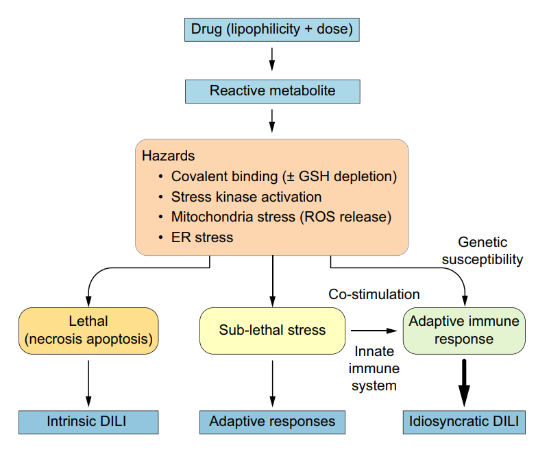
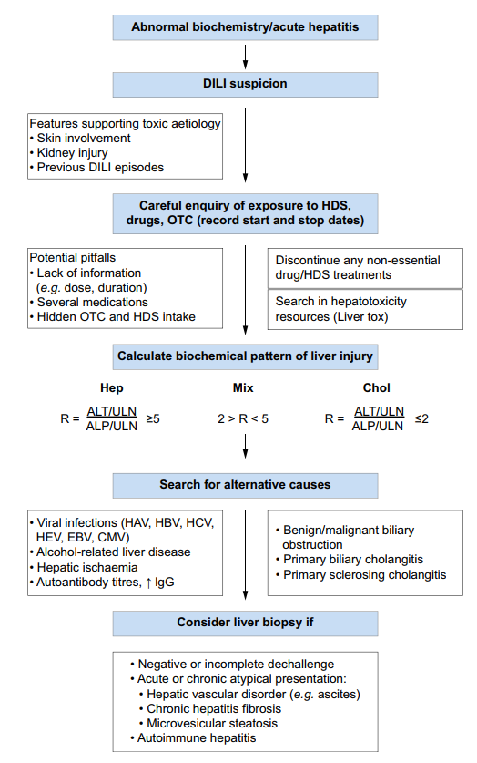

  

    

      
R ≥ 5 / R ≤ 2

      
Chỉ số R phân định Thể Tế bào gan (R ≥ 5) vs Thể Ứ mật (R ≤ 2) dựa trên men gan lúc phát hiện

    

    

      
10%

      
Tỷ lệ tử vong hoặc cần ghép gan khi bệnh nhân thỏa mãn tiêu chuẩn Quy tắc Hy's Law

    

    

      
≥ 50 - 100 mg

      
Ngưỡng liều uống hàng ngày chiếm 77% - 88% tổng số các ca tổn thương gan bất thường (Idiosyncratic DILI)

    

    

      
58% vs 27%

      
Tỷ lệ sống sót không cần ghép gan tăng vọt khi dùng N-acetylcysteine (NAC) sớm trong suy gan cấp hôn mê độ I-II

    

  

  

    

      
🔬

      

        
Chẩn Đoán Loại Trừ &amp; Phân Định Thể R

        
DILI là chẩn đoán loại trừ nghiêm ngặt; tính toán ngay chỉ số R để định hướng hình thái tổn thương (Tế bào gan, Ứ mật, Hỗn hợp), phân lập các phenotype chuyên biệt và tầm soát các nguyên nhân cạnh tranh.

      

    

    

      
⚠️

      

        
Nhận Diện Nguy Cơ Thảo Dược &amp; Hy's Law

        
Cảnh giác cao độ với thảo dược, TPCN (HDS chiếm 16-30% ca bệnh) và các thuốc có LogP &gt; 3 liều cao. Phát hiện sớm dấu hiệu Hy's Law để dự phòng diễn tiến bão hòa suy gan tối cấp.

      

    

    

      
🎯

      

        
Ngừng Thuốc Ngay Lập Tức &amp; Antidote Hướng Đích

        
Ngừng toàn bộ thuốc nghi ngờ không thiết yếu. Sử dụng NAC cho suy gan cấp do idiosyncratic DILI, L-carnitine cho ngộ độc Valproate, Cholestyramine cho Leflunomide và Corticosteroids đúng chỉ định cho irDILI / DRESS.

      

    

  

  

    <a href="#sec-1" class="quickmenu-item active">1. Cơ chế sinh bệnh</a>
    <a href="#sec-2" class="quickmenu-item">2. Độc tính Thảo dược</a>
    <a href="#sec-3" class="quickmenu-item">3. Chỉ số R &amp; Phenotype</a>
    <a href="#sec-4" class="quickmenu-item">4. Tổn thương do ICIs</a>
    <a href="#sec-5" class="quickmenu-item">5. Chẩn đoán &amp; Hy's Law</a>
    <a href="#sec-6" class="quickmenu-item">6. RUCAM &amp; Phân độ</a>
    <a href="#sec-7" class="quickmenu-item">7. Điều trị &amp; Antidote</a>
    <a href="#sec-8" class="quickmenu-item">8. Yếu tố Nguy cơ</a>
    <a href="#sec-9" class="quickmenu-item">9. Rechallenge &amp; Markers</a>
    <a href="#sec-10" class="quickmenu-item">10. Cảnh giác Dược</a>
  

  {/* ==================== SECTION 1 ==================== */}
  

    
🔬 <h2 class="sec-title">1. Phân Loại &amp; Cơ Chế Bệnh Sinh Cơ Bản (Intrinsic vs Idiosyncratic DILI)</h2>

    

      

        💡
        

          <strong>Định Nghĩa Tổn Thương Gan Do Thuốc (DILI)</strong>
          Tổn thương gan do thuốc (Drug-Induced Liver Injury - DILI) là một biến cố bất lợi nghiêm trọng, đại diện cho nguyên nhân hàng đầu gây suy gan cấp (ALF) và rút khỏi thị trường của các dược phẩm. DILI được phân loại kinh điển thành hai thể bệnh sinh chính: <strong>Trực tiếp (Intrinsic)</strong> và <strong>Bất thường / Không dự đoán trước (Idiosyncratic)</strong>.
        

      

      

        

          

          

            
⚡

            
Tổn Thương Gan Trực Tiếp (Intrinsic DILI)

          

          

            <ul style="margin-left: 1rem; line-height: 1.7;">
              <li><strong>Tính chất</strong>: Phụ thuộc liều lượng (dose-dependent), có thể dự đoán được (predictable), có thể tái lập trên mô hình động vật thí nghiệm.</li>
              <li><strong>Thời gian khởi phát</strong>: Ngắn, thường từ vài giờ đến vài ngày sau khi phơi nhiễm liều gây độc.</li>
              <li><strong>Tỷ lệ mắc</strong>: Cao ở tất cả các cá thể tiếp xúc với ngưỡng liều độc hại.</li>
              <li><strong>Mô hình kinh điển</strong>: Ngộ độc <em>Acetaminophen (Paracetamol)</em>.</li>
            </ul>
          

          
Dự đoán được &amp; Phụ thuộc liều tuyệt đối

        

        

          

          

            
🧬

            
Tổn Thương Gan Bất Thường (Idiosyncratic DILI)

          

          

            <ul style="margin-left: 1rem; line-height: 1.7;">
              <li><strong>Tính chất</strong>: Không phụ thuộc trực tiếp vào liều lượng theo kiểu tuyến tính, không thể dự đoán trước trên đa số cá thể, không tái lập được trên động vật.</li>
              <li><strong>Thời gian ủ bệnh (Latency)</strong>: Rất biến thiên, từ vài ngày, vài tuần đến vài tháng sau khi dùng thuốc.</li>
              <li><strong>Tần suất</strong>: Rất hiếm gặp (1/1.000 đến 1/100.000 bệnh nhân dùng thuốc), chỉ xảy ra ở những cá thể có tính nhạy cảm di truyền (HLA, men chuyển hóa) hoặc miễn dịch.</li>
              <li><strong>Ngưỡng liều tối thiểu</strong>: Thường đòi hỏi liều hàng ngày ≥ 50 - 100 mg.</li>
            </ul>
          

          
Không dự đoán trước &amp; Nhạy cảm ký chủ

        

      

      

        ⚠️
        

          <strong>Cơ Chế Phân Tử Chi Tiết Của Ngộ Độc Acetaminophen (Mô hình Intrinsic DILI)</strong>
          Khi dùng liều điều trị thông thường, 90% Paracetamol được liên hợp glucuronide và sulfate bài tiết qua thận. Chỉ một lượng nhỏ (&lt; 10%) được oxy hóa bởi CYP2E1 (và CYP1A2, CYP3A4) tạo thành chất chuyển hóa có hoạt tính cao: <strong>N-acetyl-p-benzoquinone imine (NAPQI)</strong>. NAPQI ngay lập tức được khử độc nhờ liên hợp với <strong>Glutathione (GSH)</strong> trong tế bào gan. 
          Khi dùng quá liều:
          <ol style="margin-left: 1.2rem; margin-top: 0.5rem; line-height: 1.6;">
            <li>Nguồn dự trữ Glutathione trong bào tương và ty thể cạn kiệt (&gt; 70-80%).</li>
            <li>NAPQI tự do gắn đồng hóa trị (covalent binding) với các protein ty thể, hình thành các APAP-protein adducts.</li>
            <li>Gây ức chế chuỗi truyền điện tử ty thể, sản sinh quá mức các loài oxy phản ứng (ROS) và kích hoạt dòng thác stress kinase JNK.</li>
            <li>Phosphoryl hóa JNK chuyển vị vào ty thể, kích hoạt hiện tượng mở <strong>lỗ chuyển tính thấm màng ty thể (MPT pore - Mitochondrial Permeability Transition)</strong>.</li>
            <li>Điện thế màng ty thể sụp đổ hoàn toàn, ngừng tổng hợp ATP, ty thể sưng to và vỡ màng, giải phóng AIF và Endonuclease G, dẫn đến <strong>hoại tử tế bào gan do ly giải (oncolytic necrosis)</strong>.</li>
          </ol>
        

      

      {/* Sơ đồ Figure 1 */}
      

        
        

          
Figure 1. Mối quan hệ cơ chế giữa tổn thương gan trực tiếp (Intrinsic) và bất thường (Idiosyncratic)

          Tiền đề chung là sự chuyển hóa thuốc ưa mỡ tại gan tạo ra các chất chuyển hóa phản ứng, kết gắn đồng hóa trị với protein mô gan, làm suy giảm dự trữ GSH nội bào, kích hoạt tín hiệu stress kinase, gây stress ty thể (giải phóng ROS) và stress lưới nội chất (ER stress). Ở tổn thương trực tiếp (như Paracetamol quá liều), độc tính tế bào vượt ngưỡng chịu đựng dẫn thẳng đến hoại tử mô gan. Ở tổn thương bất thường (Idiosyncratic), stress tế bào dưới ngưỡng hoại tử giải phóng các tín hiệu nguy hiểm (DAMPs / danger signals) kích thích hệ miễn dịch bẩm sinh; từ đó cung cấp tín hiệu đồng kích thích cho hệ miễn dịch thích ứng ở những người mang kiểu gen nhạy cảm (HLA), khởi phát phản ứng dị ứng qua trung gian tế bào T.
        

      

      {/* Table 1 */}
      

        

          

            <i class="fa-solid fa-table-list"></i> Bảng 1. Danh Mục Các Thuốc Điển Hình Gây Tổn Thương Gan Trực Tiếp vs Bất Thường
          

          <i class="fa-solid fa-capsules"></i> Phân loại cơ chế
        

        

          <table class="comparison-table">
            <thead>
              <tr>
                <th style="width:30%">DILI Trực Tiếp (Intrinsic DILI)</th>
                <th style="width:35%">DILI Bất Thường (Idiosyncratic DILI - Nhóm 1)</th>
                <th style="width:35%">DILI Bất Thường (Idiosyncratic DILI - Nhóm 2)</th>
              </tr>
            </thead>
            <tbody>
              <tr>
                <td>Điển hình <strong>Acetaminophen</strong> (Paracetamol)</td>
                <td>Allopurinol</td>
                <td>Lapatinib</td>
              </tr>
              <tr>
                <td>Amiodarone</td>
                <td>Amoxicillin-clavulanate</td>
                <td>Methyldopa</td>
              </tr>
              <tr>
                <td>Anabolic androgenic steroids</td>
                <td>Bosentan</td>
                <td>Minocycline</td>
              </tr>
              <tr>
                <td>Antimetabolites (Methotrexate liều cao)</td>
                <td>Dantrolene</td>
                <td>Nitrofurantoin</td>
              </tr>
              <tr>
                <td>Cholestyramine (liều độc)</td>
                <td>Diclofenac</td>
                <td>Pazopanib</td>
              </tr>
              <tr>
                <td>Cyclosporine</td>
                <td>Disulfiram</td>
                <td>Phenytoin</td>
              </tr>
              <tr>
                <td>Valproic acid (độc tính ty thể trực tiếp)</td>
                <td>Felbamate</td>
                <td>Pyrazinamide</td>
              </tr>
              <tr>
                <td>HAART drugs (liều cao)</td>
                <td>Fenofibrate</td>
                <td>Propylthiouracil (PTU)</td>
              </tr>
              <tr>
                <td>Heparins</td>
                <td>Flucloxacillin</td>
                <td>Statins (Atorvastatin, Rosuvastatin)</td>
              </tr>
              <tr>
                <td>Nicotinic acid (Niacin liều cao)</td>
                <td>Flutamide</td>
                <td>Sulfonamides (Co-trimoxazole)</td>
              </tr>
              <tr>
                <td>Statins (liều độc tế bào)</td>
                <td>Halothane</td>
                <td>Terbinafine</td>
              </tr>
              <tr>
                <td>Tacrine</td>
                <td>Isoniazid</td>
                <td>Ticlopidine</td>
              </tr>
              <tr>
                <td>—</td>
                <td>Ketoconazole</td>
                <td>Tolvaptan</td>
              </tr>
              <tr>
                <td>—</td>
                <td>Leflunomide</td>
                <td>Tolcapone</td>
              </tr>
              <tr>
                <td>—</td>
                <td>Lisinopril</td>
                <td>Trovafloxacin</td>
              </tr>
            </tbody>
          </table>
        

      

    

  

  {/* ==================== SECTION 2 ==================== */}
  

    
🌿 <h2 class="sec-title">2. Độc Tính Gan Do Thảo Dược &amp; Thực Phẩm Chức Năng (HDS Hepatotoxicity)</h2>

    

      

        ⚠️
        

          <strong>Thực Trạng Dịch Tễ Học Độc Tính Thảo Dược &amp; TPCN</strong>
          Tổn thương gan do Thảo dược và Thực phẩm chức năng (Herbal and Dietary Supplements - HDS) đang gia tăng nhanh chóng trên phạm vi toàn cầu:
          <ul style="margin-left: 1rem; margin-top: 0.5rem; line-height: 1.6;">
            <li>Chiếm khoảng <strong>16%</strong> tổng số ca DILI tại các nước phương Tây (Mỹ, Tây Ban Nha, Iceland).</li>
            <li>Chiếm hơn <strong>30%</strong> (thậm chí lên tới 70% tại một số trung tâm) tại các quốc gia Châu Á (như Hàn Quốc, Trung Quốc, Đài Loan).</li>
            <li>HDS thường bị người dân hiểu lầm là "hoàn toàn tự nhiên và vô hại", dẫn đến tình trạng chậm trễ trong khai báo và chẩn đoán.</li>
          </ul>
        

      

      

        

          

          

            
🩸

            
Pyrrolizidine Alkaloids &amp; Hội Chứng SOS/VOD

          

          

            
Có trong hơn 6.000 loài thực vật thuộc các chi <em>Crotalaria, Senecio, Heliotropium, Symphytum officinale</em> (comfrey) và <em>Gynura segetum</em> (Tusanqi - Thổ tam thất giả):

            <ul style="margin-left: 1rem; line-height: 1.6;">
              <li>Là nguyên nhân hàng đầu gây <strong>Hội chứng tắc tĩnh mạch xoang gan (Sinusoidal Obstruction Syndrome - SOS / Veno-Occlusive Disease - VOD)</strong>.</li>
              <li>Chất chuyển hóa pyrrole pyrrolic phản ứng alkyl hóa ADN và protein tế bào nội mô xoang gan vùng 3 quanh tĩnh mạch trung tâm, gây bong tróc nội mạc, tắc nghẽn vi tuần hoàn xoang, ứ máu gan tiến triển, tăng áp cửa và suy gan cấp/mạn.</li>
            </ul>
          

          
Nguy cơ tắc xoang &amp; Suy gan tử vong cao

        

        

          

          

            
💊

            
TPCN Giảm Cân, Tăng Cơ &amp; Anabolic Steroids

          

          

            
Các sản phẩm bổ sung thể hình và giảm béo thường chứa các hợp chất độc tế bào gan tiềm ẩn:

            <ul style="margin-left: 1rem; line-height: 1.6;">
              <li><strong>Axit Usnic kết hợp</strong> (trong các TPCN giảm cân như <em>LipoKinetix, OxyELITE Pro, Hydroxycut</em>): Phá hãm chuỗi phosphoryl oxy hóa ty thể, gây hoại tử tế bào gan cấp và suy gan cấp tối cấp.</li>
              <li><strong>Anabolic Androgenic Steroids (AAS bất hợp pháp)</strong>: Sử dụng tăng cơ bắp liều cao gây viêm gan ứ mật kéo dài, u tuyến tế bào gan (hepatic adenoma), ung thư gan (HCC) và hội chứng SOS.</li>
            </ul>
          

          
Viêm gan cấp, ứ mật &amp; Nguy cơ sinh u gan

        

      

      {/* Table 2 */}
      

        

          

            <i class="fa-solid fa-leaf"></i> Bảng 2. Thảo Dược và Thực Phẩm Chức Năng Gây Độc Tính Gan Phổ Biến (EASL Table 2)
          

          <i class="fa-solid fa-triangle-exclamation"></i> Thảo dược &amp; TPCN
        

        

          <table class="comparison-table">
            <thead>
              <tr>
                <th style="width:40%">Thảo Dược / Thực Phẩm Chức Năng</th>
                <th style="width:60%">Dạng Tổn Thương Gan Điển Hình (Phenotype)</th>
              </tr>
            </thead>
            <tbody>
              <tr style="background: var(--color-surface-variant, #f8fafc);">
                <td colspan="2"><strong>1. Chế phẩm Thảo dược Phương Tây (Herbal preparations)</strong></td>
              </tr>
              <tr>
                <td><strong>Pyrrolizidine alkaloids</strong> (<em>Crotalaria</em>, <em>Senecio</em>, <em>Heliotropium</em>, <em>Symphytum officinale</em> / Comfrey)</td>
                <td>Hội chứng tắc tĩnh mạch xoang gan (SOS / VOD) thể cấp tính và mãn tính, tăng áp tĩnh mạch cửa nặng</td>
              </tr>
              <tr>
                <td><strong>Teucrium chamaedrys</strong> (Germander)</td>
                <td>Viêm gan tế bào gan cấp (AHH), hình thành kháng thể anti-hydrolase tự miễn</td>
              </tr>
              <tr>
                <td><strong>Piper methysticum</strong> (Kava-kava), <strong>Chelidonium majus</strong> (Celandine)</td>
                <td>Viêm gan hoại tử tế bào gan cấp, suy gan cấp (ALF) cần ghép gan khẩn</td>
              </tr>
              <tr>
                <td><strong>Camellia sinensis</strong> (Chiết xuất trà xanh đậm đặc - EGCG)</td>
                <td>Viêm gan tế bào gan cấp tính hoặc bán cấp, hoại tử vùng trung tâm tiểu thùy</td>
              </tr>
              <tr>
                <td><strong>Actaea racemosa</strong> (Black cohosh)</td>
                <td>Viêm gan tế bào gan cấp, suy gan cấp tiến triển</td>
              </tr>
              <tr>
                <td><strong>Morinda citrifolia</strong> (Noni juice - Nước ép Nhàu), <strong>Cassia angustifolia</strong> (Senna), <strong>Larrea tridentata</strong> (Chaparral)</td>
                <td>Viêm gan tế bào gan cấp (AHH), viêm gan ứ mật cấp (ACH), xơ gan tiến triển, viêm đường mật</td>
              </tr>
              <tr style="background: var(--color-surface-variant, #f8fafc);">
                <td colspan="2"><strong>2. Bài thuốc Y học Cổ truyền Châu Á (Asian herbal medicine)</strong></td>
              </tr>
              <tr>
                <td><strong>Lycoperdon serratum</strong> (Jin Bu Huan - Kim bất hoán)</td>
                <td>Viêm gan tế bào gan cấp (AHH), viêm gan ứ mật cấp (ACH), suy gan cấp (ALF)</td>
              </tr>
              <tr>
                <td><strong>Ephedra sinica</strong> (Ma Huang - Ma hoàng)</td>
                <td>Viêm gan tế bào gan cấp kèm tính chất tự miễn rõ rệt (ANA/ASMA dương tính)</td>
              </tr>
              <tr>
                <td><strong>Sho-Saiko-To</strong> (Xiao-Chai-Hu-Tang - Tiểu sài hồ thang)</td>
                <td>Viêm gan tế bào gan cấp tính, có thể tiến triển thành viêm gan mãn tính</td>
              </tr>
              <tr>
                <td><strong>Polygonum multiflorum</strong> (Shou-Wu-Pian - Hà thủ ô đỏ)</td>
                <td>Viêm gan tế bào gan cấp tính, vàng da ứ mật kéo dài, suy gan cấp</td>
              </tr>
              <tr>
                <td><strong>Ganoderma lucidum</strong> (Linh chi)</td>
                <td>Viêm gan hoại tử tế bào gan cấp tính</td>
              </tr>
              <tr style="background: var(--color-surface-variant, #f8fafc);">
                <td colspan="2"><strong>3. Thực phẩm chức năng &amp; Hóa chất bổ sung (Dietary supplements)</strong></td>
              </tr>
              <tr>
                <td><strong>Axit Usnic kết hợp</strong> (LipoKinetix®, UCP-1, OxyELITE Pro®)</td>
                <td>Hoại tử tế bào gan lan tỏa cấp tính (AHH), suy gan cấp tối cấp (ALF)</td>
              </tr>
              <tr>
                <td><strong>Hydroxycut®</strong></td>
                <td>Viêm gan tế bào gan cấp (AHH), viêm gan ứ mật (ACH), suy gan cấp, viêm gan kèm tính chất tự miễn</td>
              </tr>
              <tr>
                <td><strong>Steroid đồng hóa bất hợp pháp</strong> (Illicit anabolic androgenic steroids - AAS)</td>
                <td>Viêm gan ứ mật nặng kéo dài, U tuyến biểu mô tế bào gan (Hepatic Adenoma), Ung thư biểu mô tế bào gan (HCC), Hội chứng tắc tĩnh mạch xoang (SOS)</td>
              </tr>
            </tbody>
          </table>
        

      

    

  

  {/* ==================== SECTION 3 ==================== */}
  

    
🩺 <h2 class="sec-title">3. Biểu Hiện Lâm Sàng, Chỉ Số R (R-ratio) &amp; Các Phenotype DILI Đặc Thù</h2>

    

      

        📐
        

          <strong>Công Thức Tính Chỉ Số R (R-ratio) Trong Phân Loại Tổn Thương Gan</strong>
          Chỉ số R được tính toán dựa trên kết quả xét nghiệm sinh hóa gan đầu tiên thu được lúc phát hiện biến cố tổn thương gan:
          

            Chỉ số R = (ALT / ULN) / (ALP / ULN)
          

          Trong đó ALT và ALP là nồng độ xét nghiệm của bệnh nhân; ULN (Upper Limit of Normal) là giới hạn trên bình thường của phòng xét nghiệm tương ứng.
        

      

      

        

          

          

            
🔴

            
1. Thể Tế Bào Gan (Hepatocellular)

          

          

            
<strong>Tiêu chuẩn</strong>: ALT tăng ≥ 5 × ULN đơn độc HOẶC <strong>Chỉ số R ≥ 5</strong>.

            <ul style="margin-left: 1rem; line-height: 1.6;">
              <li>Tiến triển nhanh chóng với hoại tử nhu mô gan.</li>
              <li>Có nguy cơ cao nhất tiến triển thành suy gan cấp theo quy tắc Hy's Law.</li>
              <li>Thường gặp ở người trẻ tuổi.</li>
            </ul>
          

          
Nguy cơ suy gan cấp &amp; Hy's Law cao nhất

        

        

          

          

            
🟡

            
2. Thể Ứ Mật (Cholestatic)

          

          

            
<strong>Tiêu chuẩn</strong>: ALP tăng ≥ 2 × ULN đơn độc HOẶC <strong>Chỉ số R ≤ 2</strong>.

            <ul style="margin-left: 1rem; line-height: 1.6;">
              <li>Biểu hiện nổi bật với ngứa, vàng da, phân bạc màu.</li>
              <li>Thời gian phục hồi men gan chậm (thường mất nhiều tháng).</li>
              <li>Thường gặp ở bệnh nhân lớn tuổi.</li>
            </ul>
          

          
Hồi phục chậm &amp; Nguy cơ biến mất ống mật

        

        

          

          

            
🔵

            
3. Thể Hỗn Hợp (Mixed Pattern)

          

          

            
<strong>Tiêu chuẩn</strong>: <strong>2 &lt; Chỉ số R &lt; 5</strong>.

            <ul style="margin-left: 1rem; line-height: 1.6;">
              <li>Tổn thương kết hợp đồng thời hoại tử tế bào gan và ứ mật.</li>
              <li>Cần kiểm tra kỹ chẩn đoán hình ảnh đường mật và kháng thể tự miễn.</li>
            </ul>
          

          
Hình thái trung gian

        

      

      {/* Table 3 */}
      

        

          

            <i class="fa-solid fa-shapes"></i> Bảng 3. Định Nghĩa Các Phenotype Lâm Sàng Đặc Thù Của DILI (EASL Table 3)
          

          <i class="fa-solid fa-dna"></i> Phenotypes
        

        

          <table class="comparison-table">
            <thead>
              <tr>
                <th style="width:25%">Phenotype DILI Đặc Thù</th>
                <th style="width:40%">Tiêu Chuẩn Chẩn Đoán Ca Bệnh</th>
                <th style="width:35%">Thuốc Liên Quan Điển Hình</th>
              </tr>
            </thead>
            <tbody>
              <tr>
                <td><strong>Idiosyncratic DILI Điển hình</strong></td>
                <td>Định nghĩa theo chỉ số R: Thể Tế bào gan (R ≥ 5), Ứ mật (R ≤ 2), Hỗn hợp (2 &lt; R &lt; 5). DILI mãn tính nếu tổn thương kéo dài &gt; 1 năm.</td>
                <td>Amoxicillin-clavulanate, Isoniazid, Nitrofurantoin, Amiodarone, Statins, Carbamazepine, Valproate, Methotrexate, Diclofenac...</td>
              </tr>
              <tr>
                <td><strong>Hội chứng DRESS</strong> (Drug Reaction with Eosinophilia and Systemic Symptoms)</td>
                <td>Phản ứng quá mẫn nặng với sốt, phát ban toàn thân, hạch to, tăng bạch cầu ái toan/lympho không điển hình; tổn thương gan xuất hiện ở 60-100% ca với tỷ lệ tử vong 10%.</td>
                <td>Carbamazepine, Phenytoin, Lamotrigine, Allopurinol, Minocycline, Abacavir, Nevirapine, Sulfasalazine.</td>
              </tr>
              <tr>
                <td><strong>Viêm gan Tự miễn do Thuốc</strong> (Drug-induced AIH - DIAIH)</td>
                <td>DILI cấp kèm dấu ấn tự kháng thể (ANA, ASMA ≥ 1:80), IgG tăng cao và/hoặc mô học có thâm nhiễm tương bào tương tự AIH nguyên phát. Thường hồi phục sau ngưng thuốc và <strong>không tái phát khi dừng Corticoid</strong>.</td>
                <td>Nitrofurantoin, Minocycline, Infliximab, Diclofenac, Methyldopa, Statins, Hydralazine.</td>
              </tr>
              <tr>
                <td><strong>Viêm đường mật xơ hóa thứ phát</strong> (Secondary Sclerosing Cholangitis)</td>
                <td>DILI thể ứ mật cấp tiến triển có hình ảnh chít hẹp và giãn đường mật dạng chuỗi hạt lan tỏa trên MRCP/ERCP, giống viêm đường mật xơ hóa nguyên phát.</td>
                <td>Amoxicillin-clavulanate, Infliximab, Amiodarone, Atorvastatin, Sevoflurane, Thuốc gây mê đường hít.</td>
              </tr>
              <tr>
                <td><strong>Viêm gan U hạt</strong> (Granulomatous Hepatitis)</td>
                <td>Hiện diện u hạt không bã đậu (non-caseating granulomas) rải rác trong nhu mô hoặc khoảng cửa trên tiêu bản sinh thiết gan do thuốc.</td>
                <td>Allopurinol, Carbamazepine, Methyldopa, Phenytoin, Quinidine, Sulfonamides, Diltiazem.</td>
              </tr>
              <tr>
                <td><strong>Gan nhiễm mỡ cấp tính</strong> (Acute Fatty Liver / Microvesicular Steatosis)</td>
                <td>Hội chứng suy tế bào gan tiến triển nhanh, toan lactic máu nặng, hạ đường huyết, tăng amoniac máu do thoái hóa mỡ hạt nhỏ lan tỏa ức chế oxy hóa beta ty thể.</td>
                <td>Valproic acid, Tetracycline tiêm tĩnh mạch liều cao, Amiodarone, NRTIs (Stavudine, Didanosine, Fialuridine).</td>
              </tr>
              <tr>
                <td><strong>Bệnh gan nhiễm mỡ do thuốc</strong> (Drug-Associated Fatty Liver Disease - DAFLD)</td>
                <td>Thoái hóa mỡ hạt lớn (macrovesicular steatosis) hoặc viêm gan thoái hóa mỡ (MASH) quy cho việc sử dụng thuốc kéo dài ở bệnh nhân không uống rượu.</td>
                <td>Tamoxifen, Methotrexate, 5-Fluorouracil, Irinotecan, Corticosteroids kéo dài, Amiodarone.</td>
              </tr>
              <tr>
                <td><strong>Tăng sản dạng nốt tái tạo</strong> (Nodular Regenerative Hyperplasia - NRH)</td>
                <td>Các nốt tế bào gan tăng sản lan tỏa không có vách xơ phân cách, do tổn thương tế bào nội mạc xoang gan dẫn đến tăng áp lực tĩnh mạch cửa không xơ gan.</td>
                <td>Azathioprine, 6-Thioguanine, Oxaliplatin, Busulfan, Cyclophosphamide.</td>
              </tr>
              <tr>
                <td><strong>Hội chứng Biến mất Ống mật</strong> (Vanishing Bile Duct Syndrome - VBDS)</td>
                <td>Ứ mật nặng mãn tính kèm mất trên 50% số ống mật liên tiểu thùy trên sinh thiết gan, có thể dẫn đến xơ gan ứ mật thứ phát không hồi phục.</td>
                <td>Amoxicillin-clavulanate, Carbamazepine, Chlorpromazine, Phenytoin, Terbinafine, TMP-SMX.</td>
              </tr>
              <tr>
                <td><strong>Khối u gan do thuốc</strong> (Drug-Induced Liver Tumors)</td>
                <td>Phát triển u tuyến tế bào gan (Hepatic Adenoma), tăng sản dạng nốt khu trú (FNH) hoặc Ung thư biểu mô tế bào gan (HCC).</td>
                <td>Steroid đồng hóa (Anabolic steroids), Thuốc tránh thai đường uống (Oral contraceptives kéo dài).</td>
              </tr>
            </tbody>
          </table>
        

      

    

  

  {/* ==================== SECTION 4 ==================== */}
  

    
🛡️ <h2 class="sec-title">4. Tổn Thương Gan Do Thuốc Ức Chế Điểm Kiểm Soát Miễn Dịch (ICIs) Trong Điều Trị Ung Thư</h2>

    

      

        ⚠️
        

          <strong>Cơ Chế Miễn Dịch &amp; Mức Độ Nguy Cơ Của Immune-Mediated DILI (irDILI)</strong>
          Các thuốc ức chế điểm kiểm soát miễn dịch giải phóng sự ức chế tế bào T nhằm tăng cường tiêu diệt tế bào ác tính, nhưng đồng thời gây ra các tác dụng phụ liên quan miễn dịch (immune-related Adverse Events - irAEs):
          <ul style="margin-left: 1rem; margin-top: 0.5rem; line-height: 1.6;">
            <li><strong>Kháng thể kháng CTLA-4</strong> (Ipilimumab, Tremelimumab): Tần suất gây viêm gan miễn dịch cao hơn nhiều so với nhóm kháng PD-1/PD-L1 (Nivolumab, Pembrolizumab, Atezolizumab).</li>
            <li><strong>Liệu pháp Phối hợp (Ipilimumab + Nivolumab)</strong>: Làm tăng nguy cơ độc tính gan nặng lên tới <strong>15-30%</strong>, là nguyên nhân hàng đầu khiến bệnh nhân phải tạm ngừng hoặc chấm dứt điều trị ung thư sớm.</li>
            <li><strong>Đặc điểm độc đáo</strong>: Đa số các ca irDILI do ICIs là <strong>"huyết thanh âm tính" (seronegative)</strong>, không xuất hiện hiệu giá cao ANA hoặc ASMA như trong viêm gan tự miễn cổ điển. Về mô học, anti-CTLA-4 điển hình gây viêm gan u hạt kèm đọng fibrin và viêm nội mạc tĩnh mạch trung tâm xoang.</li>
          </ul>
        

      

      {/* Table 5 */}
      

        

          

            <i class="fa-solid fa-shield-virus"></i> Bảng 5. Hướng Dẫn Phân Độ &amp; Xử Trí Lâm Sàng Tổn Thương Gan Do ICIs (EASL Table 5)
          

          <i class="fa-solid fa-procedures"></i> Độc tính ICIs
        

        

          <table class="regimen-table">
            <thead>
              <tr>
                <th style="width:25%">Phân Độ Độc Tính (CTCAE)</th>
                <th style="width:35%">Đánh Giá &amp; Giám Sát</th>
                <th style="width:40%">Xử Trí &amp; Phác Đồ Can Thiệp</th>
              </tr>
            </thead>
            <tbody>
              <tr>
                <td><strong>Trước điều trị (Baseline)</strong></td>
                <td>Xét nghiệm men gan nền (ALT, AST, ALP, Total Bilirubin, INR). Tầm soát vi-rút viêm gan (HIV, HBV, HCV, HEV). Loại trừ bệnh gan tự miễn hoặc di căn gan từ trước.</td>
                <td>Ghi nhận chỉ số tham chiếu cơ bản trước khi bắt đầu chu kỳ truyền thuốc đích đầu tiên.</td>
              </tr>
              <tr>
                <td><strong>Grade 1</strong> Nhẹ ALT/AST ≤ 3 × ULN TBL ≤ 1.5 × ULN</td>
                <td>Tính chỉ số R. Loại trừ NASH hoặc nhiễm độc khác không do irAEs. Xét nghiệm lặp lại trước mỗi chu kỳ dùng thuốc.</td>
                <td><strong>Tiếp tục điều trị ICI</strong> bình thường dưới sự giám sát chặt chẽ.</td>
              </tr>
              <tr>
                <td><strong>Grade 2</strong> Trung bình ALT/AST 3 - 5 × ULN TBL 1.5 - 3 × ULN</td>
                <td>Theo dõi men gan và INR <strong>2 lần mỗi tuần</strong>. Khảo sát chẩn đoán hình ảnh bụng loại trừ di căn tiến triển hoặc tắc mật.</td>
                <td><strong>Tạm ngừng dùng liều ICI kế tiếp</strong>. Nếu men gan tự cải thiện về Grade 1, có thể dùng lại thuốc. Nếu bất thường <strong>kéo dài &gt; 2 tuần</strong>: Bắt đầu dùng <strong>Corticosteroids</strong> (Prednisone 0.5 - 1 mg/kg/ngày) và ngưng thuốc cho đến khi phục hồi.</td>
              </tr>
              <tr>
                <td><strong>Grade 3 hoặc 4</strong> Nặng / Nguy kịch ALT/AST &gt; 5 × ULN HOẶC TBL &gt; 3 × ULN</td>
                <td>Theo dõi men gan và INR <strong>hàng ngày hoặc mỗi 48 giờ</strong>. Nhập viện ngay nếu Total Bilirubin ≥ 2.5 mg/dL hoặc INR ≥ 1.5. Cân nhắc sinh thiết gan khẩn nếu chẩn đoán không rõ ràng hoặc không đáp ứng điều trị.</td>
                <td><strong>Ngưng thuốc ICI vĩnh viễn</strong> (đặc biệt nếu Grade 4). Bắt đầu ngay lập tức <strong>Methylprednisolone 1 - 2 mg/kg/ngày truyền tĩnh mạch</strong>. Khi men gan cải thiện về Grade 1, giảm dần liều Corticoid chậm trong ít nhất 4 tuần. Nếu <strong>không đáp ứng sau 2 - 3 ngày</strong> dùng Corticoid liều cao: Bổ sung <strong>Mycophenolate Mofetil (MMF) 1.000 mg × 2 lần/ngày</strong>. <strong style="color:#b91c1c;">LƯU Ý CỐT LÕI: KHÔNG khuyến cáo sử dụng Infliximab</strong> do thuốc này có nguy cơ gây độc tính gan riêng biệt.</td>
              </tr>
            </tbody>
          </table>
        

      

    

  

  {/* ==================== SECTION 5 ==================== */}
  

    
🎯 <h2 class="sec-title">5. Tiếp Cận Chẩn Đoán Từng Bước, Quy Trình Loại Trừ &amp; Quy Tắc Hy's Law</h2>

    

      

        ⚖️
        

          <strong>Quy Tắc Tiên Lượng Hy's Law — "Thảm Họa Tiềm Ẩn" Trong DILI</strong>
          Quy tắc Hy's Law (được đặt theo tên nhà bệnh lý gan mật học Hyman Zimmerman) là tiêu chuẩn vàng dự báo nguy cơ suy tế bào gan nghiêm trọng và tử vong trong DILI. Bệnh nhân được xác định thỏa mãn Hy's Law khi đáp ứng <strong>đầy đủ 3 tiêu chuẩn</strong>:
          <ol style="margin-left: 1.2rem; margin-top: 0.5rem; line-height: 1.6;">
            <li><strong>Tổn thương tế bào gan nặng</strong>: Nồng độ ALT hoặc AST tăng ≥ 3 × ULN.</li>
            <li><strong>Vàng da suy chức năng tế bào gan mà không kèm ứ mật ban đầu</strong>: Nồng độ Total Bilirubin tăng &gt; 2 × ULN (chủ yếu là Bilirubin liên hợp) mà <strong>KHÔNG CÓ sự gia tăng tương ứng của ALP</strong> (ALP &lt; 2 × ULN hoặc chỉ số R ≥ 5).</li>
            <li><strong>Chẩn đoán loại trừ hoàn toàn</strong>: Không tìm thấy bất kỳ nguyên nhân nào khác giải thích được tình trạng tăng Bilirubin (như viêm gan virus cấp, viêm gan tự miễn, sỏi mật, tắc mật ngoài gan, hội chứng Gilbert hay tán huyết).</li>
          </ol>
          

            Ý NGHĨA LÂM SÀNG: Bệnh nhân xuất hiện dấu hiệu Hy's Law có tỷ lệ tử vong hoặc cần ghép gan khẩn cấp lên tới khoảng 10% (Dao động từ 5% đến 50% tùy nghiên cứu)!
          

        

      

      {/* Sơ đồ Figure 2 */}
      

        
        

          
Figure 2. Thuật toán tiếp cận chẩn đoán DILI từng bước theo khuyến cáo thực hành EASL 2019

          Sơ đồ chuẩn hóa quy trình điều tra DILI lâm sàng: Bắt đầu từ việc phát hiện men gan bất thường → Khai thác tỉ mỉ tiền sử dùng thuốc, TPCN, thuốc nam/bắc trong 6 tháng qua → Lập tức ngưng tất cả thuốc không thiết yếu → Tra cứu LiverTox → Tính chỉ số R phân loại thể tổn thương → Thực hiện bộ xét nghiệm sinh hóa và huyết thanh loại trừ toàn diện (Table 6, Table 7) → Áp dụng thang điểm CIOMS/RUCAM → Cân nhắc sinh thiết gan khi bệnh nhân diễn tiến xấu, nghi ngờ AIH hoặc men gan không hạ sau 3-6 tháng ngưng thuốc.
        

      

      {/* Tái hiện Lưu đồ Trực quan SVG Editorial Flowchart theo Rule 4.1 */}
      

        <h4 style="margin-top: 0; color: var(--color-primary); font-size: 1.1rem; text-align: center;">
          <i class="fa-solid fa-diagram-project"></i> Lưu Đồ Tiếp Cận Chẩn Đoán DILI Từng Bước (Interactive Editorial Diagram)
        </h4>
        
        

          
          {/* BƯỚC 1 */}
          

            

              1
              NGHI NGỜ TỔN THƯƠNG GAN DO THUỐC (Suspicion of DILI)
            

            

              Xuất hiện bất thường xét nghiệm gan: <strong>ALT ≥ 5 × ULN</strong>, HOẶC <strong>ALP ≥ 2 × ULN</strong>, HOẶC <strong>ALT ≥ 3 × ULN kèm TBL &gt; 2 × ULN</strong>.
            

          

          
<i class="fa-solid fa-arrow-down"></i>

          {/* BƯỚC 2 */}
          

            

              2
              ĐIỀU TRA TIỀN SỬ PHƠI NHIỄM &amp; HÀNH ĐỘNG KHẨN CẤP
            

            <ul style="margin: 0.5rem 0 0 1.2rem; color: var(--color-text); line-height: 1.6;">
              <li>Rà soát toàn bộ: Thuốc kê đơn, thuốc OTC, Thảo dược, Trà giảm cân, TPCN, Steroids đồng hóa trong vòng 3 - 6 tháng.</li>
              <li><strong>NGƯNG NGAY LẬP TỨC</strong> tất cả các thuốc và sản phẩm nghi ngờ không thực sự sống còn.</li>
              <li>Tra cứu tiền sử độc tính của hoạt chất trên cơ sở dữ liệu <strong>LiverTox® (NIH/NIDDK)</strong>.</li>
            </ul>
          

          
<i class="fa-solid fa-arrow-down"></i>

          {/* BƯỚC 3 */}
          

            

              3
              TÍNH TOÁN CHỈ SỐ R &amp; PHÂN LOẠI HÌNH THÁI
            

            

              

                <strong style="color: #b91c1c;">R ≥ 5 (Tế bào gan)</strong> 
                Đánh giá nguy cơ Hy's Law; Tầm soát vi-rút HAV, HBV, HCV-RNA, IgM HEV; Tự miễn; Ngộ độc Acetaminophen.
              

              

                <strong style="color: #d97706;">R ≤ 2 (Ứ mật)</strong> 
                Chỉ định bắt buộc Siêu âm bụng / MRCP loại trừ sỏi mật, u đường mật, tắc mật hoặc bệnh lý thâm nhiễm.
              

              

                <strong style="color: #2563eb;">2 &lt; R &lt; 5 (Hỗn hợp)</strong> 
                Tầm soát song song cả nguyên nhân tổn thương nhu mô tế bào gan và bệnh lý tắc mật/đường mật.
              

            

          

          
<i class="fa-solid fa-arrow-down"></i>

          {/* BƯỚC 4 */}
          

            

              4
              ĐÁNH GIÁ QUY NGUYÊN BẰNG THANG ĐIỂM RUCAM &amp; THEO DÕI
            

            <ul style="margin: 0.5rem 0 0 1.2rem; color: var(--color-text); line-height: 1.6;">
              <li>Chấm điểm CIOMS/RUCAM: Xác định mức độ liên quan (Rất có khả năng &gt; 8, Có khả năng 6-8, Có thể 3-5).</li>
              <li>Giám sát sát sao men gan và chức năng gan tổng hợp (Bilirubin, INR) ít nhất 2 lần/tuần đến khi thoái lui.</li>
              <li><strong>Chỉ định Sinh thiết Gan</strong>: Khi nghi ngờ Drug-induced AIH cần Corticoid, men gan tiếp tục tăng hoặc không giảm sau 3 - 6 tháng ngưng thuốc.</li>
            </ul>
          

        

      

      {/* Table 6 */}
      

        

          

            <i class="fa-solid fa-flask-vial"></i> Bảng 6. Đánh Giá Các Xét Nghiệm Sinh Hóa Gan Tiêu Chuẩn Trong Chẩn Đoán DILI (EASL Table 6)
          

          <i class="fa-solid fa-vial"></i> Sinh hóa gan
        

        

          <table class="comparison-table">
            <thead>
              <tr>
                <th style="width:20%">Xét Nghiệm</th>
                <th style="width:45%">Ý Nghĩa Lâm Sàng Của Bất Thường</th>
                <th style="width:35%">Độ Đặc Hiệu Cho Gan &amp; Lưu Ý</th>
              </tr>
            </thead>
            <tbody>
              <tr>
                <td><strong>ALT</strong> (Alanine Aminotransferase)</td>
                <td>Chỉ dấu nhạy cảm nhất về tổn thương hủy hoại tế bào gan cấp tính.</td>
                <td>Khá đặc hiệu cho mô gan khi tăng &gt; 3 × ULN. Nằm chủ yếu ở bào tương tế bào gan.</td>
              </tr>
              <tr>
                <td><strong>AST</strong> (Aspartate Aminotransferase)</td>
                <td>Tổn thương tế bào gan, phản ánh mức độ hoại tử sâu vào cấu trúc ty thể.</td>
                <td>Không đặc hiệu tuyệt đối cho gan (có nhiều ở cơ xương, cơ tim, thận, hồng cầu).</td>
              </tr>
              <tr>
                <td><strong>Total Bilirubin</strong></td>
                <td>Ứ mật, suy giảm khả năng thanh thải/liên hợp/bài tiết của gan, tắc mật ngoài gan, hoặc tán huyết.</td>
                <td>Cần phân tích 2 thành phần: Bilirubin trực tiếp (liên hợp) và gián tiếp. Tăng kèm ALT/AST là chỉ dấu suy chức năng gan nặng (Hy's Law).</td>
              </tr>
              <tr>
                <td><strong>ALP</strong> (Alkaline Phosphatase)</td>
                <td>Tổn thương vi quản mật, tắc mật cơ học, bệnh lý thâm nhiễm gan (u hạt, di căn).</td>
                <td>Không đặc hiệu riêng cho gan (có ở xương, ruột non, nhau thai). Khi ALP tăng cần đối chiếu với GGT.</td>
              </tr>
              <tr>
                <td><strong>GGT</strong> (Gamma-Glutamyltransferase)</td>
                <td>Tổn thương đường mật, ứ mật, cảm ứng enzyme bởi thuốc (như Rifampicin, Barbiturates, rượu).</td>
                <td>Độ nhạy rất cao nhưng kém đặc hiệu cho bệnh gan (tăng trong bệnh lý tụy, thận, phổi, béo phì). Rất hữu ích để khẳng định nguồn gốc tăng ALP là từ gan mật.</td>
              </tr>
              <tr>
                <td><strong>GLDH</strong> (Glutamate Dehydrogenase)</td>
                <td>Chỉ dấu đặc hiệu phản ánh tổn thương ty thể tế bào gan và hoại tử trung tâm tiểu thùy.</td>
                <td><strong>Rất đặc hiệu cho tế bào gan</strong>. Là xét nghiệm lý tưởng để phân biệt tăng ALT do cơ xương (rhabdomyolysis) hay do tổn thương nhu mô gan.</td>
              </tr>
              <tr>
                <td><strong>Albumin / INR</strong></td>
                <td>Chỉ dấu đánh giá chức năng tổng hợp protein và các yếu tố đông máu phụ thuộc vitamin K của tế bào gan.</td>
                <td>INR kéo dài (≥ 1.5) là dấu hiệu cảnh báo tiến triển suy gan cấp (ALF), chỉ định chuyển tuyến hồi sức chuyên khoa.</td>
              </tr>
              <tr>
                <td><strong>Creatine Kinase (CK)</strong></td>
                <td>Tổn thương màng tế bào cơ xương.</td>
                <td>Bắt buộc làm khi AST &gt; ALT để loại trừ tiêu cơ vân cấp hoặc chấn thương cơ.</td>
              </tr>
            </tbody>
          </table>
        

      

      {/* Table 7 */}
      

        

          

            <i class="fa-solid fa-list-check"></i> Bảng 7. Quy Trình Xét Nghiệm Bắt Buộc Loại Trừ Các Bệnh Gan Nền Cạnh Tranh (EASL Table 7)
          

          <i class="fa-solid fa-filter"></i> Chẩn đoán loại trừ
        

        

          <table class="diagnostic-table">
            <thead>
              <tr>
                <th style="width:30%">Nhóm Căn Nguyên Cạnh Tranh</th>
                <th style="width:70%">Xét Nghiệm Cận Lâm Sàng Cần Thực Hiện Khảo Sát</th>
              </tr>
            </thead>
            <tbody>
              <tr>
                <td><strong>Vi-rút Viêm Gan Thường Gặp</strong></td>
                <td>
                  • Vi-rút Viêm gan A: Xét nghiệm <strong>IgM anti-HAV</strong>. 
                  • Vi-rút Viêm gan B: Xét nghiệm <strong>HBsAg, IgM anti-HBc</strong> và <strong>HBV-DNA</strong> (loại trừ đợt bùng phát viêm gan B cấp). 
                  • Vi-rút Viêm gan C: Xét nghiệm <strong>Anti-HCV</strong> và bắt buộc kiểm tra <strong>HCV-RNA</strong> (vì anti-HCV có thể âm tính ở giai đoạn sơ nhiễm cấp). 
                  • Vi-rút Viêm gan E: Xét nghiệm <strong>IgM anti-HEV</strong> và <strong>HEV-RNA</strong> (đây là nguyên nhân hàng đầu hay bị chẩn đoán nhầm thành DILI tại Châu Âu).
                </td>
              </tr>
              <tr>
                <td><strong>Vi-rút Cơ Hội Khác</strong></td>
                <td>CMV (IgM anti-CMV, CMV-DNA), EBV (anti-VCA IgM, EBV-DNA), HSV (HSV-DNA, IgM), VZV (ở bệnh nhân suy giảm miễn dịch).</td>
              </tr>
              <tr>
                <td><strong>Bệnh Gan Tự Miễn (AIH / PBC / PSC)</strong></td>
                <td>Xét nghiệm <strong>ANA, ASMA, Anti-LKM1</strong>, định lượng <strong>IgG toàn phần</strong>, kháng thể kháng ty thể (<strong>AMA</strong>). Phân biệt AIH nguyên phát với Drug-induced AIH.</td>
              </tr>
              <tr>
                <td><strong>Viêm Gan Do Rượu</strong></td>
                <td>Khai thác tiền sử uống rượu, xét nghiệm ethanol máu, đối chiếu tỷ số AST/ALT &gt; 2, thể tích hồng cầu (MCV), GGT.</td>
              </tr>
              <tr>
                <td><strong>Gan Thoái Hóa Mỡ (MASLD / MASH)</strong></td>
                <td>Siêu âm bụng, MRI gan, chỉ số FibroScan-CAP, đánh giá các thành tố hội chứng chuyển hóa (tiểu đường, béo phì, rối loạn lipid).</td>
              </tr>
              <tr>
                <td><strong>Thiếu Máu Cục Bộ Gan (Ischemic Hepatitis)</strong></td>
                <td>Tiền sử tụt huyết áp, sốc, ngừng tim, suy tim sung huyết nặng. Đặc trưng bởi ALT/AST tăng vọt &gt; 20 - 50 × ULN kèm LDH tăng rất cao và giảm nhanh sau 48-72h.</td>
              </tr>
              <tr>
                <td><strong>Bệnh Lý Đường Mật &amp; Mạch Máu</strong></td>
                <td><strong>Siêu âm bụng bắt buộc</strong> cho 100% ca bệnh; chụp cộng hưởng từ mật tụy (<strong>MRCP</strong>), siêu âm Doppler mạch máu gan (loại trừ hội chứng Budd-Chiari, huyết khối tĩnh mạch cửa).</td>
              </tr>
              <tr>
                <td><strong>Bệnh Gan Chuyển Hóa Di Truyền</strong></td>
                <td>
                  • Bệnh Wilson: Định lượng <strong>Ceruloplasmin</strong> máu, đồng nước tiểu 24h, khám mắt tìm vòng Kayser-Fleischer (ở bệnh nhân &lt; 40 tuổi). 
                  • Bệnh ứ sắt (Hemochromatosis): Định lượng <strong>Ferritin</strong> và độ bão hòa Transferrin (Transferrin saturation). 
                  • Thiếu hụt Alpha-1-antitrypsin.
                </td>
              </tr>
            </tbody>
          </table>
        

      

      {/* Table 4 */}
      

        

          

            <i class="fa-solid fa-dna"></i> Bảng 4. Các Kiểu Gen HLA &amp; Tự Kháng Thể Đặc Thù Hỗ Trợ Chẩn Đoán DILI (EASL Table 4)
          

          <i class="fa-solid fa-microscope"></i> Di truyền dược lý
        

        

          <table class="comparison-table">
            <thead>
              <tr>
                <th style="width:25%">Thuốc Gây DILI</th>
                <th style="width:35%">Alen HLA Nguy Cơ Liên Quan</th>
                <th style="width:40%">Tần Suất, Ý Nghĩa &amp; Quần Thể Liên Quan</th>
              </tr>
            </thead>
            <tbody>
              <tr>
                <td><strong>Amoxicillin-clavulanate</strong></td>
                <td><strong>HLA-DRB1*15:01</strong> - DQB1*06:02 HLA-A*02:01</td>
                <td>Alen liên quan mạnh nhất ở người da trắng Châu Âu (OR ~ 8-10). Ở người Nam Á, HLA-DRB1*15:02 liên quan đến suy gan tối cấp.</td>
              </tr>
              <tr>
                <td><strong>Flucloxacillin</strong></td>
                <td><strong>HLA-B*57:01</strong></td>
                <td>Tăng nguy cơ DILI lên tới 80 lần (OR ~ 80) ở người mang alen này. Thường gây tổn thương dạng ứ mật nặng.</td>
              </tr>
              <tr>
                <td><strong>Carbamazepine / Phenytoin</strong></td>
                <td><strong>HLA-A*31:01</strong> (Châu Âu) <strong>HLA-B*15:02</strong> (Đông Á, Đông Nam Á)</td>
                <td>Liên quan chặt chẽ với phản ứng quá mẫn nặng DRESS và hoại tử biểu bì nhiễm độc (TEN) kèm tổn thương tế bào gan.</td>
              </tr>
              <tr>
                <td><strong>Minocycline</strong></td>
                <td><strong>HLA-B*35:02</strong></td>
                <td>Liên quan điển hình với phenotype Viêm gan tự miễn do thuốc (Drug-induced AIH) ở nữ giới trẻ tuổi.</td>
              </tr>
              <tr>
                <td><strong>Ticlopidine</strong></td>
                <td><strong>HLA-A*33:01</strong> (Châu Âu, OR = 163) <strong>HLA-A*33:03</strong> (Nhật Bản, OR = 13)</td>
                <td>Nguy cơ gây viêm gan ứ mật rất cao ở người mang alen này.</td>
              </tr>
              <tr>
                <td><strong>Methyldopa</strong></td>
                <td><strong>HLA-A*33:01</strong></td>
                <td>Liên quan đến viêm gan mạn tính và viêm gan tự miễn do thuốc.</td>
              </tr>
            </tbody>
          </table>
        

      

    

  

  {/* ==================== SECTION 6 ==================== */}
  

    
⚖️ <h2 class="sec-title">6. Thang Điểm Đánh Giá Mối Quan Hệ Nhân Quả (RUCAM) &amp; Phân Độ Nặng DILI</h2>

    

      

        📊
        

          <strong>Thang Điểm CIOMS / RUCAM (Roussel Uclaf Causality Assessment Method)</strong>
          RUCAM là công cụ định lượng chuẩn hóa được quốc tế công nhận rộng rãi nhất để xác lập mối quan hệ nhân quả giữa thuốc nghi ngờ và tổn thương gan. Thang điểm đánh giá 7 tiêu chí cốt lõi với dải điểm từ <strong>-9 đến +14</strong> điểm (phân nhóm cho Thể Tế bào gan và Thể Ứ mật riêng biệt):
          <ul style="margin-left: 1rem; margin-top: 0.5rem; line-height: 1.6;">
            <li><strong>1. Thời gian khởi phát (Time to onset)</strong>: Tính từ ngày bắt đầu dùng thuốc hoặc ngừng thuốc đến khi phát hiện tổn thương.</li>
            <li><strong>2. Diễn tiến hồi phục (Course of the reaction)</strong>: Đánh giá tốc độ giảm ALT hoặc ALP sau khi ngưng thuốc (Dechallenge).</li>
            <li><strong>3. Yếu tố nguy cơ (Risk factors)</strong>: Uống rượu, mang thai, tuổi tác (≥ 55 tuổi được cộng điểm).</li>
            <li><strong>4. Thuốc dùng kèm (Concomitant drugs)</strong>: Khả năng gây độc gan của các thuốc dùng đồng thời.</li>
            <li><strong>5. Loại trừ nguyên nhân khác (Exclusion of non-drug causes)</strong>: Mức độ toàn diện trong việc loại trừ virus, tự miễn, tắc mật...</li>
            <li><strong>6. Dữ liệu y văn đã biết (Previous information on drug hepatotoxicity)</strong>: Mức độ độc tính gan đã được ghi nhận của thuốc trong tài liệu sản phẩm hoặc LiverTox.</li>
            <li><strong>7. Phản ứng khi dùng lại thuốc (Response to unintentional re-exposure)</strong>: Tái xuất hiện tổn thương gan khi vô tình dùng lại thuốc.</li>
          </ul>
        

      

      

        

          

          

            
✅

            
Phân Tầng Điểm RUCAM

          

          

            <ul style="margin-left: 1rem; line-height: 1.7;">
              <li><strong>Điểm &gt; 8</strong>: Rất có khả năng (Highly probable).</li>
              <li><strong>Điểm 6 - 8</strong>: Có khả năng (Probable).</li>
              <li><strong>Điểm 3 - 5</strong>: Có thể (Possible).</li>
              <li><strong>Điểm 1 - 2</strong>: Ít khả năng (Unlikely).</li>
              <li><strong>Điểm ≤ 0</strong>: Bị loại trừ (Excluded).</li>
            </ul>
          

          
Định lượng độ tin cậy nguyên nhân

        

        

          

          

            
🔍

            
Đánh Giá Chuyên Gia Có Cấu Trúc (DILIN)

          

          

            
Mạng lưới Nghiên cứu Tổn thương Gan do Thuốc Hoa Kỳ (DILIN) áp dụng quy trình đánh giá đồng thuận của hội đồng chuyên gia (Structured Expert Opinion Process):

            <ul style="margin-left: 1rem; line-height: 1.7;">
              <li>Kết hợp RUCAM với phân tích bệnh cảnh lâm sàng chi tiết.</li>
              <li>Phân thành 5 mức độ quy nguyên: Xác định (&gt; 95%), Rất có thể (75-95%), Có thể (50-74%), Không chắc (25-49%), Rất ít khả năng (&lt; 25%).</li>
            </ul>
          

          
Bổ trợ hoàn hảo cho RUCAM

        

      

      {/* Table 8 */}
      

        

          

            <i class="fa-solid fa-microscope"></i> Bảng 8. Các Đặc Điểm Mô Hóa Bệnh Lý Có Giá Trị Tiên Lượng Trong DILI (EASL Table 8)
          

          <i class="fa-solid fa-chart-line"></i> Mô bệnh học tiên lượng
        

        

          <table class="comparison-table">
            <thead>
              <tr>
                <th style="width:50%">Đặc Điểm Tiên Lượng Tốt (Nhẹ / Trung Bình, Tự Hồi Phục)</th>
                <th style="width:50%">Đặc Điểm Tiên Lượng Xấu (Nặng, Ghép Gan Hoặc Tử Vong)</th>
              </tr>
            </thead>
            <tbody>
              <tr>
                <td>Thuận lợi <strong>Hiện diện của U hạt (Granulomas)</strong>: Phản ánh đáp ứng miễn dịch khu trú kiểm soát tốt tổn thương nhu mô.</td>
                <td>Nguy hiểm <strong>Xâm nhập tế bào bạch cầu trung tính (Neutrophils)</strong> lan tỏa.</td>
              </tr>
              <tr>
                <td>Thuận lợi <strong>Thâm nhiễm tế bào bạch cầu ái toan (Eosinophils)</strong>: Biểu hiện của phản ứng quá mẫn dị ứng thường có xu hướng hồi phục nhanh khi cắt thuốc.</td>
                <td>Nguy hiểm <strong>Mức độ hoại tử tế bào gan lan tỏa cao</strong> (hoại tử cầu nối, hoại tử toàn bộ tiểu thùy).</td>
              </tr>
              <tr>
                <td>—</td>
                <td>Nguy hiểm <strong>Mức độ xơ hóa cao</strong> (xơ hóa bắc cầu, xơ gan nền).</td>
              </tr>
              <tr>
                <td>—</td>
                <td>Nguy hiểm <strong>Ứ mật vi quản mật (Cholangiolar cholestasis)</strong> kèm tạo nút mật.</td>
              </tr>
              <tr>
                <td>—</td>
                <td>Nguy hiểm <strong>Phản ứng ống mật tăng sinh (Ductular reaction)</strong> rõ rệt.</td>
              </tr>
              <tr>
                <td>—</td>
                <td>Nguy hiểm <strong>Bệnh lý tĩnh mạch cửa (Portal venopathy)</strong> hoặc tắc nội xoang.</td>
              </tr>
              <tr>
                <td>—</td>
                <td>Nguy hiểm <strong>Thoái hóa mỡ hạt nhỏ (Microvesicular steatosis)</strong> lan tỏa.</td>
              </tr>
            </tbody>
          </table>
        

      

      {/* Table 9 */}
      

        

          

            <i class="fa-solid fa-layer-group"></i> Bảng 9. Hệ Thống Phân Độ Mức Độ Nặng Của DILI (EASL Table 9)
          

          <i class="fa-solid fa-gauge-high"></i> Phân tầng mức độ
        

        

          <table class="score-table">
            <thead>
              <tr>
                <th style="width:20%">Mức Độ Nặng</th>
                <th style="width:40%">Tiêu Chuẩn Theo Mạng Lưới DILIN (Hoa Kỳ)</th>
                <th style="width:40%">Tiêu Chuẩn Theo Nhóm Chuyên Gia Quốc Tế</th>
              </tr>
            </thead>
            <tbody>
              <tr>
                <td><strong>Mild (Nhẹ)</strong></td>
                <td>Tăng ALT hoặc ALP nhưng <strong>Total Bilirubin &lt; 2.5 mg/dL</strong> và <strong>INR &lt; 1.5</strong>. Không có triệu chứng nặng.</td>
                <td>ALT ≥ 5 × ULN hoặc ALP ≥ 2 × ULN và <strong>Total Bilirubin &lt; 2 × ULN</strong>.</td>
              </tr>
              <tr>
                <td><strong>Moderate (Trung bình)</strong></td>
                <td>Tăng ALT hoặc ALP và <strong>Total Bilirubin ≥ 2.5 mg/dL</strong> HOẶC <strong>INR ≥ 1.5</strong> mà không cần nhập viện chuyên sâu.</td>
                <td>ALT ≥ 5 × ULN hoặc ALP ≥ 2 × ULN và <strong>Total Bilirubin ≥ 2 × ULN</strong> HOẶC viêm gan có triệu chứng lâm sàng rõ rệt.</td>
              </tr>
              <tr>
                <td><strong>Severe (Nặng)</strong></td>
                <td>Tăng ALT/ALP, Total Bilirubin ≥ 2.5 mg/dL KÈM THEO: Nhập viện (hoặc kéo dài ngày nằm viện) do DILI; HOẶC có dấu hiệu suy gan (<strong>INR &gt; 1.5</strong>, cổ trướng, bệnh não gan); HOẶC suy cơ quan ngoài gan khác.</td>
                <td>ALT ≥ 5 × ULN hoặc ALP ≥ 2 × ULN và Total Bilirubin ≥ 2 × ULN KÈM THEO một trong các yếu tố: <strong>INR ≥ 1.5</strong>, cổ trướng, bệnh não gan, hoặc suy chức năng các cơ quan khác.</td>
              </tr>
              <tr>
                <td><strong>Fatal / Transplant (Tử vong / Ghép gan)</strong></td>
                <td><strong>Tử vong hoặc cần ghép gan khẩn cấp</strong> do biến chứng suy gan cấp của DILI.</td>
                <td><strong>Tử vong hoặc cần ghép gan khẩn cấp</strong> do DILI.</td>
              </tr>
            </tbody>
          </table>
        

      

    

  

  {/* ==================== SECTION 7 ==================== */}
  

    
💊 <h2 class="sec-title">7. Chiến Lược Điều Trị Lâm Sàng, Antidote Đặc Hiệu &amp; Quản Lý Suy Gan</h2>

    

      

        🛑
        

          <strong>Hành Động Cốt Lõi Số 1: Ngưng Lập Tức Các Dược Phẩm Nghi Ngờ</strong>
          Việc ngưng dùng thuốc nghi ngờ ngay khi phát hiện men gan bất thường là can thiệp quan trọng nhất có tính quyết định sinh mạng bệnh nhân. Tiếp tục dùng thuốc khi đã có tổn thương gan làm tăng vọt nguy cơ tiến triển thành suy gan tối cấp không thể phục hồi.
        

      

      

        

          

          

            
💉

            
1. N-acetylcysteine (NAC)

          

          

            <ul style="margin-left: 1rem; line-height: 1.7;">
              <li><strong>Ngộ độc Acetaminophen</strong>: Antidote đặc hiệu bắt buộc. Bổ sung nguồn cysteine để tái tổng hợp Glutathione nội bào nhằm trung hòa NAPQI. Hiệu quả bảo vệ gan gần như 100% nếu dùng trong vòng 8-10 giờ đầu sau uống.</li>
              <li><strong>Idiosyncratic DILI (Không do Paracetamol)</strong>: Thử nghiệm lâm sàng ngẫu nhiên có đối chứng (RCT) của Lee et al. chứng minh: NAC truyền tĩnh mạch giúp <strong>tăng tỷ lệ sống sót không cần ghép gan từ 27% lên 58%</strong> ở bệnh nhân người lớn bị suy gan cấp (ALF) ở giai đoạn hôn mê gan sớm (Độ I - II).</li>
              <li><em>Khuyến cáo EASL</em>: Cân nhắc sử dụng sớm NAC truyền tĩnh mạch cho bệnh nhân người lớn bị suy gan cấp do DILI bất thường ở giai đoạn bệnh não gan độ I-II.</li>
            </ul>
          

          
Tăng sống không ghép gan trong ALF sớm

        

        

          

          

            
🧬

            
2. L-Carnitine (Levocarnitine)

          

          

            <ul style="margin-left: 1rem; line-height: 1.7;">
              <li><strong>Chỉ định</strong>: Antidote đặc hiệu hàng đầu cho ngộ độc và tổn thương gan nặng do <strong>Valproic acid</strong> (Depakine).</li>
              <li><strong>Cơ chế</strong>: Valproate kết hợp với carnitine tự do gây cạn kiệt carnitine, ức chế quá trình beta-oxy hóa acid béo tại ty thể và làm tăng amoniac máu. Bổ sung L-carnitine giúp phục hồi vận chuyển acid béo vào ty thể và tăng đào thải valproate qua thận.</li>
              <li><strong>Phác đồ khuyến cáo</strong>: Liều nạp <strong>100 mg/kg truyền tĩnh mạch trong 30 phút</strong> (tối đa 6 g), sau đó duy trì <strong>15 mg/kg mỗi 4 giờ</strong> truyền tĩnh mạch cho đến khi nồng độ amoniac máu hạ và tri giác bệnh nhân cải thiện.</li>
            </ul>
          

          
Antidote đặc hiệu cho Valproate

        

        

          

          

            
🔄

            
3. Cholestyramine

          

          

            <ul style="margin-left: 1rem; line-height: 1.7;">
              <li><strong>Chỉ định</strong>: Tăng tốc độ đào thải và cắt đứt chu trình gan-ruột (enterohepatic circulation) của các thuốc có thời gian bán thải kéo dài trong cơ thể.</li>
              <li><strong>Điển hình</strong>: <strong>Leflunomide</strong> (chất chuyển hóa hoạt tính teriflunomide có thời gian bán thải lên tới hơn 2 tuần) hoặc <strong>Terbinafine</strong>.</li>
              <li><strong>Liều dùng</strong>: Cholestyramine 4 g uống 3 lần/ngày trong 11 ngày giúp hạ nhanh nồng độ teriflunomide huyết tương xuống dưới ngưỡng an toàn (0.02 mg/L).</li>
            </ul>
          

          
Cắt chu trình gan-ruột Leflunomide

        

        

          

          

            
🛡️

            
4. Corticosteroids

          

          

            <ul style="margin-left: 1rem; line-height: 1.7;">
              <li><strong>Nguyên tắc chung</strong>: <strong>KHÔNG khuyến cáo sử dụng thường quy Corticoid</strong> cho các trường hợp DILI thông thường do thiếu bằng chứng RCT và nguy cơ nhiễm trùng nặng.</li>
              <li><strong>Chỉ định bắt buộc</strong>:
                <ol style="margin-left: 1rem; margin-top: 0.3rem;">
                  <li>Viêm gan miễn dịch do thuốc ức chế điểm kiểm soát (irDILI do ICIs Grade 2-4).</li>
                  <li>Hội chứng quá mẫn nặng DRESS.</li>
                  <li>Viêm gan tự miễn do thuốc (Drug-induced AIH) có đặc điểm huyết thanh/mô học rõ rệt.</li>
                </ol>
              </li>
            </ul>
          

          
Chỉ định chọn lọc chặt chẽ

        

      

      {/* Table 10 */}
      

        

          

            <i class="fa-solid fa-list-check"></i> Bảng 10. Quy Trình Tiếp Cận Thực Hành Quản Lý Bệnh Nhân Nghi Ngờ DILI (EASL Table 10)
          

          <i class="fa-solid fa-hospital-user"></i> Quy trình thực hành
        

        

          <table class="regimen-table">
            <thead>
              <tr>
                <th style="width:25%">Giai Đoạn Thực Hành</th>
                <th style="width:75%">Chiến Lược Hành Động Cụ Thể</th>
              </tr>
            </thead>
            <tbody>
              <tr>
                <td><strong>1. Khai thác Tiền sử Phơi nhiễm</strong></td>
                <td>Khai thác tỉ mỉ tất cả các thuốc đã dùng trong vòng 6 tháng qua (kể cả các đợt kháng sinh ngắn ngày đã hoàn thành vài tuần trước). Truy vấn cẩn thận về thảo dược, trà giảm cân, TPCN, thuốc nam/bắc và các loại thuốc OTC. Thu thập mẫu xét nghiệm máu đầu tiên để tính chỉ số R.</td>
              </tr>
              <tr>
                <td><strong>2. Điều tra &amp; Chẩn Đoán Phân Biệt</strong></td>
                <td>Thực hiện bộ xét nghiệm sinh hóa gan (ALT, AST, ALP, TBL, GGT, GLDH, INR). Với thể tế bào gan: làm ngay HBV, HCV-RNA, HAV, HEV IgM/RNA, tự kháng thể. Với thể ứ mật/hỗn hợp: chỉ định bắt buộc siêu âm bụng và chụp MRCP để dựng hình đường mật.</td>
              </tr>
              <tr>
                <td><strong>3. Đánh Giá Mối Quan Hệ Nhân Quả</strong></td>
                <td>Ứng dụng thang điểm CIOMS/RUCAM như một bảng kiểm hệ thống để thu thập đầy đủ các dữ liệu lâm sàng, thời gian biểu và yếu tố nguy cơ.</td>
              </tr>
              <tr>
                <td><strong>4. Chỉ Định Sinh Thiết Gan</strong></td>
                <td>Sinh thiết gan <strong>không bắt buộc thường quy</strong> trong mọi ca DILI. Chỉ định khi: Nghi ngờ Drug-induced AIH cần quyết định điều trị ức chế miễn dịch lâu dài; Bệnh nhân diễn tiến xấu đi dù đã ngưng thuốc; Men gan tăng cao kéo dài hoặc không giảm sau 3 - 6 tháng ngưng thuốc; Cần đánh giá mức độ xơ hóa hoặc tổn thương vi quản mật (VBDS).</td>
              </tr>
              <tr>
                <td><strong>5. Giám Sát &amp; Điều Trị</strong></td>
                <td>Ngưng ngay thuốc nghi ngờ. Theo dõi sát Bilirubin, ALT và INR mỗi 48-72h. Nếu có dấu hiệu suy gan cấp (INR ≥ 1.5, bệnh não gan): chuyển gấp lên trung tâm ghép gan và cân nhắc dùng NAC truyền tĩnh mạch sớm. Sử dụng Antidote chuyên biệt (Carnitine cho Valproate, Cholestyramine cho Leflunomide, Corticoid cho ICIs/DRESS).</td>
              </tr>
            </tbody>
          </table>
        

      

    

  

  {/* ==================== SECTION 8 ==================== */}
  

    
⚠️ <h2 class="sec-title">8. Các Yếu Tố Nguy Cơ DILI: Yếu Tố Ký Chủ &amp; Đặc Tính Hóa Dược Của Thuốc</h2>

    

      

        🧬
        

          <strong>Mô Hình Đa Yếu Tố Trong Bệnh Sinh DILI</strong>
          Khả năng một bệnh nhân phát triển DILI bất thường không phải là ngẫu nhiên, mà là sự giao thoa phức tạp giữa <strong>tính nhạy cảm nội tại của ký chủ (host factors)</strong> và <strong>tiềm năng độc tính hóa dược của phân tử thuốc (drug properties)</strong>.
        

      

      

        

          

          

            
👤

            
Yếu Tố Nguy Cơ Ký Chủ (Host Factors)

          

          

            <ul style="margin-left: 1rem; line-height: 1.7;">
              <li><strong>Tuổi tác</strong>: Tuổi cao (&gt; 55 tuổi) làm tăng phản ứng có hại của thuốc do suy giảm độ thanh thải gan (+1 điểm trong RUCAM). Tuổi cao có khuynh hướng phát triển <em>Thể Ứ mật</em> và liên quan đến nguy cơ DILI do <strong>Isoniazid</strong> (nguy cơ tăng gấp 5 lần ở người ≥ 50 tuổi). Ngược lại, trẻ nhỏ dưới 2 tuổi có nguy cơ tử vong cao nhất do <strong>Valproic acid</strong>.</li>
              <li><strong>Giới tính</strong>: Phụ nữ có độ nhạy cảm cao hơn với DILI dạng tự miễn (do <strong>Nitrofurantoin</strong>, <strong>Minocycline</strong>) và có tỷ lệ tiến triển thành Suy gan cấp (ALF) cao hơn nam giới.</li>
              <li><strong>Yếu tố Di truyền &amp; Chủng tộc</strong>: Đột biến gen chuyển hóa chậm <em>NAT2 (slow acetylators)</em> làm tăng tích tụ chất chuyển hóa độc của Isoniazid ở người Đông Á. Đa hình HLA đặc thù quyết định tính nhạy cảm cá thể (Table 4).</li>
              <li><strong>Rượu &amp; Thai kỳ</strong>: Uống rượu cảm ứng mạnh CYP2E1 làm tăng NAPQI trong ngộ độc Paracetamol, đồng thời tăng độc tính của Isoniazid và Methotrexate. Thai kỳ làm tăng nguy cơ thoái hóa mỡ hạt nhỏ do Tetracycline tiêm tĩnh mạch.</li>
              <li><strong>Bệnh gan nền &amp; Đồng mắc</strong>: Nhiễm HBV/HCV mãn tính dùng thuốc điều trị HIV (HAART) hoặc thuốc lao có nguy cơ DILI <strong>cao gấp 3 đến 14 lần</strong> so với người bình thường. Tỷ lệ tử vong do DILI ở bệnh nhân có xơ gan/bệnh gan mạn nền cao hơn rõ rệt (<strong>16%</strong> so với 5.2%). Béo phì và tiểu đường làm tăng nặng tổn thương gan do Tamoxifen và Methotrexate.</li>
            </ul>
          

          
Tuổi, giới, gen HLA &amp; Bệnh gan nền

        

        

          

          

            
💊

            
Yếu Tố Hóa Dược Của Thuốc (Drug Properties)

          

          

            <ul style="margin-left: 1rem; line-height: 1.7;">
              <li><strong>Ngưỡng liều hàng ngày (Daily Dose)</strong>: Mặc dù là phản ứng bất thường, các thuốc dùng liều hàng ngày <strong>≥ 50 - 100 mg</strong> chiếm tới <strong>77% - 88%</strong> tổng số các ca DILI trong các bảng ghi nhận dịch tễ học quốc tế (Spanish Registry, Iceland Study). Liều ≥ 50 mg/ngày cũng có thời gian ủ bệnh ngắn hơn.</li>
              <li><strong>Tỷ lệ chuyển hóa tại gan</strong>: Các thuốc có tỷ lệ chuyển hóa qua gan &gt; 50% có tần suất gây hoại tử tế bào gan và tử vong cao hơn hẳn các thuốc thải qua thận nguyên dạng.</li>
              <li><strong>Tính ưa mỡ &amp; Quy tắc "Rule-of-Two"</strong>: Thuốc có độ ưa mỡ cao (<strong>LogP &gt; 3</strong>) kết hợp với liều dùng hàng ngày cao (<strong>&gt; 100 mg/ngày</strong>) là "quy tắc kép" dự báo độc tính gan vượt trội, do thuốc dễ xâm nhập qua màng tế bào gan và sinh chất chuyển hóa phản ứng.</li>
              <li><strong>Ức chế Bơm Xuất Muối Mật (BSEP Inhibition)</strong>: Các thuốc ức chế kênh BSEP (ABCB11) tại màng vi quản mật (như Bosentan, Cyclosporine, Troglitazone) làm ứ đọng acid mật nội bào gây độc tế bào gan. Độc tính kép: vừa ức chế ty thể vừa ức chế BSEP là cơ chế của các ca DILI thảm khốc nhất.</li>
              <li><strong>Tương tác thuốc (DDI)</strong>: Rifampicin cảm ứng mạnh CYP làm tăng độc tính của Isoniazid; Carbamazepine và Phenytoin kích hoạt chuyển hóa Valproate thành chất độc 4-ene-valproic acid.</li>
            </ul>
          

          
Liều ≥ 50mg, LogP &gt; 3 &amp; Ức chế BSEP

        

      

    

  

  {/* ==================== SECTION 9 ==================== */}
  

    
🔬 <h2 class="sec-title">9. Thử Nghiệm Tái Sử Dụng Thuốc (Rechallenge), DILI Tái Phát &amp; Các Biomarkers Mới</h2>

    

      

        ☣️
        

          <strong>Mối Nguy Hiểm Chết Người Của Việc Tự Ý Dùng Lại Thuốc (Rechallenge)</strong>
          <strong>Rechallenge</strong> là việc tái sử dụng lại chính thuốc nghi ngờ sau khi tổn thương gan cấp tính ban đầu đã hồi phục hoàn toàn:
          <ul style="margin-left: 1rem; margin-top: 0.5rem; line-height: 1.6;">
            <li><strong>Tiêu chuẩn Positive Rechallenge</strong>: Men gan ALT tăng vọt &gt; 3 × ULN (hoặc tăng gấp đôi enzyme tương ứng) sau khi dùng lại thuốc. Đợt tái phát có thời gian khởi phát rút ngắn còn chưa bằng một nửa đợt đầu, 64% có vàng da và 39% kèm phản ứng quá mẫn toàn thân.</li>
            <li><strong>Nguy cơ tử vong</strong>: Việc vô tình hoặc tự ý rechallenge thuốc nghi ngờ dẫn đến tỷ lệ <strong>tử vong hoặc cần ghép gan khẩn cấp lên tới 13%</strong>!</li>
            <li><em>Nguyên tắc tuyệt đối</em>: CHỐNG CHỈ ĐỊNH RECHALLENGE thuốc nghi ngờ, NGOẠI TRỪ các trường hợp bất khả kháng dưới sự giám sát chặt chẽ tại bệnh viện chuyên khoa.</li>
          </ul>
        

      

      

        

          

          

            
🫁

            
1. Rechallenge Thuốc Điều Trị Lao (Anti-TBC)

          

          

            
Do vai trò thiết yếu không thể thay thế trong phác đồ điều trị lao:

            <ul style="margin-left: 1rem; line-height: 1.6;">
              <li>Tiến hành thử lại tuần tự từng thuốc (Isoniazid, Rifampicin) sau khi men gan đã giảm về dưới 2 × ULN.</li>
              <li>Tỷ lệ tái phát dao động từ 0% đến 24%.</li>
              <li><strong>Hạt ngọc lâm sàng</strong>: Nguy cơ tái phát DILI giảm xuống mức tối thiểu khi <strong>LOẠI BỎ PYRAZINAMIDE</strong> ra khỏi phác đồ tái sử dụng!</li>
            </ul>
          

          
Loại trừ Pyrazinamide giúp thử lại an toàn

        

        

          

          

            
🎯

            
2. Thích Ứng Dung Nạp (Adaptation) Trong Ung Thư

          

          

            
Trong các thử nghiệm lâm sàng thuốc ức chế Tyrosine Kinase điều trị ung thư (như <em>Pazopanib</em>):

            <ul style="margin-left: 1rem; line-height: 1.6;">
              <li>Khi thử lại thuốc dưới giám sát chặt chẽ, có tới <strong>60% bệnh nhân xuất hiện hiện tượng thích ứng (hepatic adaptation / negative rechallenge)</strong>.</li>
              <li>Men gan tự động bình thường hóa trở lại mà không gây tổn thương gan nặng, cho phép bệnh nhân tiếp tục liệu trình chống ung thư.</li>
            </ul>
          

          
60% bệnh nhân thích ứng dung nạp thuốc

        

        

          

          

            
🔄

            
3. DILI Tái Phát Do Thuốc Khác (Recurrent DILI)

          

          

            
Hiện tượng một cá thể mắc các đợt DILI nối tiếp do các loại thuốc hoàn toàn <em>khác nhau</em> gây ra (chiếm khoảng 1.21% ca bệnh):

            <ul style="margin-left: 1rem; line-height: 1.6;">
              <li>Thường xảy ra khi dùng các thuốc có cấu trúc hóa học tương tự hoặc cùng nhóm dược lý.</li>
              <li>Đáng chú ý, đợt DILI thứ hai có xu hướng biểu hiện dưới phenotype <strong>Viêm gan tự miễn (Drug-induced AIH)</strong>.</li>
            </ul>
          

          
Cẩn trọng tương tác chéo cùng nhóm

        

        

          

          

            
🧪

            
4. Các Biomarkers Mới Được FDA/EMA Chấp Thuận

          

          

            <ul style="margin-left: 1rem; line-height: 1.6;">
              <li><strong>Chẩn đoán sớm hoại tử</strong>: <em>MicroRNA-122 (miR-122)</em> tăng vọt trong máu chỉ vài giờ sau ngộ độc Paracetamol trước khi ALT tăng; <em>GLDH</em> khẳng định hoại tử ty thể gan; <em>GSTa</em> phản ánh phá hủy tế bào gan tức thì.</li>
              <li><strong>Tiên lượng tử vong / Ghép gan</strong>: <em>HMGB1</em> (tín hiệu DAMP), <em>MCSFR1</em>, <em>Cytokeratin-18 (K18)</em> phân cắt và <em>Osteopontin</em> giúp phân tầng sớm nguy cơ suy gan cấp.</li>
            </ul>
          

          
Dự báo sớm trước khi ALT tăng

        

      

    

  

  {/* ==================== SECTION 10 ==================== */}
  

    
📋 <h2 class="sec-title">10. Giám Sát DILI Trong Thử Nghiệm Lâm Sàng, Cảnh Giác Dược &amp; Thuốc Điều Trị Lao</h2>

    

      

        🛡️
        

          <strong>Phát Hiện Tín Hiệu (Signal Detection) &amp; Tiêu Chuẩn Ngừng Thuốc Của FDA</strong>
          Trong quá trình phát triển thuốc mới và thử nghiệm lâm sàng, phát hiện tín hiệu DILI là ưu tiên an toàn sống còn. Sự xuất hiện của <strong>1 ca Hy's Law</strong> trong cơ sở dữ liệu thử nghiệm lâm sàng là tín hiệu báo động đỏ; phát hiện <strong>2 ca Hy's Law</strong> dự báo chắc chắn thuốc có khả năng gây tổn thương gan nặng khi phân phối ra thị trường đại chúng.
        

      

      

        

          

          

            
🛑

            
Tiêu Chuẩn Ngừng Thuốc Của FDA (FDA Stopping Rules)

          

          

            
Bắt buộc ngừng thuốc nghiên cứu ngay lập tức khi xuất hiện bất kỳ ngưỡng nào sau đây:

            <ul style="margin-left: 1rem; line-height: 1.7;">
              <li><strong>ALT hoặc AST &gt; 8 × ULN</strong> (dù không có triệu chứng).</li>
              <li><strong>ALT hoặc AST &gt; 5 × ULN</strong> kéo dài liên tục trên 2 tuần.</li>
              <li><strong>ALT hoặc AST &gt; 3 × ULN</strong> kết hợp với <strong>Total Bilirubin &gt; 2 × ULN</strong> HOẶC <strong>INR &gt; 1.5</strong> (thỏa mãn tiêu chuẩn Hy's Law).</li>
              <li><strong>ALT hoặc AST &gt; 3 × ULN</strong> kèm theo xuất hiện các triệu chứng lâm sàng tiến triển (mệt mỏi nhiều, buồn nôn, đau hạ sườn phải, sốt, phát ban) hoặc tăng bạch cầu ái toan máu (&gt; 5%).</li>
            </ul>
          

          
Ngưỡng an toàn bảo vệ bệnh nhân tuyệt đối

        

        

          

          

            
🫁

            
Quy Trình Giám Sát Men Gan Khi Dùng Thuốc Lao (ATS)

          

          

            
Theo Hiệp hội Lồng ngực Hoa Kỳ (ATS), bệnh nhân điều trị lao cần được xét nghiệm ALT trước điều trị và theo dõi mỗi 2 tuần trong 8 tuần đầu, sau đó mỗi 4 tuần:

            <ul style="margin-left: 1rem; line-height: 1.7;">
              <li><strong>Ngừng Isoniazid ngay khi</strong>:
                 • <strong>ALT &gt; 3 × ULN</strong> khi CÓ triệu chứng lâm sàng (nôn, đau bụng, vàng da).
                 • <strong>ALT &gt; 5 × ULN</strong> dù HOÀN TOÀN KHÔNG CÓ triệu chứng lâm sàng.
                 • Total Bilirubin &gt; 1.5 × ULN hoặc Prothrombin Time &gt; 1.5 × ULN.
              </li>
              <li>Sau khi ngừng, theo dõi men gan hàng tuần cho đến khi hồi phục &lt; 2 × ULN trước khi cân nhắc thử lại từng thuốc nối tiếp (loại bỏ Pyrazinamide).</li>
            </ul>
          

          
ALT &gt; 3x (có triệu chứng) hoặc &gt; 5x (không triệu chứng)

        

      

      

        💡
        

          <strong>Các Khoảng Trống Tri Thức &amp; Nhu Cầu Nghiên Cứu Chưa Được Đáp Ứ</strong>
          Hướng dẫn EASL 2019 nhấn mạnh các thách thức nghiên cứu lớn cần giải quyết:
          <ol style="margin-left: 1.2rem; margin-top: 0.5rem; line-height: 1.6;">
            <li><strong>DILI Mãn Tính (Chronic DILI)</strong>: Khoảng <strong>8%</strong> bệnh nhân DILI không hồi phục sau 1 năm mà tiến triển thành tổn thương gan mãn tính hoặc xơ gan; hiện thiếu các biomarker giúp dự báo sớm nhóm bệnh nhân này.</li>
            <li><strong>Ứng dụng Trí tuệ Nhân tạo &amp; Big Data</strong>: Cần khai thác hồ sơ bệnh án điện tử (EHR) để tính toán chính xác tỷ lệ mắc DILI thực sự trong cộng đồng.</li>
            <li><strong>Thử nghiệm Lâm sàng Ngẫu nhiên (RCTs)</strong>: Cần thêm các thử nghiệm đối chứng quy mô lớn để xác lập hiệu quả của các thuốc giải độc tiềm năng trong DILI không do Paracetamol.</li>
          </ol>
        

      

    

  

  {/* CITATION BOX */}
  

    <strong>Tài liệu gốc tham chiếu chuẩn AMA:</strong> 
    European Association for the Study of the Liver. EASL Clinical Practice Guidelines: Drug-induced liver injury. <em>Journal of Hepatology</em>. 2019;70(6):1222-1261. doi:10.1016/j.jhep.2019.02.014.
  

{/* BOTTOM NAV */}

  

    <a href="#/ebm/kho-guidelines" class="btn btn-primary">
      <i class="fa-solid fa-arrow-left"></i> Quay lại Kho Guidelines
    </a>
    <a href="#sec-1" class="btn">
      <i class="fa-solid fa-arrow-up"></i> Lên đầu trang
    </a>
  

