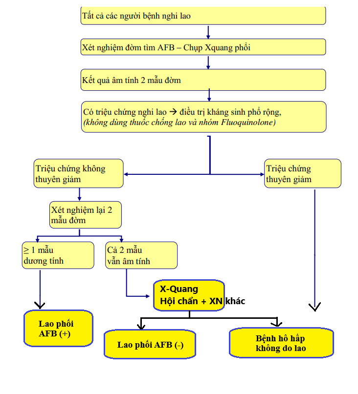
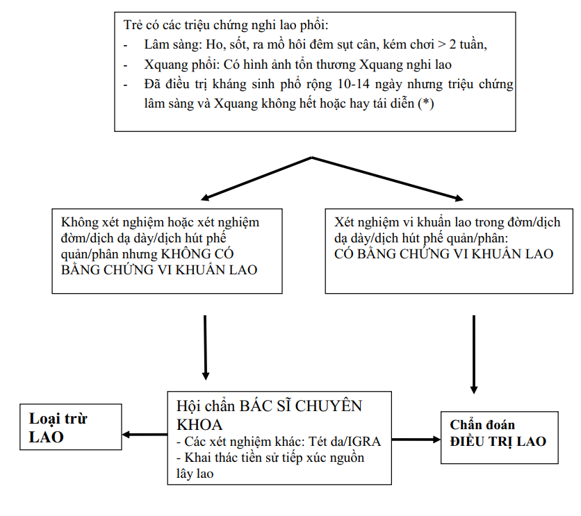
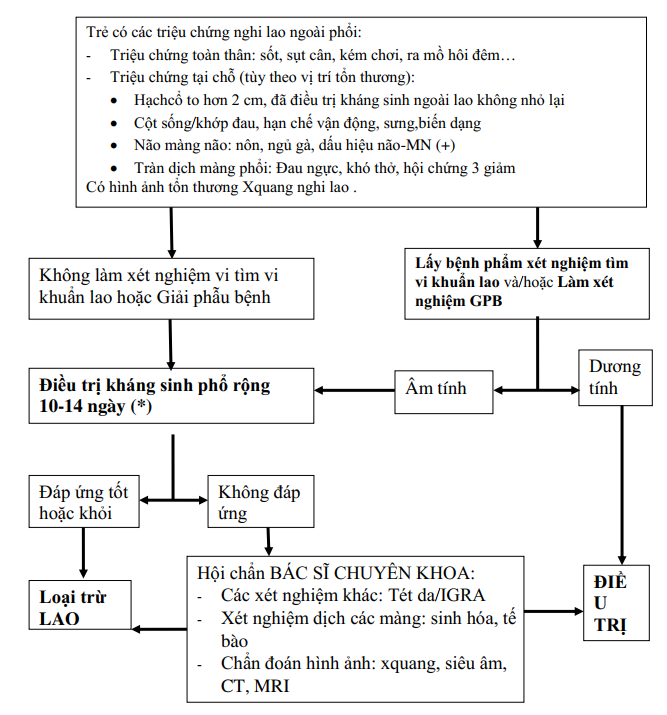
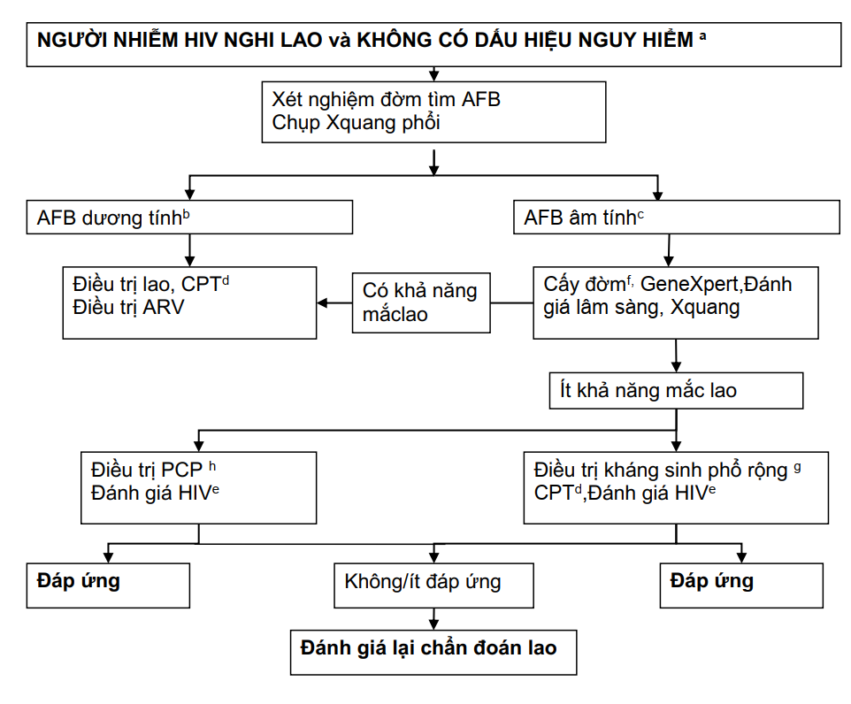
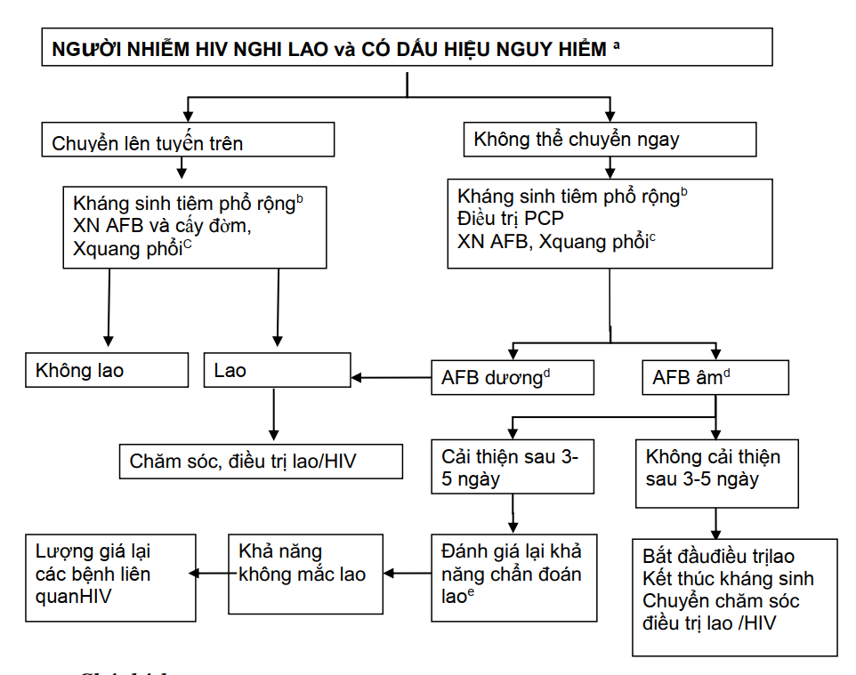
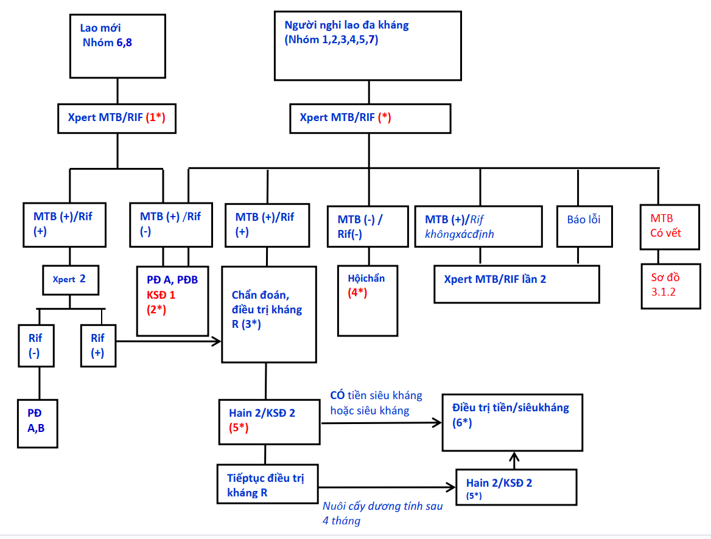

  

    

      
Ho &gt; 2 Tuần

      
Dấu hiệu nghi ngờ then chốt nhất định hướng tầm soát lao phổi

    

    

      
2 Giờ

      
Thời gian trả kết quả phát hiện MTB và đột biến kháng Rifampicin qua Xpert

    

    

      
8 Nhóm Nguy Cơ

      
Đối tượng ưu tiên bắt buộc chỉ định Xpert MTB/RIF tầm soát kháng thuốc

    

    

      
4 Triệu Chứng

      
Bộ tứ sàng lọc loại trừ lao hoạt động ở người nhiễm HIV (Ho, Sốt, Sút cân, Mồ hôi đêm)

    

  

  

    

      
🔬

      

        
Vi Sinh Đa Tầng

        
Kết hợp nhuộm soi đờm AFB trực tiếp, nuôi cấy môi trường đặc/lỏng MGIT và kỹ thuật sinh học phân tử Xpert MTB/RIF & LPA Hain test.

      

    

    

      
🎯

      

        
Phân Luồng Chặt Chẽ

        
Xác lập quy trình chẩn đoán phân nhánh cho Lao phổi AFB(-), Lao ngoài phổi, Lao đồng nhiễm HIV và tiếp cận đa chuyên khoa ở Trẻ em.

      

    

    

      
🛡️

      

        
Tầm Soát Kháng Thuốc

        
Chỉ định Xpert MTB/RIF sớm trước khởi trị để phát hiện RR-TB/MDR-TB, xử trí chính xác kết quả Xpert Ultra MTB vết và định hướng phác đồ phù hợp.

      

    

  

  

    <a href="#sec-1" class="quickmenu-item active">1. Nghi Lao & Phân Loại</a>
    <a href="#sec-2" class="quickmenu-item">2. Vi Sinh & Xpert</a>
    <a href="#sec-3" class="quickmenu-item">3. Lao Phổi & Ngoài Phổi</a>
    <a href="#sec-4" class="quickmenu-item">4. Lao Trẻ Em</a>
    <a href="#sec-5" class="quickmenu-item">5. Lao Đồng Nhiễm HIV</a>
    <a href="#sec-6" class="quickmenu-item">6. Lao Kháng Thuốc</a>
  

  <!-- ==================== SECTION 1 ==================== -->
  

    

      👥
      <h2 class="sec-title">1. Người Nghi Lao & Hệ Thống Phân Loại Bệnh Lao</h2>
    

    

      

        💡
        

          <strong>Định nghĩa Người Nghi Lao Phổi (Chương trình Chống lao Quốc gia - CTCLQG)</strong> 
          Người nghi lao phổi là người có triệu chứng <strong>ho kéo dài trên 2 tuần</strong> (ho khan, ho có đờm, ho ra máu). Đây là triệu chứng lâm sàng quan trọng nhất định hướng chỉ định xét nghiệm vi sinh.
        

      

      

        

          

          

            
🩺

            
Triệu Chứng Toàn Thân &amp; Cơ Năng

          

          

            <ul style="margin-left: 1rem; line-height: 1.7;">
              <li><strong>Sốt nhẹ về chiều:</strong> Thường sốt gai rét hoặc sốt nhẹ kéo dài liên tục nhiều tuần.</li>
              <li><strong>Ra mồ hôi đêm:</strong> Vã mồ hôi đầm đìa khi ngủ dù trời không nóng.</li>
              <li><strong>Hội chứng suy kiệt:</strong> Mệt mỏi kéo dài, chán ăn, gầy sút cân nhanh chóng.</li>
              <li><strong>Đau ngực &amp; Khó thở:</strong> Đau âm ỉ khu trú vùng tổn thương hoặc khó thở tăng dần khi tổn thương phổi lan tỏa/tràn dịch phối hợp.</li>
            </ul>
          

          
Dấu hiệu định hướng

        

        

          

          

            
📋

            
Khám Thực Thể Phổi

          

          

            <ul style="margin-left: 1rem; line-height: 1.7;">
              <li>Nghe phổi có thể hoàn toàn bình thường ở giai đoạn tổn thương sớm.</li>
              <li>Tổn thương đông đặc hoặc tạo hang: Nghe thấy ran ẩm, ran nổ khu trú vùng đỉnh phổi hoặc hội chứng hang.</li>
              <li>Tổn thương màng phổi phối hợp: Rung thanh giảm, gõ đục, rì rào phế nang giảm (Hội chứng 3 giảm).</li>
            </ul>
          

          
Khám lâm sàng

        

      

      <h3 style="margin-top: 1.5rem; margin-bottom: 0.75rem; font-size: 1.15rem; font-weight: 700; color: var(--color-primary);">
        Hệ Thống Phân Loại Bệnh Lao Toàn Diện (6 Chiều Phân Loại)
      </h3>

      

        

          

            <i class="fa-solid fa-network-wired"></i> Bảng 1. Khung Phân Loại Bệnh Lao Chuẩn Quốc Gia
          

          <i class="fa-solid fa-list-check"></i> Tiêu chuẩn phân loại
        

        

          <table class="comparison-table">
            <thead>
              <tr>
                <th style="width: 25%;">Tiêu chí phân loại</th>
                <th style="width: 40%;">Các phân nhóm lâm sàng</th>
                <th style="width: 35%;">Định nghĩa &amp; Ý nghĩa quản lý</th>
              </tr>
            </thead>
            <tbody>
              <tr>
                <td><strong>1. Vị trí giải phẫu</strong></td>
                <td>
                  • <strong>Lao phổi:</strong> Chiếm 80–85% (bao gồm cả thể Lao kê). 
                  • <strong>Lao ngoài phổi:</strong> Chiếm 15–20% (hạch, màng phổi, màng não, xương khớp, phúc mạc, màng ngoài tim, niệu dục...).
                </td>
                <td>Bệnh nhân có tổn thương đồng thời ở phổi và ngoài phổi được phân loại là <strong>Lao phổi</strong>.</td>
              </tr>
              <tr>
                <td><strong>2. Nhuộm soi trực tiếp</strong></td>
                <td>
                  • <strong>Lao phổi AFB(+):</strong> Ít nhất 1 mẫu bệnh phẩm soi trực tiếp có vi khuẩn lao. 
                  • <strong>Lao phổi AFB(-):</strong> Có ít nhất 2 mẫu đờm AFB(-) và thỏa mãn tiêu chuẩn chẩn đoán.
                </td>
                <td>Lao phổi AFB(+) là nguồn lây truyền chính trong cộng đồng, cần kiểm soát lây nhiễm nghiêm ngặt.</td>
              </tr>
              <tr>
                <td><strong>3. Bằng chứng vi sinh</strong></td>
                <td>
                  • <strong>Bệnh nhân có bằng chứng vi khuẩn:</strong> AFB(+), Nuôi cấy(+), hoặc Xpert/Hain(+). 
                  • <strong>Bệnh nhân chẩn đoán lâm sàng:</strong> Không có bằng chứng vi sinh, được thầy thuốc quyết định điều trị dựa trên lâm sàng + X-quang.
                </td>
                <td>Tất cả các ca chẩn đoán lâm sàng phải được hội chẩn chuyên khoa và nỗ lực tìm kiếm vi sinh.</td>
              </tr>
              <tr>
                <td><strong>4. Tiền sử điều trị thuốc</strong></td>
                <td>
                  • <strong>Mới:</strong> Chưa bao giờ dùng thuốc lao hoặc dùng dưới 1 tháng. 
                  • <strong>Tái phát:</strong> Đã điều trị khỏi/hoàn thành, nay chẩn đoán mắc lại. 
                  • <strong>Thất bại:</strong> AFB(+) hoặc cấy(+) từ tháng thứ 5 trở đi. 
                  • <strong>Điều trị lại sau bỏ trị:</strong> Bỏ thuốc liên tục ≥ 2 tháng nay quay lại với vi sinh (+). 
                  • <strong>Khác / Chuyển đến:</strong> Dùng thuốc &gt; 1 tháng không rõ kết quả hoặc chuyển cơ sở.
                </td>
                <td>Các nhóm Tái phát, Thất bại, Bỏ trị được coi là <strong>người nghi ngờ kháng thuốc</strong>, bắt buộc làm Xpert.</td>
              </tr>
              <tr>
                <td><strong>5. Tình trạng nhiễm HIV</strong></td>
                <td>
                  • Lao / HIV(+) 
                  • Lao / HIV(-) 
                  • Lao / Không rõ tình trạng HIV
                </td>
                <td>Tư vấn xét nghiệm HIV chủ động (PITC) cho 100% bệnh nhân lao ngay khi tiếp nhận.</td>
              </tr>
              <tr>
                <td><strong>6. Mức độ kháng thuốc</strong></td>
                <td>
                  • <strong>Kháng đơn:</strong> Kháng 1 thuốc hàng 1 khác Rifampicin. 
                  • <strong>Kháng nhiều:</strong> Kháng ≥ 2 thuốc hàng 1 nhưng không kháng R. 
                  • <strong>Kháng Rifampicin (RR-TB):</strong> Kháng R (có/không kháng thuốc khác). 
                  • <strong>Lao đa kháng (MDR-TB):</strong> Kháng đồng thời ít nhất Isoniazid (H) và Rifampicin (R). 
                  • <strong>Tiền siêu kháng (preXDR):</strong> MDR + kháng thêm Fluoroquinolone (FQ) hoặc 1 thuốc tiêm hàng 2. 
                  • <strong>Siêu kháng (XDR-TB):</strong> MDR + kháng FQ + kháng ít nhất 1 thuốc tiêm hàng 2 (Amikacin/Kanamycin/Capreomycin).
                </td>
                <td>Quyết định phân tuyến điều trị và chuyển giao sang phác đồ hàng 2 chuyên biệt.</td>
              </tr>
            </tbody>
          </table>
        

      

    

  

  <!-- ==================== SECTION 2 ==================== -->
  

    

      🔬
      <h2 class="sec-title">2. Kỹ Thuật Vi Sinh Cốt Lõi &amp; Lộ Trình Xpert</h2>
    

    

      

        

          

            <i class="fa-solid fa-vial"></i> Bảng 2. Đối Sánh Các Kỹ Thuật Vi Sinh Chẩn Đoán Bệnh Lao
          

          <i class="fa-solid fa-microscope"></i> Xét nghiệm chuẩn
        

        

          <table class="diagnostic-table">
            <thead>
              <tr>
                <th style="width: 22%;">Kỹ thuật xét nghiệm</th>
                <th style="width: 28%;">Nguyên lý &amp; Hình ảnh đặc trưng</th>
                <th style="width: 20%;">Thời gian trả kết quả</th>
                <th style="width: 30%;">Chỉ định &amp; Giá trị lâm sàng</th>
              </tr>
            </thead>
            <tbody>
              <tr>
                <td><strong>Nhuộm soi Ziehl-Neelsen (ZN)</strong></td>
                <td>Nhuộm nóng Carbofuchsin tẩy cồn-acid: Trực khuẩn mảnh, màu đỏ, đứng riêng rẽ hoặc thành chùm trên nền xanh Methylene.</td>
                <td>Trong ngày (khoảng 2–3 giờ)</td>
                <td>Xét nghiệm nền tảng bắt buộc. Yêu cầu lấy <strong>2 mẫu đờm tại chỗ</strong> cách nhau ít nhất 2 giờ.</td>
              </tr>
              <tr>
                <td><strong>Nhuộm Huỳnh Quang (LED)</strong></td>
                <td>Nhuộm Auramine O: Vi khuẩn phát sáng màu vàng/xanh huỳnh quang trên nền tối.</td>
                <td>Trong ngày</td>
                <td>Đọc tiêu bản nhanh hơn, trường nhìn rộng hơn, tăng độ nhạy khoảng 10% so với ZN cổ điển.</td>
              </tr>
              <tr>
                <td><strong>Xpert MTB/RIF &amp; Ultra</strong></td>
                <td>Real-time PCR tự động khép kín khuếch đại gen rpoB phát hiện phức hợp <em>M. tuberculosis</em> và đột biến kháng Rifampicin.</td>
                <td>Khoảng 2 giờ</td>
                <td>Độ nhạy &gt; 98% ở ca AFB(+), 70–80% ở ca AFB(-). Giúp phát hiện nhanh RR-TB trước khi bắt đầu phác đồ hàng 1.</td>
              </tr>
              <tr>
                <td><strong>Nuôi cấy môi trường lỏng (BACTEC MGIT)</strong></td>
                <td>Hệ thống huỳnh quang giám sát tiêu thụ oxy tự động trong ống nuôi cấy lỏng 7H9.</td>
                <td><strong>Khoảng 2 tuần</strong> (10–14 ngày)</td>
                <td>Tiêu chuẩn vàng về độ nhạy. Bắt buộc cho theo dõi phác đồ kháng thuốc và nhóm ca khó chẩn đoán (HIV, trẻ em).</td>
              </tr>
              <tr>
                <td><strong>Nuôi cấy môi trường đặc (Löwenstein-Jensen)</strong></td>
                <td>Khuẩn lạc sần sùi màu trắng ngà hoặc vàng kem dạng súp lơ trên thạch trứng LJ.</td>
                <td><strong>3 – 4 tuần</strong> (tối đa 8 tuần)</td>
                <td>Kỹ thuật kinh điển, chi phí thấp, dùng làm kháng sinh đồ tỷ lệ và lưu trữ chủng vi khuẩn.</td>
              </tr>
              <tr>
                <td><strong>Hain test (Line Probe Assay - LPA)</strong></td>
                <td>Lai phân tử trên dải giấy phát hiện đột biến kháng H và R (LPA 1), hoặc kháng FQ và thuốc tiêm (LPA 2).</td>
                <td>24 – 48 giờ</td>
                <td>Chẩn đoán nhanh tiền siêu kháng và siêu kháng thuốc trên bệnh phẩm đờm AFB(+) hoặc mẫu nuôi cấy.</td>
              </tr>
            </tbody>
          </table>
        

      

      

        ⚠️
        

          <strong>Quy Trình Xử Trí Kết Quả "MTB Vết" (Xpert Ultra Trace Calls)</strong> 
          Xpert Ultra có độ nhạy siêu cao nên có thể phát hiện lượng cực nhỏ ADN vi khuẩn (vết - trace), không xác định được tính nhạy cảm với Rifampicin:
          <ul style="margin-top: 0.5rem; margin-left: 1.2rem; line-height: 1.6;">
            <li><strong>Nhóm 1 (Trẻ em, người nhiễm HIV, nghi ngờ lao màng não, hoặc người lớn thuộc nhóm nguy cơ cao kháng thuốc):</strong> Coi là kết quả dương tính thực sự. Bắt đầu phác đồ điều trị phù hợp, đồng thời lấy mẫu làm Ultra lần 2 và nuôi cấy / KSĐ hàng 1 để kiểm chứng.</li>
            <li><strong>Nhóm 2 (Người lớn có tiền sử điều trị lao thành công trong vòng 2 năm gần đây):</strong> Cần hết sức thận trọng vì kết quả có thể do xác vi khuẩn lao tồn dư. Không vội vàng kết luận lao tái phát; bắt buộc hội chẩn lâm sàng, đối chiếu diễn tiến X-quang, thử kháng sinh phổ rộng và chờ kết quả nuôi cấy MGIT.</li>
          </ul>
        

      

      <h3 style="margin-top: 1.5rem; margin-bottom: 0.75rem; font-size: 1.15rem; font-weight: 700; color: var(--color-primary);">
        Lộ Trình Mở Rộng Ứng Dụng Xét Nghiệm Xpert MTB/RIF Tại Việt Nam (2017–2020)
      </h3>

      

        

          

          

            
📅

            
Mốc 2017: Nhóm Nguy Cơ &amp; AFB(+)

          

          

            
Tập trung chẩn đoán kháng thuốc ở nhóm nguy cơ cao (thất bại, tái phát, bỏ trị) và bệnh nhân lao mới AFB(+). Bước đầu mở rộng cho nhóm đặc biệt: người có HIV, trẻ em, lao màng não.

          

          
Giai đoạn 1

        

        

          

          

            
📅

            
Mốc 2018: Phủ Toàn Bộ Lao AFB(-)

          

          

            
Bắt buộc thực hiện xét nghiệm Xpert MTB/RIF trước khi điều trị cho tất cả các trường hợp được chẩn đoán lao phổi AFB(-) nhằm hạn chế chẩn đoán quá mức và phát hiện sớm kháng R.

          

          
Giai đoạn 2

        

        

          

          

            
📅

            
Mốc 2019: Tổn Thương X-Quang Bất Thường

          

          

            
Mở rộng chỉ định Xpert cho tất cả các đối tượng chụp X-quang phổi có tổn thương bất thường nghi ngờ lao, không phụ thuộc vào tình trạng ho khạc đờm.

          

          
Giai đoạn 3

        

        

          

          

            
📅

            
Từ Năm 2020: Bao Phủ Người Nghi Lao

          

          

            
Tiến tới xét nghiệm Xpert MTB/RIF ngay từ đầu cho mọi đối tượng có biểu hiện nghi lao (tùy thuộc vào nguồn lực y tế từng địa phương) thay thế dần kỹ thuật soi trực tiếp.

          

          
Mục tiêu 2020

        

      

    

  

  <!-- ==================== SECTION 3 ==================== -->
  

    

      🫁
      <h2 class="sec-title">3. Tiêu Chuẩn Chẩn Đoán Lao Phổi &amp; Lao Ngoài Phổi</h2>
    

    

      <h3 style="margin-top: 0; margin-bottom: 0.75rem; font-size: 1.15rem; font-weight: 700; color: var(--color-primary);">
        3.1. Tiêu Chuẩn Chẩn Đoán Xác Định Lao Phổi
      </h3>
      

        Bệnh nhân được chẩn đoán xác định mắc bệnh lao phổi khi có <strong>hình ảnh X-quang ngực bất thường nghi lao</strong> và thỏa mãn một trong hai tiêu chuẩn sau:
      

      

        

          

          

            
1️⃣

            
Tiêu Chuẩn Có Bằng Chứng Vi Sinh

          

          

            
Tìm thấy vi khuẩn lao trong bệnh phẩm đường hô hấp (đờm, dịch phế quản, dịch rửa dạ dày):

            <ul style="margin-left: 1rem; line-height: 1.6;">
              <li>Ít nhất 1 mẫu soi trực tiếp có AFB(+).</li>
              <li>HOẶC kết quả xét nghiệm Xpert MTB/RIF dương tính (+).</li>
              <li>HOẶC kết quả nuôi cấy phân lập được vi khuẩn lao (+).</li>
            </ul>
          

          
Tiêu chuẩn vàng

        

        

          

          

            
2️⃣

            
Tiêu Chuẩn Chẩn Đoán Lâm Sàng

          

          

            
Khi các xét nghiệm vi sinh ban đầu đều âm tính, chẩn đoán dựa trên:

            <ul style="margin-left: 1rem; line-height: 1.6;">
              <li>Lâm sàng nghi lao điển hình kéo dài &gt; 2 tuần.</li>
              <li>Không đáp ứng với đợt điều trị kháng sinh phổ rộng 10–14 ngày (trừ nhóm Quinolone).</li>
              <li>Tổn thương X-quang phổi tiến triển phù hợp bệnh lao do <strong>bác sĩ chuyên khoa lao hội chẩn</strong> quyết định.</li>
            </ul>
          

          
Hội chẩn chuyên khoa

        

      

      

        🚨
        

          <strong>Thể Lâm Sàng Đặc Biệt: Lao Kê (Miliary Tuberculosis)</strong> 
          Lao kê là thể lao lan tỏa toàn thân qua đường máu, biểu hiện tổn thương rầm rộ nhất tại phổi, thường gặp ở trẻ nhỏ hoặc người suy giảm miễn dịch nặng (HIV). 
          Hình ảnh X-quang phổi kinh điển biểu hiện quy luật <strong>"3 đều"</strong>: kích thước hạt kê đều nhau (khoảng 1–2 mm), mật độ phân bố đều khắp hai phế trường từ đỉnh đến đáy phổi, và đậm độ cản quang đều nhau.
        

      

      <!-- FIGURE 1: Phụ lục 2 - Lao phổi AFB(-) -->
      

        
        

          
Figure 1 (Phụ Lục 2). Sơ Đồ Quy Trình Chẩn Đoán Lao Phổi AFB(-)

          Mọi trường hợp nghi lao được xét nghiệm 2 mẫu đờm tìm AFB và chụp X-quang phổi. Nếu cả 2 mẫu AFB(-), bệnh nhân được điều trị thử bằng kháng sinh phổ rộng 10–14 ngày (không dùng nhóm Quinolone và thuốc chống lao). Nếu không đỡ, xét nghiệm lại 2 mẫu đờm: nếu có mẫu (+) chẩn đoán Lao phổi AFB(+); nếu vẫn (-), tiến hành hội chẩn chuyên khoa kết hợp X-quang để phân định Lao phổi AFB(-) hoặc Bệnh phổi không lao.
        

      

      <h3 style="margin-top: 1.75rem; margin-bottom: 0.75rem; font-size: 1.15rem; font-weight: 700; color: var(--color-primary);">
        3.2. Chẩn Đoán Các Thể Lao Ngoài Phổi Thường Gặp
      </h3>

      

        

          

            <i class="fa-solid fa-bone"></i> Bảng 3. Dấu Hiệu Lâm Sàng &amp; Tiêu Chuẩn Chẩn Đoán Lao Ngoài Phổi
          

          <i class="fa-solid fa-stethoscope"></i> Lâm sàng chuyên sâu
        

        

          <table class="diagnostic-table">
            <thead>
              <tr>
                <th style="width: 20%;">Thể bệnh</th>
                <th style="width: 40%;">Triệu chứng lâm sàng điển hình</th>
                <th style="width: 40%;">Cận lâm sàng &amp; Tiêu chuẩn xác chẩn</th>
              </tr>
            </thead>
            <tbody>
              <tr>
                <td><strong>Lao hạch</strong></td>
                <td>Hay gặp hạch vùng cổ dọc cơ ức đòn chũm. Hạch sưng to thành chuỗi, không đau, lúc đầu chắc di động, sau nhuyễn hóa dính vào nhau và da, vỡ tạo lỗ rò chảy chất bã đậu khó liền.</td>
                <td>Chọc hút kim nhỏ (FNA) hoặc sinh thiết hạch: Tổn thương nang lao điển hình (hoại tử bã đậu, tế bào bán liên, tế bào khổng lồ Langhans). Nhuộm soi AFB hoặc Xpert dịch hạch (+).</td>
              </tr>
              <tr>
                <td><strong>Tràn dịch màng phổi do lao</strong></td>
                <td>Sốt, đau ngực kiểu màng phổi, ho khan, khó thở tăng dần. Khám thực thể: Hội chứng 3 giảm (rung thanh giảm, gõ đục, rì rào phế nang mất).</td>
                <td>X-quang: Hình mờ đậm thuần nhất đáy phổi có đường cong Damoiseau. Chọc hút dịch: Dịch tiết màu vàng chanh, Protein &gt; 30 g/L, Rivalta(+), ưu thế Lympho (&gt; 70%), ADA tăng cao. Sinh thiết màng phổi tìm nang lao.</td>
              </tr>
              <tr>
                <td><strong>Tràn dịch màng ngoài tim</strong></td>
                <td>Đau ngực sau xương ức, khó thở khi nằm, tĩnh mạch cổ nổi, tiếng tim mờ xa xăm, huyết áp kẹt, dấu hiệu mạch nghịch (Tam chứng Beck khi chèn ép tim cấp).</td>
                <td>X-quang bóng tim to hình bầu rượu. Siêu âm tim: Lớp dịch tự do màng tim, phát hiện sớm dấu hiệu dọa chèn ép tim (ép nhĩ/thất phải). Dịch chọc dò là dịch tiết ưu thế Lympho.</td>
              </tr>
              <tr>
                <td><strong>Lao màng bụng</strong></td>
                <td>Sốt dai dẳng, đau bụng âm ỉ mơ hồ, bụng trướng to dần, rối loạn đại tiện. Khám sờ thấy bụng căng chắc kiểu ngọn nến hoặc các mảng thâm nhiễm, gõ đục vùng thấp.</td>
                <td>Siêu âm / CT ổ bụng: Dịch tự do dịch tiết, dính các quai ruột, hạch mạc treo phì đại. Soi ổ bụng sinh thiết phúc mạc thấy các nốt kê lao màu trắng rải rác là tiêu chuẩn vàng.</td>
              </tr>
              <tr>
                <td><strong>Lao màng não</strong></td>
                <td>Giai đoạn sớm: Nhức đầu tăng dần, sốt nhẹ, thay đổi tính tình. Giai đoạn toàn phát: Nôn vọt, táo bón, cổ cứng, Kernig(+), Brudzinski(+), liệt thần kinh sọ (dây III, VI, VII), rối loạn ý thức.</td>
                <td>Chọc dò tủy sống (DNT): Áp lực tăng, dịch trong hoặc vàng chanh; Protein tăng cao (1–5 g/L), Glucose hạ (&lt; 50% đường máu song song), Tế bào tăng (50–500/mm³ ưu thế Lympho). Xpert/MGIT DNT (+).</td>
              </tr>
              <tr>
                <td><strong>Lao cột sống (Bệnh Pott)</strong></td>
                <td>Đau khu trú tại đốt sống tổn thương, đau tăng khi vận động, co cứng cơ cạnh sống, hạn chế cúi gập. Giai đoạn muộn: Biến dạng gù cột sống, áp xe lạnh cạnh cột sống, liệt hai chi dưới do chèn ép tủy.</td>
                <td>X-quang / MRI cột sống: Hẹp khe đĩa đệm, tiêu xương bờ trước thân đốt sống liền kề, hình ảnh ổ áp xe hình thoi quanh đốt sống. Sinh thiết đốt sống hoặc chọc hút mủ áp xe tìm vi khuẩn.</td>
              </tr>
            </tbody>
          </table>
        

      

    

  

  <!-- ==================== SECTION 4 ==================== -->
  

    

      👶
      <h2 class="sec-title">4. Chẩn Đoán Bệnh Lao Ở Trẻ Em</h2>
    

    

      

        💡
        

          <strong>Đặc Thù Bệnh Lao Nhi Khoa</strong> 
          Trẻ em mắc lao thường có số lượng vi khuẩn rất thấp (thể ít vi khuẩn - paucibacillary), trẻ nhỏ không biết khạc đờm nên xét nghiệm soi trực tiếp thường âm tính. Chẩn đoán đòi hỏi phối hợp toàn diện giữa tiền sử dịch tễ tiếp xúc, xét nghiệm miễn dịch nhiễm lao (TST/IGRA), hình ảnh học và các kỹ thuật lấy bệnh phẩm đặc thù.
        

      

      

        

          

          

            
🏡

            
1. Yếu Tố Dịch Tễ &amp; Lâm Sàng

          

          

            <ul style="margin-left: 1rem; line-height: 1.6;">
              <li><strong>Nguồn lây:</strong> Sống cùng nhà hoặc tiếp xúc gần với người mắc lao phổi (đặc biệt là người lớn AFB(+)) trong vòng 1–2 năm qua.</li>
              <li><strong>Triệu chứng kéo dài &gt; 2 tuần:</strong> Sốt nhẹ dai dẳng, mồ hôi trộm, ho khan hoặc ho khạc, mệt mỏi, kém chơi.</li>
              <li><strong>Chậm lớn:</strong> Chán ăn, sút cân hoặc không tăng cân liên tục trong 2–3 tháng, suy dinh dưỡng dù được bổ sung đầy đủ.</li>
              <li><strong>Thất bại kháng sinh:</strong> Đã điều trị đợt kháng sinh phổ rộng 10–14 ngày nhưng không đỡ.</li>
            </ul>
          

          
Dịch tễ &amp; Lâm sàng

        

        

          

          

            
🧪

            
2. Cận Lâm Sàng Đánh Giá

          

          

            <ul style="margin-left: 1rem; line-height: 1.6;">
              <li><strong>Bệnh phẩm lấy mẫu:</strong> Hút dịch dạ dày vào sáng sớm (khi trẻ mới ngủ dậy, chưa ăn uống), dịch hút phế quản, phân hoặc đờm (nếu trẻ lớn).</li>
              <li><strong>Xét nghiệm vi sinh:</strong> Xpert MTB/RIF Ultra (ưu tiên số 1), nuôi cấy MGIT và soi AFB.</li>
              <li><strong>Xét nghiệm nhiễm lao:</strong> Phản ứng Mantoux (TST: dương tính khi đường kính sưng chai ≥ 10 mm ở trẻ bình thường, hoặc ≥ 5 mm ở trẻ có HIV/suy dinh dưỡng nặng) hoặc xét nghiệm IGRA máu.</li>
              <li><strong>X-quang ngực:</strong> Phì đại hạch rốn phổi/trung thất, phức hợp nguyên thủy, hình ảnh xẹp phổi phân thùy.</li>
            </ul>
          

          
Tiêu chuẩn chẩn đoán

        

      

      <!-- FIGURE 6: Phụ lục 6 - Sơ đồ chẩn đoán lao phổi trẻ em -->
      

        
        

          
Figure 2 (Phụ Lục 6). Sơ Đồ Hướng Dẫn Quy Trình Chẩn Đoán Lao Phổi Trẻ Em

          Trẻ nghi lao phổi (ho, sốt, sút cân &gt; 2 tuần, X-quang nghi lao, kháng sinh phổ rộng 10–14 ngày không giảm) được chỉ định xét nghiệm tìm vi khuẩn trong đờm/dịch dạ dày/dịch hút phế quản/phân. Nếu có bằng chứng vi khuẩn → Điều trị lao ngay; Nếu không có bằng chứng vi khuẩn → Hội chẩn bác sĩ chuyên khoa dựa trên TST/IGRA, tiền sử tiếp xúc và biến đổi X-quang để quyết định Điều trị lao hoặc Loại trừ lao.
        

      

      <!-- FIGURE 2: Phụ lục 7 - Lao ngoài phổi trẻ em -->
      

        
        

          
Figure 3 (Phụ Lục 7). Sơ Đồ Quy Trình Chẩn Đoán Lao Ngoài Phổi Trẻ Em

          Trẻ có triệu chứng nghi lao ngoài phổi (hạch cổ &gt; 2cm, đau khớp/cột sống, hội chứng não-màng não, tràn dịch màng phổi) kèm X-quang nghi lao được lấy bệnh phẩm xét nghiệm vi khuẩn và/hoặc mô bệnh học. Nếu dương tính → Điều trị lao; Nếu âm tính hoặc không thể lấy mẫu → Dùng kháng sinh phổ rộng 10–14 ngày (tránh Quinolone). Nếu không đáp ứng, hội chẩn chuyên khoa đánh giá TST/IGRA, dịch màng và nguồn lây trong 2 năm để quyết định điều trị.
        

      

    

  

  <!-- ==================== SECTION 5 ==================== -->
  

    

      🎗️
      <h2 class="sec-title">5. Chẩn Đoán Lao Đồng Nhiễm HIV</h2>
    

    

      

        ⚠️
        

          <strong>Mối Tương Tác Hai Chiều Phức Tạp Giữa Lao &amp; HIV</strong> 
          Nhiễm HIV làm tăng nguy cơ kích hoạt lao tiềm ẩn thành bệnh lao hoạt động lên gấp 20–30 lần. Ngược lại, bệnh lao thúc đẩy virus HIV nhân lên nhanh chóng và làm suy giảm tế bào CD4 trầm trọng. Bệnh nhân HIV mắc lao thường có triệu chứng lâm sàng không điển hình, X-quang ít tạo hang, tỷ lệ AFB(-) và lao ngoài phổi rất cao.
        

      

      

        

          

          

            
🔍

            
Bộ Tứ Triệu Chứng Sàng Lọc (W4SS)

          

          

            
Tại mỗi lần khám bệnh, nhân viên y tế bắt buộc sàng lọc 4 triệu chứng (ở bất kỳ thời gian nào):

            <ol style="margin-left: 1.2rem; line-height: 1.6;">
              <li><strong>Ho</strong> (bất kể thời gian bao lâu).</li>
              <li><strong>Sốt</strong> (sốt nhẹ về chiều hoặc sốt thất thường).</li>
              <li><strong>Sút cân</strong> (sút cân không rõ nguyên nhân).</li>
              <li><strong>Ra mồ hôi đêm</strong>.</li>
            </ol>
            

              • <strong>Nếu có ≥ 1 triệu chứng:</strong> Nghi ngờ mắc bệnh lao → Chuyển làm xét nghiệm chẩn đoán. 
              • <strong>Nếu âm tính cả 4 triệu chứng:</strong> Loại trừ bệnh lao hoạt động → Chỉ định điều trị Lao tiềm ẩn (LTA).
            

          

          
Sàng lọc bắt buộc

        

        

          

          

            
📸

            
Đặc Điểm Hình Ảnh Học &amp; Vi Sinh

          

          

            <ul style="margin-left: 1rem; line-height: 1.6;">
              <li><strong>Giai đoạn CD4 &gt; 350/mm³:</strong> Biểu hiện tổn thương X-quang tương tự người không có HIV (thâm nhiễm vùng đỉnh phổi, tạo hang).</li>
              <li><strong>Giai đoạn CD4 &lt; 200/mm³:</strong> Tổn thương dạng kê lan tỏa hai phế trường, thâm nhiễm thùy dưới, phì đại hạch rốn phổi/trung thất, rất hiếm khi thấy hang lao, thậm chí 10–15% X-quang hoàn toàn bình thường.</li>
              <li><strong>Ưu tiên vi sinh:</strong> Bắt buộc chỉ định Xpert MTB/RIF và nuôi cấy MGIT cho 100% người có HIV nghi lao.</li>
            </ul>
          

          
Đặc thù miễn dịch

        

      

      <!-- FIGURE 4: Phụ lục 4 - Người HIV nghi lao không dấu hiệu nặng -->
      

        
        

          
Figure 4 (Phụ Lục 4). Sơ Đồ Quy Trình Chẩn Đoán Lao Phổi Ở Người HIV(+) Không Có Dấu Hiệu Nặng

          Áp dụng cho người nhiễm HIV nghi lao còn tự đi lại được, không khó thở, không sốt cao, mạch &lt; 120 lần/phút: Thực hiện xét nghiệm AFB đờm và X-quang ngực. Nếu AFB(+) → Khởi trị lao ngay, kèm Cotrimoxazol (CPT) và ARV sau 2 tuần; Nếu AFB(-) → Làm GeneXpert và cấy MGIT. Đánh giá khả năng mắc lao: nếu có khả năng → Điều trị lao; nếu ít khả năng → Điều trị thử kháng sinh phổ rộng (trừ Quinolone) hoặc phác đồ PCP, sau đó lượng giá lại chẩn đoán.
        

      

      <!-- FIGURE 5: Phụ lục 5 - Người HIV nghi lao có dấu hiệu nặng -->
      

        
        

          
Figure 5 (Phụ Lục 5). Sơ Đồ Quy Trình Chẩn Đoán Lao Phổi Ở Người HIV(+) Có Dấu Hiệu Nặng (Nguy Hiểm)

          Người nhiễm HIV nghi lao có bất kỳ dấu hiệu nguy hiểm nào (nhịp thở &gt; 30 lần/phút, sốt &gt; 39°C, mạch &gt; 120 lần/phút, không tự đi lại được): Nếu không thể chuyển tuyến ngay, bắt đầu điều trị khẩn cấp bằng kháng sinh tiêm phổ rộng (trừ Quinolone) phối hợp điều trị PCP. Đồng thời khẩn trương lấy bệnh phẩm xét nghiệm AFB, cấy đờm và chụp X-quang tại giường. Lượng giá lại lâm sàng sau 3–5 ngày để quyết định bổ sung thuốc điều trị lao.
        

      

    

  

  <!-- ==================== SECTION 6 ==================== -->
  

    

      🛡️
      <h2 class="sec-title">6. Chẩn Đoán &amp; Phân Tầng Lao Kháng Thuốc</h2>
    

    

      

        🎯
        

          <strong>Chỉ Định Xét Nghiệm Sinh Học Phân Tử Xpert MTB/RIF Ưu Tiên</strong> 
          Chương trình Chống lao Quốc gia quy định <strong>8 nhóm đối tượng nguy cơ cao</strong> bắt buộc phải được làm xét nghiệm Xpert MTB/RIF để tầm soát kháng Rifampicin ngay khi tiếp nhận:
          <ol style="margin-top: 0.5rem; margin-left: 1.2rem; line-height: 1.6;">
            <li>Người bệnh thất bại phác đồ lao nhạy cảm (không kháng R).</li>
            <li>Người nghi lao hoặc người bệnh lao mới có tiền sử tiếp xúc gần với bệnh nhân lao đa kháng (MDR-TB).</li>
            <li>Bệnh nhân không âm hóa đờm sau 2 hoặc 3 tháng điều trị phác đồ không kháng R.</li>
            <li>Bệnh nhân lao tái phát sau khi đã điều trị khỏi hoặc hoàn thành.</li>
            <li>Bệnh nhân lao điều trị lại sau bỏ trị (ngừng thuốc liên tục ≥ 2 tháng).</li>
            <li>Người bệnh lao mới được chẩn đoán có nhiễm HIV(+).</li>
            <li>Người nghi lao có tiền sử sử dụng thuốc chống lao trên 1 tháng trước đây.</li>
            <li>Người bệnh lao phổi mới (sàng lọc trong số ca AFB(+) hoặc mở rộng ca AFB(-)).</li>
          </ol>
        

      

      <!-- FIGURE 3: Phụ lục 3.1 - Sơ đồ 3.1.1 Chẩn đoán lao kháng thuốc -->
      

        
        

          
Figure 6 (Phụ Lục 3.1). Sơ Đồ Chẩn Đoán Lao Kháng Thuốc Theo Các Nhóm Nguy Cơ

          Quy trình xử lý kết quả Xpert MTB/RIF: Đối với nhóm nguy cơ kháng cao (Nhóm 1–5, 7), nếu kết quả MTB(+)/Rif(+) → Chẩn đoán Lao kháng R, bắt đầu phác đồ kháng R (ưu tiên phác đồ ngắn hạn 9 tháng nếu đủ điều kiện) đồng thời làm LPA 2 / KSĐ 2 để loại trừ tiền siêu kháng/siêu kháng; Nếu kết quả MTB(+)/Rif(-) → Chỉ định phác đồ lao nhạy cảm A hoặc B và làm KSĐ hàng 1. Đối với nhóm lao mới (Nhóm 6, 8), nếu MTB(+)/Rif(+) cần làm lại Xpert mẫu 2 để xác chẩn trước khi chuyển phác đồ kháng thuốc.
        

      

      

        

          

            <i class="fa-solid fa-triangle-exclamation"></i> Bảng 4. Ma Trận Phân Biệt Các Mức Độ Lao Kháng Thuốc
          

          <i class="fa-solid fa-dna"></i> Phân tầng vi sinh
        

        

          <table class="diagnostic-table">
            <thead>
              <tr>
                <th style="width: 25%;">Kiểu hình kháng thuốc</th>
                <th style="width: 35%;">Định nghĩa vi sinh</th>
                <th style="width: 40%;">Chiến lược cận lâm sàng tiếp theo</th>
              </tr>
            </thead>
            <tbody>
              <tr>
                <td><strong>Kháng đơn thuốc (Mono-resistance)</strong></td>
                <td>Chỉ kháng với 1 loại thuốc chống lao hàng 1 duy nhất (H, Z, E, hoặc S) nhưng <strong>còn nhạy cảm hoàn toàn với Rifampicin</strong>.</td>
                <td>Nếu kháng đơn Isoniazid (H) → Chỉ định phác đồ chuyên biệt 6 R(H)ZELfx. Làm lại Xpert ở tháng 0, 2, 3 để theo dõi phát triển kháng R.</td>
              </tr>
              <tr>
                <td><strong>Kháng nhiều thuốc (Poly-resistance)</strong></td>
                <td>Kháng từ 2 loại thuốc chống lao hàng 1 trở lên nhưng <strong>không kháng đồng thời cả H và R</strong> (ví dụ: kháng H + E, hoặc H + Z + S).</td>
                <td>Làm kháng sinh đồ hàng 1 đầy đủ, thiết kế phác đồ cá thể hóa dựa trên các thuốc còn hiệu lực, bảo vệ tuyệt đối Rifampicin.</td>
              </tr>
              <tr>
                <td><strong>Lao kháng Rifampicin (RR-TB)</strong></td>
                <td>Có bằng chứng kháng Rifampicin trên Xpert MTB/RIF, Hain test hoặc KSĐ (có thể nhạy hoặc kháng kèm các thuốc khác).</td>
                <td>Được quản lý và điều trị tương đương như Lao đa kháng thuốc (MDR-TB). Chỉ định ngay LPA hàng 2 để tầm soát tiền siêu kháng.</td>
              </tr>
              <tr>
                <td><strong>Lao đa kháng thuốc (MDR-TB)</strong></td>
                <td>Kháng <strong>đồng thời ít nhất với Isoniazid (H) và Rifampicin (R)</strong>, là hai trụ cột mạnh nhất của phác đồ hàng 1.</td>
                <td>Chuyển cơ sở chuyên khoa điều trị lao kháng thuốc. Đánh giá tiêu chuẩn vào phác đồ chuẩn ngắn hạn 9–11 tháng hoặc dài hạn 18–20 tháng.</td>
              </tr>
              <tr>
                <td><strong>Tiền siêu kháng (preXDR-TB)</strong></td>
                <td>Lao đa kháng thuốc (MDR-TB) có kháng thêm với bất kỳ thuốc nào thuộc nhóm <strong>Fluoroquinolone (Lfx/Mfx)</strong> HOẶC ít nhất 1 <strong>thuốc tiêm hàng 2 (Am/Km/Cm)</strong>.</td>
                <td>Bắt buộc làm Hain test LPA 2 và KSĐ nồng độ tối thiểu. Xây dựng phác đồ cá thể hóa (Phác đồ E1 hoặc E2) có Bedaquiline / Linezolid.</td>
              </tr>
              <tr>
                <td><strong>Siêu kháng thuốc (XDR-TB)</strong></td>
                <td>MDR-TB kháng đồng thời cả với <strong>Fluoroquinolone</strong> VÀ ít nhất 1 <strong>thuốc tiêm hàng 2</strong>.</td>
                <td>Hội chẩn Hội đồng chuyên môn Quốc gia / Khu vực. Phác đồ cá thể hóa phức hợp kết hợp Bedaquiline, Delamanid, Linezolid, Clofazimine và Carbapenem.</td>
              </tr>
            </tbody>
          </table>
        

      

    

  

  <!-- ==================== CITATION BOX ==================== -->
  

    <strong>Tài liệu gốc tham chiếu:</strong>
    <ol style="margin-top: 0.5rem; margin-bottom: 0; padding-left: 1.25rem; line-height: 1.8; color: var(--color-text-muted); font-size: 0.88rem;">
      <li>Bộ Y tế Việt Nam. <em>Hướng dẫn chẩn đoán, điều trị và dự phòng bệnh lao</em> (Ban hành kèm theo Quyết định số 1314/QĐ-BYT ngày 24 tháng 3 năm 2020 của Bộ trưởng Bộ Y tế). Hà Nội, Việt Nam: Bộ Y tế; 2020.</li>
      <li>Chương trình Chống lao Quốc gia (CTCLQG). <em>Sổ tay hướng dẫn quản lý bệnh lao kháng thuốc và lộ trình mở rộng xét nghiệm GeneXpert</em>. Hà Nội: Nhà xuất bản Y học; 2020.</li>
    </ol>
  

<!-- BOTTOM NAVIGATION -->

  

    <a href="#/ebm/kho-guidelines" class="btn btn-primary">
      <i class="fa-solid fa-arrow-left"></i> Quay lại Kho Guidelines
    </a>
    <a href="#/ebm/kho-guidelines/2020-byt-lao-p2" class="btn btn-secondary">
      Xem Tiếp Phần 2: Điều Trị, ADR &amp; Viêm Gan <i class="fa-solid fa-arrow-right"></i>
    </a>
    <a href="#sec-1" class="btn">
      <i class="fa-solid fa-arrow-up"></i> Lên đầu trang
    </a>
  

