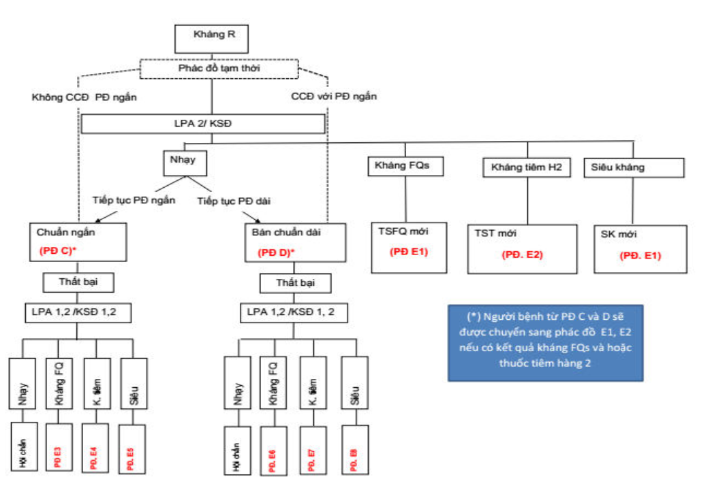
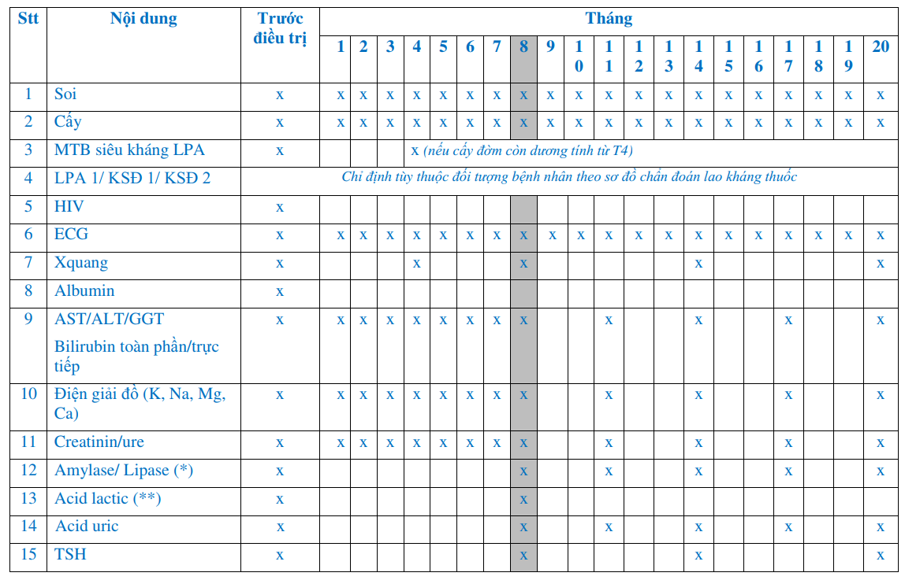
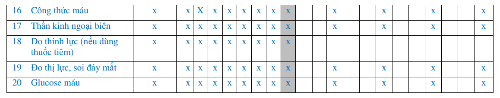

  

    

      
4 Nguyên Tắc

      
Phối hợp - Đúng liều - Đều đặn - Đủ thời gian (Tấn công 2-3th + Duy trì 4-6th)

    

    

      
9 – 11 Tháng

      
Liệu trình Phác đồ chuẩn ngắn hạn điều trị Lao đa kháng thuốc (MDR-TB / RR-TB)

    

    

      
&gt; 5 Lần ULN

      
Ngưỡng men gan bắt buộc ngừng khẩn cấp toàn bộ các thuốc độc gan (H, R, Z)

    

    

      
&gt; 250 µmol/L

      
Ngưỡng Bilirubin kết hợp men gan &gt; 10x ULN chỉ định xem xét Thay huyết tương (PE)

    

  

  

    

      
💊

      

        
Chuẩn Hóa Phác Đồ

        
Cấu trúc rõ ràng giữa Phác đồ nhạy cảm (A1/A2/B1/B2), Phác đồ kháng đơn Isoniazid (6 R(H)ZELfx), và Phác đồ đa kháng phân nhóm A-B-C theo WHO 2019.

      

    

    

      
🧬

      

        
Viêm Gan Chuyên Sâu

        
Làm rõ cơ chế phân tử enzym NAT2 / CYP2E1, chất độc acetyl diazine, yếu tố dự đoán độc lập (Albumin thấp, bệnh kèm) và bảng phân độ định lượng ULN.

      

    

    

      
🛡️

      

        
Dự Phòng &amp; DOTS

        
Bảo vệ cộng đồng qua điều trị Lao tiềm ẩn (9H người lớn / 6H trẻ em), tiêm chủng vắc xin BCG, kiểm soát lây nhiễm buồng khám và mạng lưới giám sát 3 cấp.

      

    

  

  

    <a href="#sec-1" class="quickmenu-item active">1. Nguyên Tắc &amp; Thuốc</a>
    <a href="#sec-2" class="quickmenu-item">2. Phác Đồ Điều Trị</a>
    <a href="#sec-3" class="quickmenu-item">3. Quần Thể Đặc Biệt</a>
    <a href="#sec-4" class="quickmenu-item">4. Giám Sát &amp; Đánh Giá</a>
    <a href="#sec-5" class="quickmenu-item">5. Xử Trí ADR</a>
    <a href="#sec-6" class="quickmenu-item">6. Viêm Gan Chuyên Sâu</a>
    <a href="#sec-7" class="quickmenu-item">7. Phòng Bệnh &amp; DOTS</a>
  

  <!-- ==================== SECTION 1 ==================== -->
  

    

      💊
      <h2 class="sec-title">1. Nguyên Tắc Điều Trị &amp; Phân Loại Thuốc Chống Lao</h2>
    

    

      <h3 style="margin-top: 0; margin-bottom: 0.75rem; font-size: 1.15rem; font-weight: 700; color: var(--color-primary);">
        1.1. Bốn Nguyên Tắc Vàng Trong Điều Trị Bệnh Lao
      </h3>

      

        

          

          

            
1️⃣

            
Phối Hợp Các Thuốc Chống Lao

          

          

            
Mỗi thuốc có cơ chế tác dụng khác nhau trên vi khuẩn (diệt khuẩn nhanh, diệt khuẩn tiệt căn, tác động ở các môi trường pH nội bào / ngoại bào khác nhau):

            <ul style="margin-left: 1rem; line-height: 1.6;">
              <li><em>Lao nhạy cảm:</em> Phối hợp ít nhất 3 loại thuốc ở giai đoạn tấn công và ít nhất 2 loại ở giai đoạn duy trì.</li>
              <li><em>Lao đa kháng:</em> Phối hợp ít nhất 5 thuốc có hiệu lực, gồm Pyrazinamide (Z) và 4 thuốc lao hàng hai.</li>
            </ul>
          

          
Nguyên tắc 1

        

        

          

          

            
2️⃣

            
Dùng Thuốc Đúng Liều Theo Cân Nặng

          

          

            
Mỗi thuốc chống lao có một ngưỡng nồng độ ức chế và diệt khuẩn nhất định:

            <ul style="margin-left: 1rem; line-height: 1.6;">
              <li>Dùng liều thấp không đạt hiệu quả điều trị và nhanh chóng chọn lọc đột biến kháng thuốc.</li>
              <li>Dùng liều quá cao làm bùng phát độc tính và tai biến nặng nề (độc gan, thần kinh, thận).</li>
              <li>Với trẻ em, bắt buộc phải cân và <strong>chỉnh liều hàng tháng</strong> theo cân nặng thực tế.</li>
            </ul>
          

          
Nguyên tắc 2

        

        

          

          

            
3️⃣

            
Dùng Thuốc Đều Đặn (Uống Cùng 1 Lần)

          

          

            
Các thuốc chống lao phải được uống cùng một lần vào một thời điểm cố định trong ngày:

            <ul style="margin-left: 1rem; line-height: 1.6;">
              <li>Uống xa bữa ăn (thường uống vào buổi sáng <strong>lúc đói</strong> trước ăn 30–60 phút) để đạt đỉnh nồng độ thuốc trong máu tối đa (Cmax).</li>
              <li>Thực hiện điều trị có giám sát trực tiếp (DOTS - Directly Observed Treatment Short-course).</li>
            </ul>
          

          
Nguyên tắc 3

        

        

          

          

            
4️⃣

            
Dùng Thuốc Đủ Thời Gian &amp; 2 Giai Đoạn

          

          

            
Điều trị chia làm hai giai đoạn liên tục:

            <ul style="margin-left: 1rem; line-height: 1.6;">
              <li><em>Giai đoạn tấn công (2–3 tháng):</em> Tiêu diệt nhanh số lượng lớn vi khuẩn đang phân chia mạnh để cắt đứt nguồn lây và ngăn đột biến kháng thuốc.</li>
              <li><em>Giai đoạn duy trì (4–6 tháng):</em> Tiêu diệt triệt để các vi khuẩn lao còn sót lại nằm ẩn trong tổn thương để chống tái phát.</li>
            </ul>
          

          
Nguyên tắc 4

        

      

      <h3 style="margin-top: 1.75rem; margin-bottom: 0.75rem; font-size: 1.15rem; font-weight: 700; color: var(--color-primary);">
        1.2. Bảng Liều Lượng Các Thuốc Chống Lao Hàng 1 Theo Cân Nặng (Phụ lục 8)
      </h3>

      

        

          

            <i class="fa-solid fa-scale-balanced"></i> Bảng 1 (Phụ Lục 8). Liều Dùng Thuốc Chống Lao Thiết Yếu Hàng Ngày
          

          <i class="fa-solid fa-pills"></i> Dược lý lâm sàng
        

        

          <table class="regimen-table">
            <thead>
              <tr>
                <th style="width: 25%;">Thuốc chống lao (Ký hiệu)</th>
                <th style="width: 35%;">Liều khuyến cáo Người lớn</th>
                <th style="width: 40%;">Liều khuyến cáo Trẻ em</th>
              </tr>
            </thead>
            <tbody>
              <tr>
                <td class="source-cell"><strong>Isoniazid (H)</strong></td>
                <td><strong>5 mg/kg/ngày</strong> (dao động 4–6 mg/kg, tối đa 300 mg/ngày)</td>
                <td><strong>10 mg/kg/ngày</strong> (dao động 7–15 mg/kg, tối đa 300 mg/ngày)</td>
              </tr>
              <tr>
                <td class="source-cell"><strong>Rifampicin (R)</strong></td>
                <td><strong>10 mg/kg/ngày</strong> (dao động 8–12 mg/kg, tối đa 600 mg/ngày)</td>
                <td><strong>15 mg/kg/ngày</strong> (dao động 10–20 mg/kg, tối đa 600 mg/ngày)</td>
              </tr>
              <tr>
                <td class="source-cell"><strong>Pyrazinamide (Z)</strong></td>
                <td><strong>25 mg/kg/ngày</strong> (dao động 20–30 mg/kg/ngày)</td>
                <td><strong>35 mg/kg/ngày</strong> (dao động 30–40 mg/kg/ngày)</td>
              </tr>
              <tr>
                <td class="source-cell"><strong>Ethambutol (E)</strong></td>
                <td><strong>15 mg/kg/ngày</strong> (dao động 15–20 mg/kg/ngày)</td>
                <td><strong>20 mg/kg/ngày</strong> (dao động 15–25 mg/kg/ngày)</td>
              </tr>
              <tr>
                <td class="source-cell"><strong>Streptomycin (S)</strong></td>
                <td><strong>15 mg/kg/ngày</strong> (dao động 12–18 mg/kg, tối đa 1000 mg; người &gt; 60 tuổi dùng 500–750 mg)</td>
                <td><strong>15 mg/kg/ngày</strong> (dao động 12–18 mg/kg, tối đa 1000 mg/ngày)</td>
              </tr>
            </tbody>
          </table>
        

      

      <h3 style="margin-top: 1.75rem; margin-bottom: 0.75rem; font-size: 1.15rem; font-weight: 700; color: var(--color-primary);">
        1.3. Phân Nhóm Thuốc Hàng 2 Điều Trị Lao Kháng Thuốc (WHO 2019)
      </h3>

      

        

          

            <i class="fa-solid fa-layer-group"></i> Bảng 2. Phân Loại 3 Nhóm Thuốc Hàng Hai (WHO 2019)
          

          <i class="fa-solid fa-shield-virus"></i> Kháng thuốc
        

        

          <table class="comparison-table">
            <thead>
              <tr>
                <th style="width: 25%;">Nhóm thuốc</th>
                <th style="width: 35%;">Danh mục hoạt chất</th>
                <th style="width: 40%;">Nguyên tắc lựa chọn khi lập phác đồ dài hạn</th>
              </tr>
            </thead>
            <tbody>
              <tr>
                <td><strong style="color: #059669;">Nhóm A</strong> Ưu tiên hàng đầu</td>
                <td>
                  • Levofloxacin (Lfx) HOẶC Moxifloxacin (Mfx) 
                  • Bedaquiline (Bdq) 
                  • Linezolid (Lzd)
                </td>
                <td><strong>Bắt buộc chọn cả 3 thuốc</strong> trong nhóm A nếu không có chống chỉ định hoặc vi khuẩn không kháng thuốc.</td>
              </tr>
              <tr>
                <td><strong style="color: #0284c7;">Nhóm B</strong> Ưu tiên thứ hai</td>
                <td>
                  • Clofazimine (Cfz) 
                  • Cycloserine (Cs) HOẶC Terizidone (Trd)
                </td>
                <td><strong>Thêm 1 hoặc cả 2 thuốc</strong> của nhóm B để đảm bảo đủ tối thiểu 4 thuốc hàng hai có hiệu lực ở giai đoạn đầu.</td>
              </tr>
              <tr>
                <td><strong style="color: #d97706;">Nhóm C</strong> Bổ sung</td>
                <td>
                  • Ethambutol (E), Delamanid (Dlm) 
                  • Pyrazinamide (Z) 
                  • Imipenem-cilastatin (Ipm-Cln) HOẶC Meropenem (Mpm) 
                  • Amikacin (Am) HOẶC Streptomycin (S) 
                  • Ethionamide (Eto) HOẶC Prothionamide (Pto) 
                  • p-aminosalicylic acid (PAS)
                </td>
                <td><strong>Chỉ bổ sung</strong> khi không thể chọn đủ thuốc từ Nhóm A và Nhóm B (do kháng thuốc, không dung nạp hoặc chống chỉ định). Lưu ý: Kanamycin và Capreomycin không còn được khuyến cáo.</td>
              </tr>
            </tbody>
          </table>
        

      

    

  

  <!-- ==================== SECTION 2 ==================== -->
  

    

      💊
      <h2 class="sec-title">2. Phác Đồ Điều Trị Lao Nhạy Cảm &amp; Kháng Thuốc</h2>
    

    

      <h3 style="margin-top: 0; margin-bottom: 0.75rem; font-size: 1.15rem; font-weight: 700; color: var(--color-primary);">
        2.1. Phác Đồ Chuẩn Cho Vi Khuẩn Nhạy Cảm Thuốc (Hàng 1)
      </h3>

      

        

          

            <i class="fa-solid fa-list-ol"></i> Bảng 3. Danh Mục Các Phác Đồ Lao Nhạy Cảm Thuốc Chuẩn Quốc Gia
          

          <i class="fa-solid fa-check-double"></i> Phác đồ hàng 1
        

        

          <table class="regimen-table">
            <thead>
              <tr>
                <th style="width: 20%;">Tên phác đồ</th>
                <th style="width: 35%;">Cấu trúc công thức thuốc</th>
                <th style="width: 45%;">Chỉ định &amp; Lưu ý lâm sàng đặc biệt</th>
              </tr>
            </thead>
            <tbody>
              <tr>
                <td class="source-cell">Chuẩn 1 <strong>Phác đồ A1</strong></td>
                <td><strong>2RHZE / 4RHE</strong> Tấn công 2 tháng (R-H-Z-E hàng ngày) + Duy trì 4 tháng (R-H-E hàng ngày).</td>
                <td>Chỉ định cho bệnh nhân <strong>Lao phổi và Lao ngoài phổi ở người lớn</strong> không có bằng chứng kháng thuốc.</td>
              </tr>
              <tr>
                <td class="source-cell">Nhi khoa <strong>Phác đồ A2</strong></td>
                <td><strong>2RHZE / 4RH</strong> Tấn công 2 tháng (R-H-Z-E hàng ngày) + Duy trì 4 tháng (R-H hàng ngày).</td>
                <td>Chỉ định cho <strong>Lao phổi và Lao ngoài phổi ở trẻ em</strong> không có bằng chứng kháng thuốc (giai đoạn duy trì không cần Ethambutol).</td>
              </tr>
              <tr>
                <td class="source-cell">Kéo dài <strong>Phác đồ B1</strong></td>
                <td><strong>2RHZE / 10RHE</strong> Tấn công 2 tháng (R-H-Z-E hàng ngày) + Duy trì 10 tháng (R-H-E hàng ngày).</td>
                <td>Chỉ định cho <strong>Lao màng não, Lao xương khớp và Lao hạch ở người lớn</strong>. • <em>Lao màng não:</em> Bắt buộc phối hợp Corticoid (Dexamethasone/Prednisolone giảm liều 6–8 tuần) và dùng <strong>Streptomycin (S) thay Ethambutol (E)</strong> ở giai đoạn tấn công.</td>
              </tr>
              <tr>
                <td class="source-cell">Nhi kéo dài <strong>Phác đồ B2</strong></td>
                <td><strong>2RHZE / 10RH</strong> Tấn công 2 tháng (R-H-Z-E hàng ngày) + Duy trì 10 tháng (R-H hàng ngày).</td>
                <td>Chỉ định cho <strong>Lao màng não, Lao xương khớp và Lao hạch ở trẻ em</strong> (kèm Corticosteroid và Streptomycin thay E ở giai đoạn tấn công cho lao màng não).</td>
              </tr>
            </tbody>
          </table>
        

      

      

        🚨
        

          <strong>Bãi Bỏ Hoàn Toàn Phác Đồ II Cũ (Có Streptomycin) Cho Ca Tái Phát / Bỏ Trị</strong> 
          Chương trình Chống lao Quốc gia <strong>không còn áp dụng Phác đồ II (2SRHZE/1RHZE/5RHE)</strong>. Tất cả bệnh nhân tái phát, thất bại, điều trị lại sau bỏ trị đều được xếp vào nhóm nghi lao kháng thuốc:
          <ul style="margin-top: 0.35rem; margin-left: 1.2rem; line-height: 1.6;">
            <li>Bắt buộc làm xét nghiệm Xpert MTB/RIF ngay lập tức.</li>
            <li>Nếu kết quả <strong>Không kháng Rifampicin:</strong> Chỉ định lại Phác đồ A1/A2 hoặc B1/B2 dựa trên độ tuổi và thể bệnh.</li>
            <li>Nếu kết quả <strong>Kháng Rifampicin:</strong> Chuyển sang phác đồ điều trị lao kháng thuốc chuyên biệt.</li>
          </ul>
        

      

      <h3 style="margin-top: 1.75rem; margin-bottom: 0.75rem; font-size: 1.15rem; font-weight: 700; color: var(--color-primary);">
        2.2. Phác Đồ Điều Trị Kháng Đơn Isoniazid (H)
      </h3>
      

        Khi có kết quả kháng sinh đồ xác định vi khuẩn chỉ kháng với Isoniazid (có thể kèm hoặc không kèm kháng Streptomycin) và <strong>hoàn toàn nhạy cảm với Rifampicin</strong>:
      

      

        

          

            <i class="fa-solid fa-capsules"></i> Bảng 4. Phác Đồ Điều Trị Kháng Đơn Isoniazid (H ± S)
          

          <i class="fa-solid fa-dna"></i> Kháng đơn thuốc
        

        

          <table class="regimen-table">
            <thead>
              <tr>
                <th style="width: 25%;">Công thức phác đồ</th>
                <th style="width: 35%;">Thành phần thuốc &amp; Thời gian</th>
                <th style="width: 40%;">Lưu ý theo dõi lâm sàng bắt buộc</th>
              </tr>
            </thead>
            <tbody>
              <tr>
                <td class="source-cell"><strong>6 R(H)ZELfx</strong></td>
                <td>Dùng phối hợp <strong>Rifampicin + Pyrazinamide + Ethambutol + Levofloxacin</strong> hàng ngày liên tục trong <strong>6 tháng</strong>.</td>
                <td>
                  • Không dùng Isoniazid liều thông thường. 
                  • Làm xét nghiệm Xpert MTB/RIF vào <strong>tháng thứ 0, 2 và 3</strong> để phát hiện kịp thời nguy cơ xuất hiện đột biến kháng Rifampicin. 
                  • Nếu Levofloxacin không dung nạp, có thể thay thế bằng Moxifloxacin.
                </td>
              </tr>
            </tbody>
          </table>
        

      

      <h3 style="margin-top: 1.75rem; margin-bottom: 0.75rem; font-size: 1.15rem; font-weight: 700; color: var(--color-primary);">
        2.3. Các Phác Đồ Điều Trị Lao Kháng Thuốc (MDR-TB / RR-TB)
      </h3>

      

        

          

          

            
⚡

            
1. Phác Đồ Chuẩn Ngắn Hạn 9–11 Tháng (Phác đồ C)

          

          

            
<strong>Công thức:</strong> <code>4-6 Am Lfx Pto Cfz Z Hliều cao E / 5 Lfx Cfz Z E</code>

            <ul style="margin-left: 1rem; line-height: 1.6;">
              <li><em>Giai đoạn tấn công (4–6 tháng):</em> Amikacin + Levofloxacin + Prothionamide + Clofazimine + Pyrazinamide + Isoniazid liều cao (10–15 mg/kg) + Ethambutol hàng ngày.</li>
              <li><em>Giai đoạn duy trì (5 tháng):</em> Levofloxacin + Clofazimine + Pyrazinamide + Ethambutol hàng ngày.</li>
              <li><em>Chỉ định:</em> Bệnh nhân lao phổi kháng R/MDR-TB chưa dùng thuốc hàng 2 quá 1 tháng và không có bằng chứng kháng thuốc hàng 2.</li>
              <li><em>Tiêu chuẩn loại trừ:</em> Có thai/cho con bú; lao ngoài phổi nặng (màng não); tổn thương gan nặng; khoảng QTc ≥ 500 ms; kháng hoặc nghi ngờ mất hiệu lực với bất kỳ thuốc nào trong phác đồ (trừ H).</li>
            </ul>
          

          
Ưu tiên hàng đầu

        

        

          

          

            
🛡️

            
2. Phác Đồ Bán Chuẩn Dài Hạn 18–20 Tháng (Phác đồ D)

          

          

            
<strong>Công thức:</strong> <code>Lfx Cfz Lzd Cs + 1 thuốc nhóm C</code>

            <ul style="margin-left: 1rem; line-height: 1.6;">
              <li>Xây dựng hoàn toàn bằng thuốc uống: Chọn đủ 3 thuốc Nhóm A (Lfx + Bdq + Lzd) phối hợp thuốc Nhóm B (Cfz + Cs).</li>
              <li>Bedaquiline (Bdq) dùng trong 6 tháng đầu; Linezolid dùng tối thiểu 6 tháng (chú ý độc tính tủy xương và thị thần kinh).</li>
              <li><em>Chỉ định:</em> Bệnh nhân kháng R nhưng có chống chỉ định với phác đồ ngắn hạn (có thai, lao ngoài phổi phức tạp, lao/HIV tiến triển, không dung nạp thuốc phác đồ ngắn).</li>
            </ul>
          

          
Phác đồ thay thế

        

      

      <!-- FIGURE 1: Phụ lục 3.2 - Sơ đồ điều trị lao kháng thuốc -->
      

        
        

          
Figure 1 (Phụ Lục 3.2 / Sơ Đồ 3.2.2). Sơ Đồ Quyết Định Phác Đồ Điều Trị Lao Kháng Thuốc

          Bệnh nhân có xét nghiệm Xpert MTB/RIF (+) bắt đầu phác đồ tạm thời và làm ngay xét nghiệm Hain test LPA 2 / KSĐ hàng 2: Nếu không có chống chỉ định phác đồ ngắn → Điều trị Phác đồ chuẩn ngắn hạn 9–11 tháng (Phác đồ C); Nếu có chống chỉ định phác đồ ngắn → Điều trị Phác đồ bán chuẩn dài hạn 18–20 tháng (Phác đồ D); Nếu xét nghiệm phát hiện có kháng Fluoroquinolone hoặc thuốc tiêm hàng 2 → Chuyển sang các phác đồ cá thể hóa E1 đến E8.
        

      

    

  

  <!-- ==================== SECTION 3 ==================== -->
  

    

      🏥
      <h2 class="sec-title">3. Quản Lý Bệnh Lao Trên Các Quần Thể Đặc Biệt</h2>
    

    

      

        

          

            <i class="fa-solid fa-user-doctor"></i> Bảng 5. Hướng Dẫn Điều Chỉnh Điều Trị Lao Cho Các Nhóm Đặc Biệt
          

          <i class="fa-solid fa-notes-medical"></i> Lâm sàng chuyên biệt
        

        

          <table class="regimen-table">
            <thead>
              <tr>
                <th style="width: 22%;">Nhóm bệnh nhân đặc biệt</th>
                <th style="width: 38%;">Nguyên tắc lựa chọn phác đồ &amp; Hiệu chỉnh liều</th>
                <th style="width: 40%;">Chống chỉ định &amp; Cảnh báo an toàn</th>
              </tr>
            </thead>
            <tbody>
              <tr>
                <td class="source-cell"><strong>Phụ nữ mang thai &amp; Cho con bú</strong></td>
                <td>Áp dụng phác đồ chuẩn <strong>2RHZE / 4RHE</strong>. Bắt buộc bổ sung <strong>Vitamin B6 (Pyridoxine) 25 mg/ngày</strong> để bảo vệ thần kinh thai nhi. Trẻ bú mẹ vẫn cho bú bình thường.</td>
                <td><strong>Chống chỉ định tuyệt đối Streptomycin</strong> và các thuốc tiêm aminoglycosides khác do độc tính gây điếc bẩm sinh và tổn thương tiền đình ốc tai thai nhi.</td>
              </tr>
              <tr>
                <td class="source-cell"><strong>Phụ nữ dùng thuốc tránh thai</strong></td>
                <td>Rifampicin là chất cảm ứng enzym cytochrom P450 mạnh tại gan, làm tăng thoái giáng estrogen và progestin, làm mất hiệu lực tránh thai đường uống.</td>
                <td>Khuyến cáo chuyển sang <strong>biện pháp tránh thai phi nội tiết</strong> (bao cao su, đặt vòng tránh thai dụng cụ tử cung) hoặc dùng viên tránh thai chứa liều estrogen cao (≥ 50 µg).</td>
              </tr>
              <tr>
                <td class="source-cell"><strong>Bệnh nhân suy thận (eGFR &lt; 30 mL/phút hoặc Lọc máu)</strong></td>
                <td>• Isoniazid và Rifampicin chuyển hóa qua gan nên dùng liều bình thường. • <strong>Pyrazinamide (Z) và Ethambutol (E)</strong> thải qua thận: Hiệu chỉnh dùng <strong>3 lần/tuần</strong> (Z: 25–35 mg/kg; E: 15–25 mg/kg), uống ngay sau khi kết thúc cữ chạy thận nhân tạo.</td>
                <td>Tránh dùng nhóm aminoglycosides tiêm (Streptomycin, Amikacin) do nguy cơ tích lũy độc tính nặng trên thận và ốc tai.</td>
              </tr>
              <tr>
                <td class="source-cell"><strong>Bệnh nhân có bệnh gan mạn tính / Xơ gan</strong></td>
                <td>• <em>Bệnh gan ổn định:</em> Dùng phác đồ chuẩn và theo dõi men gan sát. • <em>Viêm gan tiến triển / Suy gan:</em> Giảm thuốc độc gan: - Còn 2 thuốc độc gan: <code>9 HRE</code> hoặc <code>2 HRSE/6 RH</code>. - Còn 1 thuốc độc gan: <code>2 HES/10 HE</code>. - Không thuốc độc gan: <code>18-24 SE FQs</code>.</td>
                <td>Ngừng toàn bộ thuốc độc gan (H, R, Z) khi men gan AST/ALT &gt; 5 lần ULN (hoặc &gt; 3 lần kèm triệu chứng lâm sàng chán ăn, vàng da, buồn nôn).</td>
              </tr>
              <tr>
                <td class="source-cell"><strong>Lao đồng nhiễm HIV</strong></td>
                <td>• Khởi động điều trị lao càng sớm càng tốt. • Bắt đầu <strong>điều trị ARV sau 2 tuần</strong> kể từ khi dung nạp thuốc lao (nếu CD4 &lt; 50/mm³ cần dùng trong vòng 2 tuần đầu; với lao màng não hoãn ARV 4–8 tuần). • Điều trị dự phòng nhiễm trùng cơ hội bằng Cotrimoxazol (CPT).</td>
                <td>Cảnh giác Hội chứng phục hồi miễn dịch (IRIS): Bệnh nhân sốt cao, hạch to, tổn thương X-quang xấu đi sau khi dùng ARV. Xử trí triệu chứng, tiếp tục thuốc lao và ARV, dùng Corticoid 1 mg/kg/ngày trong 1–2 tuần nếu IRIS nặng.</td>
              </tr>
            </tbody>
          </table>
        

      

    

  

  <!-- ==================== SECTION 4 ==================== -->
  

    

      📋
      <h2 class="sec-title">4. Giám Sát Điều Trị &amp; Đánh Giá Kết Quả</h2>
    

    

      <h3 style="margin-top: 0; margin-bottom: 0.75rem; font-size: 1.15rem; font-weight: 700; color: var(--color-primary);">
        4.1. Lịch Xét Nghiệm Đờm Định Kỳ Cho Phác Đồ Lao Nhạy Cảm (6 Tháng)
      </h3>

      

        

          

          

            
2️⃣

            
Cuối Tháng Thứ 2

          

          

            
• Nếu đờm AFB(-) → Chuyển sang giai đoạn duy trì. • Nếu đờm còn AFB(+) → Vẫn chuyển duy trì nhưng soi lại đờm ở cuối tháng thứ 3.

          

          
Hết tấn công

        

        

          

          

            
3️⃣

            
Cuối Tháng Thứ 3 (Nếu T2 còn +)

          

          

            
Nếu cuối tháng thứ 3 đờm vẫn còn AFB(+) → Bắt buộc làm ngay <strong>xét nghiệm Xpert MTB/RIF và nuôi cấy MGIT</strong> để tầm soát lao kháng thuốc.

          

          
Cảnh báo kháng thuốc

        

        

          

          

            
5️⃣

            
Cuối Tháng Thứ 5

          

          

            
Nếu đờm AFB(+) ở tháng thứ 5 → Được xác định là <strong>Thất bại điều trị</strong>. Ngừng phác đồ hàng 1, làm Xpert/LPA và chuyển phác đồ kháng thuốc.

          

          
Đánh giá thất bại

        

        

          

          

            
6️⃣

            
Cuối Tháng Thứ 6

          

          

            
Nếu đờm AFB(-) ở tháng thứ 6 và ở lần xét nghiệm trước đó → Xác nhận tiêu chuẩn <strong>Khỏi bệnh</strong>.

          

          
Kết thúc liệu trình

        

      

      <h3 style="margin-top: 1.75rem; margin-bottom: 0.75rem; font-size: 1.15rem; font-weight: 700; color: var(--color-primary);">
        4.2. Giám Sát Cận Lâm Sàng Trong Phác Đồ Lao Kháng Thuốc Dài Hạn (18–20 Tháng)
      </h3>

      <!-- FIGURE 2 & 3: Lịch xét nghiệm phác đồ dài hạn -->
      

        
        

          
Figure 2. Danh Mục Xét Nghiệm Theo Dõi Điều Trị Phác Đồ Dài Hạn (Phần 1: Vi Sinh, Lâm Sàng &amp; Điện Tim)

          Soi đờm trực tiếp và nuôi cấy vi khuẩn được thực hiện trước điều trị và <strong>hàng tháng</strong> liên tục từ tháng 1 đến tháng 20. Điện tâm đồ (ECG) đo định kỳ hàng tháng để theo dõi khoảng QTc khi sử dụng Bedaquiline, Moxifloxacin, Clofazimine. Đo thính lực đồ hàng tháng nếu có dùng thuốc tiêm Aminoglycoside.
        

      

      

        
        

          
Figure 3. Danh Mục Xét Nghiệm Theo Dõi Điều Trị Phác Đồ Dài Hạn (Phần 2: Sinh Hóa &amp; Huyết Học)

          Theo dõi công thức máu toàn phần (đặc biệt khi dùng Linezolid gây ức chế tủy), men gan (AST/ALT/Bilirubin), Creatinine máu và điện giải đồ (K+, Mg2+, Ca2+), xét nghiệm chức năng tuyến giáp TSH (khi dùng Ethionamide/PAS) và đường huyết định kỳ hàng tháng.
        

      

      <h3 style="margin-top: 1.75rem; margin-bottom: 0.75rem; font-size: 1.15rem; font-weight: 700; color: var(--color-primary);">
        4.3. Định Nghĩa 6 Kết Quả Điều Trị Theo Chuẩn Quốc Tế (WHO)
      </h3>

      

        

          

            <i class="fa-solid fa-flag-checkered"></i> Bảng 6. Định Nghĩa Tiêu Chuẩn Kết Quả Điều Trị Bệnh Lao
          

          <i class="fa-solid fa-square-poll-vertical"></i> Tiêu chuẩn WHO
        

        

          <table class="diagnostic-table">
            <thead>
              <tr>
                <th style="width: 25%;">Kết quả điều trị</th>
                <th style="width: 75%;">Tiêu chuẩn xác định cụ thể</th>
              </tr>
            </thead>
            <tbody>
              <tr>
                <td><strong style="color: #059669;">Khỏi (Cured)</strong></td>
                <td>Người bệnh lao phổi có bằng chứng vi khuẩn học ban đầu, có kết quả xét nghiệm soi đờm hoặc nuôi cấy <strong>âm tính ở tháng cuối cùng</strong> của liệu trình điều trị và có ít nhất một lần âm tính ở lần xét nghiệm trước đó.</td>
              </tr>
              <tr>
                <td><strong style="color: #0284c7;">Hoàn thành điều trị (Completed)</strong></td>
                <td>Người bệnh đã uống đủ số liều thuốc theo quy định của phác đồ nhưng không có kết quả xét nghiệm vi sinh ở tháng cuối cùng (do không khạc được đờm hoặc không làm xét nghiệm).</td>
              </tr>
              <tr>
                <td><strong style="color: #dc2626;">Thất bại điều trị (Failed)</strong></td>
                <td>Người bệnh có kết quả xét nghiệm soi đờm hoặc nuôi cấy <strong>dương tính từ tháng thứ 5 trở đi</strong>, HOẶC phát hiện chủng vi khuẩn kháng thuốc (MDR-TB) trong quá trình điều trị.</td>
              </tr>
              <tr>
                <td><strong style="color: #475569;">Chết (Died)</strong></td>
                <td>Người bệnh tử vong do bất kỳ nguyên nhân nào (bao gồm cả tai nạn, bệnh nền khác) trước khi bắt đầu hoặc trong quá trình điều trị lao.</td>
              </tr>
              <tr>
                <td><strong style="color: #d97706;">Bỏ trị (Lost to follow-up)</strong></td>
                <td>Người bệnh tự ý ngưng uống thuốc liên tục từ <strong>2 tháng trở lên</strong> mà không có sự đồng ý của bác sĩ điều trị.</td>
              </tr>
              <tr>
                <td><strong style="color: #059669;">Điều trị thành công (Success)</strong></td>
                <td>Tổng số bệnh nhân đạt kết quả <strong>Khỏi</strong> cộng với số bệnh nhân <strong>Hoàn thành điều trị</strong> (Khỏi + Hoàn thành).</td>
              </tr>
            </tbody>
          </table>
        

      

    

  

  <!-- ==================== SECTION 5 ==================== -->
  

    

      ⚠️
      <h2 class="sec-title">5. Phát Hiện, Phân Độ &amp; Xử Trí Biến Cố Bất Lợi (ADR)</h2>
    

    

      

        

          

          

            
1️⃣

            
Độ 1 (Nhẹ)

          

          

            
Biểu hiện thoáng qua; hoạt động sinh hoạt không bị hạn chế; không cần dùng thuốc can thiệp hoặc điều chỉnh phác đồ lao.

          

          
Theo dõi tại nhà

        

        

          

          

            
2️⃣

            
Độ 2 (Vừa)

          

          

            
Sinh hoạt bị hạn chế nhẹ đến trung bình; có thể cần trợ giúp tối thiểu; yêu cầu can thiệp điều trị triệu chứng tối thiểu.

          

          
Can thiệp tối thiểu

        

        

          

          

            
3️⃣

            
Độ 3 (Nặng)

          

          

            
Sinh hoạt bị hạn chế đáng kể, thường xuyên cần trợ giúp; bắt buộc nhập viện điều trị tích cực và tạm dừng thuốc lao.

          

          
Nhập viện điều trị

        

        

          

          

            
4️⃣

            
Độ 4 (Nguy kịch)

          

          

            
Đe dọa tính mạng người bệnh; sinh hoạt bị mất hoàn toàn; yêu cầu can thiệp hồi sức cấp cứu (ICU) ngay lập tức.

          

          
Hồi sức cấp cứu

        

      

      <h3 style="margin-top: 1.75rem; margin-bottom: 0.75rem; font-size: 1.15rem; font-weight: 700; color: var(--color-primary);">
        5.1. Hướng Dẫn Xử Trí Một Số ADR Đặc Thù Thường Gặp (Phụ lục 9)
      </h3>

      

        

          

            <i class="fa-solid fa-stethoscope"></i> Bảng 7 (Phụ Lục 9). Xử Trí Các Biến Cố Bất Lợi Đặc Thù Của Thuốc Lao
          

          <i class="fa-solid fa-hand-holding-medical"></i> Xử trí lâm sàng
        

        

          <table class="diagnostic-table">
            <thead>
              <tr>
                <th style="width: 22%;">Biểu hiện lâm sàng</th>
                <th style="width: 25%;">Thuốc nghi ngờ gây ra</th>
                <th style="width: 53%;">Hướng xử trí lâm sàng chuẩn hóa</th>
              </tr>
            </thead>
            <tbody>
              <tr>
                <td><strong>Dị ứng da &amp; Quá mẫn</strong></td>
                <td>Tần suất: <strong>S &gt; E &gt; Z &gt; R &gt; H</strong></td>
                <td>• <em>Nhẹ (ngứa, ban rải rác):</em> Dùng kháng Histamin H1, tiếp tục thuốc lao. • <em>Nặng (SJS, TEN, DRESS):</em> Ngừng khẩn cấp toàn bộ thuốc lao; điều trị Corticoid liều cao; sau hồi phục tiến hành quy trình thử thách liều hoặc giải mẫn cảm (chống chỉ định nếu có SJS/TEN).</td>
              </tr>
              <tr>
                <td><strong>Giảm thị lực / Viêm thị thần kinh</strong></td>
                <td>Mức độ: <strong>E &gt;&gt; H</strong></td>
                <td>Bệnh nhân giảm thị lực, nhìn mờ, rối loạn sắc giác (không phân biệt màu đỏ - xanh lá). <strong>Ngừng vĩnh viễn Ethambutol (E)</strong> ngay lập tức để tránh mù lòa vĩnh viễn. Chuyển khám chuyên khoa Mắt.</td>
              </tr>
              <tr>
                <td><strong>Tê bì / Viêm dây thần kinh ngoại biên</strong></td>
                <td>Chủ yếu do <strong>Isoniazid (H)</strong></td>
                <td>Do thiếu hụt pyridoxine cạnh tranh. Dự phòng và điều trị bằng <strong>Vitamin B6 (Pyridoxine) liều 10–50 mg/ngày</strong>. Không cần ngừng thuốc lao.</td>
              </tr>
              <tr>
                <td><strong>Tăng Acid Uric / Đau khớp / Gout</strong></td>
                <td>Chủ yếu do <strong>Pyrazinamide (Z)</strong>, sau đó đến E</td>
                <td>Z ức chế bài tiết acid uric qua ống thận. Xử trí bằng thuốc giảm đau chống viêm NSAID hoặc Paracetamol. Nếu khởi phát cơn Gout cấp điều trị theo phác đồ chuyên khoa (Colchicine); chỉ ngừng Z khi sưng đau khớp quá nặng không dung nạp.</td>
              </tr>
              <tr>
                <td><strong>Xuất huyết / Giảm tiểu cầu / Purpura</strong></td>
                <td>Chủ yếu do <strong>Rifampicin (R)</strong></td>
                <td>Cơ chế miễn dịch dị ứng gây ngưng kết và phá hủy tiểu cầu ngoại vi. <strong>Ngừng vĩnh viễn Rifampicin</strong>. Không bao giờ được dùng lại Rifampicin cho bệnh nhân này.</td>
              </tr>
              <tr>
                <td><strong>Ù tai / Giảm thính lực / Chóng mặt</strong></td>
                <td>Do <strong>Streptomycin (S)</strong>, Amikacin</td>
                <td>Tổn thương tiền đình ốc tai không hồi phục. Ngừng ngay thuốc tiêm Aminoglycoside. Đo thính lực đồ kiểm tra mức độ suy giảm.</td>
              </tr>
            </tbody>
          </table>
        

      

      <h3 style="margin-top: 1.75rem; margin-bottom: 0.75rem; font-size: 1.15rem; font-weight: 700; color: var(--color-primary);">
        5.2. Quy Trình Thử Thách Liều (Re-challenge) &amp; Giải Mẫn Cảm Thuốc (Phụ lục 10)
      </h3>

      

        

          

            <i class="fa-solid fa-flask-vial"></i> Bảng 8 (Phụ Lục 10 / Bảng 1). Liều Lượng Thử Thách Nhận Dạng Thuốc Gây Dị Ứng
          

          <i class="fa-solid fa-vial-circle-check"></i> Test kích thích
        

        

          <table class="diagnostic-table">
            <thead>
              <tr>
                <th style="width: 25%;">Thuốc thử thách</th>
                <th style="width: 25%;">Liều dùng Ngày 1</th>
                <th style="width: 25%;">Liều dùng Ngày 2</th>
                <th style="width: 25%;">Ghi chú xử trí</th>
              </tr>
            </thead>
            <tbody>
              <tr>
                <td><strong>Isoniazid (H)</strong></td>
                <td><strong>50 mg</strong></td>
                <td><strong>300 mg</strong> (liều đủ)</td>
                <td rowspan="7" style="vertical-align: middle; line-height: 1.6;">
                  • Thử từng thuốc một, mỗi thuốc cách nhau 3–4 ngày. 
                  • Nếu có phản ứng dị ứng xuất hiện → Thuốc đó là căn nguyên. 
                  • Nếu phản ứng dị ứng nặng lên, bắt đầu lại với liều bằng 1/10 liều ngày 1 (ví dụ INH dùng 5 mg). 
                  • <strong>Chống chỉ định:</strong> SJS, Lyell/TEN, DRESS, suy gan nặng, xuất huyết giảm tiểu cầu.
                </td>
              </tr>
              <tr>
                <td><strong>Rifampicin (R)</strong></td>
                <td><strong>75 mg</strong></td>
                <td><strong>300 mg</strong></td>
              </tr>
              <tr>
                <td><strong>Pyrazinamide (Z)</strong></td>
                <td><strong>250 mg</strong></td>
                <td><strong>1000 mg (1 g)</strong></td>
              </tr>
              <tr>
                <td><strong>Ethambutol (E)</strong></td>
                <td><strong>100 mg</strong></td>
                <td><strong>500 mg</strong></td>
              </tr>
              <tr>
                <td><strong>Ethionamide</strong></td>
                <td><strong>125 mg</strong></td>
                <td><strong>375 mg</strong></td>
              </tr>
              <tr>
                <td><strong>Cycloserine</strong></td>
                <td><strong>125 mg</strong></td>
                <td><strong>250 mg</strong></td>
              </tr>
              <tr>
                <td><strong>PAS</strong></td>
                <td><strong>1 g</strong></td>
                <td><strong>5 g</strong></td>
              </tr>
            </tbody>
          </table>
        

      

    

  

  <!-- ==================== SECTION 6 ==================== -->
  

    

      🔬
      <h2 class="sec-title">6. Chuyên Đề: Bệnh Sinh &amp; Xử Trí Viêm Gan Do Thuốc Lao (2024)</h2>
    

    

      

        🧬
        

          <strong>Cập Nhật Bằng Chứng Chuyên Sâu 2024 (ThS.BS. Trần Hải Hà - Tạp chí Sức khỏe Việt)</strong> 
          Viêm gan do thuốc kháng lao (Anti-Tuberculosis Drug-Induced Liver Injury - ATLI/DILI) là một trong những biến chứng nguy hiểm nhất, là nguyên nhân hàng đầu khiến bệnh nhân bỏ trị hoặc tử vong. Dưới đây là các cơ chế phân tử, dữ liệu dịch tễ học và tiêu chuẩn can thiệp định lượng chưa có trong tài liệu 2020.
        

      

      

        

          

          

            
💥

            
Cơ Chế Phân Tử: Isoniazid &amp; Rifampicin

          

          

            <ul style="margin-left: 1rem; line-height: 1.6;">
              <li><strong>Con đường INH:</strong> NAT2 chuyển hóa INH thành <em>acetyl isoniazid</em> → thủy phân thành <em>acetyl hydrazine</em> → bị oxy hóa bởi CYP2E1 tạo <strong>N-hydroxy-acetyl hydrazine</strong> → khử nước thành <strong>acetyl diazine</strong>. Bản thân acetyl diazine và các gốc tự do gắn cộng hóa trị vào đại phân tử tế bào gan gây hoại tử tế bào.</li>
              <li><strong>Acetyl hóa chậm (Slow acetylator):</strong> Làm tích lũy mono-acetyl hydrazine. Đồng thời, INH bị thủy phân trực tiếp không qua acetyl hóa tạo thành <strong>hydrazine tự do</strong> gây độc tế bào gan trực tiếp.</li>
              <li><strong>Tương tác Rifampicin:</strong> R cảm ứng mạnh <strong>CYP3A4</strong> qua thụ thể PXR của tế bào gan, thúc đẩy nhanh tốc độ chuyển hóa INH thành các chất độc hoại tử gan, giải thích nguy cơ nhiễm độc gan vọt tăng <strong>OR = 2.6</strong> khi dùng đồng thời R + H.</li>
            </ul>
          

          
Bệnh sinh phân tử

        

        

          

          

            
📊

            
Dịch Tễ Học &amp; Tỷ Lệ Tử Vong

          

          

            <ul style="margin-left: 1rem; line-height: 1.6;">
              <li><strong>Tỷ lệ mắc ATLI:</strong> Biến động từ <strong>2.55% đến 36.75%</strong> trên toàn cầu; tổng hợp của Alma Tostmann dao động từ 2% đến 28%.</li>
              <li><strong>Tỷ lệ tử vong:</strong> Chiếm từ <strong>6% – 12%</strong> trong số các ca viêm gan do thuốc, và có thể tăng vọt lên tới <strong>22.7%</strong> nếu người bệnh tiếp tục dùng thuốc sau khi đã xuất hiện triệu chứng lâm sàng.</li>
              <li><strong>Đơn trị INH (Lao tiềm ẩn):</strong> Dữ liệu FDA ước tính có <strong>23.2 ca tử vong trên 100.000 người</strong> được điều trị dự phòng bằng INH.</li>
            </ul>
          

          
Dữ liệu toàn cầu

        

      

      <h3 style="margin-top: 1.75rem; margin-bottom: 0.75rem; font-size: 1.15rem; font-weight: 700; color: var(--color-primary);">
        6.1. Các Yếu Tố Nguy Cơ Mới &amp; Động Học Diễn Tiến Lâm Sàng
      </h3>

      

        

          

          

            
🎯

            
Chỉ Số Dự Đoán Độc Lập (Independent Predictors)

          

          

            <ul style="margin-left: 1rem; line-height: 1.6;">
              <li><strong>Giảm Albumin máu ban đầu (Hypoalbuminemia):</strong> Là yếu tố dự đoán độc lập có ý nghĩa thống kê về nguy cơ tiến triển viêm gan do thuốc lao.</li>
              <li><strong>Bệnh lý nội khoa phối hợp:</strong> Người có bệnh nội khoa đi kèm có nguy cơ bị viêm gan cao <strong>gấp 12.9 lần</strong> so với bệnh nhân lao đơn thuần (do tương tác giảm chuyển hóa và bài tiết thuốc).</li>
              <li><strong>Lao ngoài phổi:</strong> Bệnh nhân lao phổi có nguy cơ viêm gan thấp hơn, chỉ bằng <strong>0.26 lần</strong> so với người mắc lao ngoài phổi.</li>
              <li><strong>Tuổi:</strong> Nhóm 18–49 tuổi có nguy cơ thấp hơn <strong>0.85 lần</strong> so với nhóm ≥ 65 tuổi.</li>
            </ul>
          

          
Yếu tố nguy cơ

        

        

          

          

            
⏱️

            
Khung Thời Gian Khởi Phát &amp; Phục Hồi

          

          

            <ul style="margin-left: 1rem; line-height: 1.6;">
              <li><strong>Triệu chứng khởi phát:</strong> Buồn nôn và nôn xuất hiện nhiều nhất (<strong>96.2%</strong>), tiếp theo là mệt mỏi (<strong>80.8%</strong>) và vàng da (<strong>65.4%</strong>).</li>
              <li><strong>Thời gian khởi phát trung bình:</strong> Là <strong>12 ngày</strong> (dao động từ 5 – 52 ngày) kể từ khi bắt đầu giai đoạn tấn công. Hầu hết biến cố xảy ra trong tháng đầu tiên.</li>
              <li><strong>Khả năng phục hồi:</strong> <strong>88%</strong> bệnh nhân hồi phục hoàn toàn sau khi ngừng thuốc. Thời gian trung bình để men gan về bình thường là <strong>14 ngày</strong> (khoảng 2 tuần).</li>
            </ul>
          

          
Động học lâm sàng

        

      

      <h3 style="margin-top: 1.75rem; margin-bottom: 0.75rem; font-size: 1.15rem; font-weight: 700; color: var(--color-primary);">
        6.2. Bảng Phân Độ Định Lượng Viêm Gan Do Thuốc Theo Bội Số ULN (Tostmann &amp; Saukkonen)
      </h3>

      

        

          

            <i class="fa-solid fa-chart-simple"></i> Bảng 9. Tiêu Chuẩn Phân Độ Sinh Hóa Viêm Gan Do Thuốc Kháng Lao (Tostmann A. &amp; Saukkonen JJ.)
          

          <i class="fa-solid fa-calculator"></i> Bội số ULN
        

        

          <table class="score-table">
            <thead>
              <tr>
                <th style="width: 20%;">Mức độ tổn thương</th>
                <th style="width: 25%;">Chỉ số ALT</th>
                <th style="width: 25%;">Chỉ số AST</th>
                <th style="width: 30%;">Bilirubin Toàn Phần</th>
              </tr>
            </thead>
            <tbody>
              <tr>
                <td><strong>Mức độ 1 (Nhẹ)</strong></td>
                <td>1.25 đến &lt; 2.5 × ULN</td>
                <td>1.25 đến &lt; 2.5 × ULN</td>
                <td>1.1 đến &lt; 1.6 × ULN</td>
              </tr>
              <tr>
                <td><strong>Mức độ 2 (Vừa)</strong></td>
                <td>2.5 đến &lt; 5.0 × ULN</td>
                <td>2.5 đến &lt; 5.0 × ULN</td>
                <td>1.6 đến &lt; 2.6 × ULN</td>
              </tr>
              <tr>
                <td><strong>Mức độ 3 (Nặng)</strong></td>
                <td>5.0 đến &lt; 10.0 × ULN</td>
                <td>5.0 đến &lt; 10.0 × ULN</td>
                <td>2.6 đến &lt; 5.0 × ULN</td>
              </tr>
              <tr class="total-row">
                <td><strong>Mức độ 4 (Nguy kịch)</strong></td>
                <td>≥ 10.0 × ULN</td>
                <td>≥ 10.0 × ULN</td>
                <td>≥ 5.0 × ULN</td>
              </tr>
            </tbody>
          </table>
        

      

      

        🚨
        

          <strong>Chỉ Định Thay Huyết Tương (Plasma Exchange - PE) &amp; Tiêu Chí Tái Dùng Thuốc An Toàn</strong>
          <ul style="margin-top: 0.5rem; margin-left: 1.2rem; line-height: 1.6;">
            <li><strong>Ngưỡng chỉ định Thay huyết tương:</strong> Khi bệnh nhân có <strong>Men gan &gt; 10 × ULN</strong> kèm theo <strong>Bilirubin toàn phần &gt; 250 µmol/L</strong> và có triệu chứng suy gan cấp lâm sàng (rối loạn đông máu INR &gt; 1.5, bệnh não gan), phải chuyển khoa Hồi sức tích cực / Tiêu hóa để điều trị hỗ trợ tế bào gan tích cực và xem xét tiến hành thay huyết tương.</li>
            <li><strong>Ngưỡng an toàn để dùng lại thuốc (Re-challenge):</strong> Bắt đầu dùng lại thuốc khi <strong>Men gan &lt; 2.5 × ULN</strong> (hoặc &lt; 2 × ULN) và các triệu chứng lâm sàng đã hết hoàn toàn. Ở bệnh nhân có tiền sử bệnh gan mạn tính, phải đợi men gan giảm về gần mức giới hạn bình thường.</li>
            <li><strong>Thứ tự thử lại thuốc chuẩn:</strong> Cho lại từng loại thuốc theo thứ tự: <strong>Rifampicin</strong> → <strong>Isoniazid</strong> → <strong>Pyrazinamide</strong>, mỗi thuốc cách nhau từ 3 ngày đến 1 tuần để theo dõi sát men gan sau mỗi lần bổ sung.</li>
          </ul>
        

      

    

  

  <!-- ==================== SECTION 7 ==================== -->
  

    

      🛡️
      <h2 class="sec-title">7. Phòng Bệnh, Lao Tiềm Ẩn &amp; Hệ Thống Quản Lý DOTS</h2>
    

    

      <h3 style="margin-top: 0; margin-bottom: 0.75rem; font-size: 1.15rem; font-weight: 700; color: var(--color-primary);">
        7.1. Tiêm Vắc Xin BCG &amp; Điều Trị Lao Tiềm Ẩn (LTA)
      </h3>

      

        

          

          

            
💉

            
Tiêm Vắc Xin BCG Cho Trẻ Sơ Sinh

          

          

            
Thực hiện tiêm trong Chương trình Tiêm chủng mở rộng cho trẻ sơ sinh:

            <ul style="margin-left: 1rem; line-height: 1.6;">
              <li>Tiêm đúng kỹ thuật trong da (vùng cơ delta cánh tay trái).</li>
              <li>Tạo miễn dịch chủ động phòng ngừa các thể lao lan tỏa nặng nguy hiểm đe dọa tính mạng (Lao màng não và Lao kê).</li>
            </ul>
          

          
Miễn dịch chủ động

        

        

          

          

            
🛡️

            
Điều Trị Lao Tiềm Ẩn (LTA)

          

          

            
<strong>Đối tượng chỉ định bắt buộc (sau khi đã loại trừ lao hoạt động):</strong>

            <ol style="margin-left: 1.2rem; line-height: 1.6;">
              <li>Tất cả người nhiễm HIV (người lớn và trẻ em).</li>
              <li>Trẻ em dưới 5 tuổi sống cùng nhà với người mắc lao phổi.</li>
              <li>Trẻ từ 0–14 tuổi có HIV tiếp xúc nguồn lây lao phổi.</li>
            </ol>
            

              • <em>Người lớn:</em> Isoniazid (INH) 300 mg/ngày uống <strong>9 tháng (9H)</strong> kèm Vitamin B6 25 mg/ngày. 
              • <em>Trẻ em:</em> Isoniazid 10 mg/kg/ngày uống <strong>6 tháng (6H)</strong> (tổng 180 liều).
            

          

          
Phác đồ dự phòng

        

      

      <h3 style="margin-top: 1.75rem; margin-bottom: 0.75rem; font-size: 1.15rem; font-weight: 700; color: var(--color-primary);">
        7.2. Quy Chuẩn Kiểm Soát Lây Nhiễm Buồng Khám Lao (Phụ lục 15)
      </h3>

      

        

          

            <i class="fa-solid fa-wind"></i> Bảng 10 (Phụ Lục 15). Tiêu Chuẩn Kỹ Thuật Kiểm Soát Lây Nhiễm Phòng Khám Lao
          

          <i class="fa-solid fa-hospital"></i> Tiêu chuẩn cơ sở
        

        

          <table class="diagnostic-table">
            <thead>
              <tr>
                <th style="width: 30%;">Tiêu chí thiết kế</th>
                <th style="width: 70%;">Quy chuẩn kỹ thuật bắt buộc</th>
              </tr>
            </thead>
            <tbody>
              <tr>
                <td><strong>Bố trí hướng luồng gió</strong></td>
                <td>Luồng không khí sạch đi từ <strong>Phía sau Cán bộ y tế (CBYT) → Bàn khám → Người bệnh → Thoát ra Cửa sổ ngoài trời</strong>. Tuyệt đối không để gió thổi từ phía người bệnh vào mặt CBYT.</td>
              </tr>
              <tr>
                <td><strong>Vị trí ngồi làm việc</strong></td>
                <td>• CBYT ngồi ở phía đầu ngọn gió. • Người bệnh ngồi ở phía dưới hướng gió, quay lưng về phía CBYT và hướng mặt về phía cửa sổ thông gió ngoài trời. • Khoảng cách tối thiểu giữa CBYT và người bệnh là <strong>1 mét</strong>.</td>
              </tr>
              <tr>
                <td><strong>Thông gió &amp; Trao đổi khí</strong></td>
                <td>• Tận dụng tối đa thông gió tự nhiên (cửa sổ luôn mở, ánh nắng mặt trời chiếu trực tiếp). • Tốc độ thông khí cơ học tối thiểu đạt <strong>12 chu kỳ trao đổi khí mỗi giờ (12 ACH)</strong>. • Diện tích buồng khám tối thiểu <strong>12 m²</strong>.</td>
              </tr>
              <tr>
                <td><strong>Phòng hộ cá nhân</strong></td>
                <td>• CBYT đeo khẩu trang phòng hộ chuyên dụng <strong>N95</strong> (hoặc tương đương) khi khám và làm thủ thuật. • Người bệnh đeo khẩu trang ngoại khoa thông thường, che miệng khi ho khạc.</td>
              </tr>
            </tbody>
          </table>
        

      

      <h3 style="margin-top: 1.75rem; margin-bottom: 0.75rem; font-size: 1.15rem; font-weight: 700; color: var(--color-primary);">
        7.3. Mô Hình Mạng Lưới Điều Trị Lao Đa Kháng (MDR-TB) &amp; Giám Sát DOTS
      </h3>

      

        

          

          

            
🏢

            
Mô Hình Quản Lý 3 Cấp Cơ Sở

          

          

            <ol style="margin-left: 1.2rem; line-height: 1.6;">
              <li><strong>Trung tâm điều trị:</strong> Có khoa nội trú cách ly riêng biệt đảm bảo an toàn sinh học, phòng xét nghiệm nuôi cấy đạt chuẩn NRL. Thu nhận điều trị nội trú ban đầu (2 tuần) và tái khám định kỳ cho tỉnh và khu vực.</li>
              <li><strong>Điểm điều trị:</strong> Đặt tại Bệnh viện Phổi / Trung tâm y tế tuyến tỉnh, tiếp nhận khám và quản lý người bệnh MDR-TB tại địa phương.</li>
              <li><strong>Tuyến huyện - xã:</strong> Đơn vị chống lao huyện và Trạm y tế xã quản lý điều trị ngoại trú có kiểm soát (DOTS), cấp phát thuốc định kỳ 7–10 ngày/lần.</li>
            </ol>
          

          
Hệ thống mạng lưới

        

        

          

          

            
👥

            
Mạng Lưới Giám Sát Viên DOTS Ngoại Trú

          

          

            <ul style="margin-left: 1rem; line-height: 1.6;">
              <li><strong>Giám sát viên 1 (GSV1):</strong> Cán bộ chuyên trách chống lao tuyến huyện/xã, định kỳ thăm hộ gia đình hàng tháng để kiểm tra thẻ điều trị và hỗ trợ người bệnh.</li>
              <li><strong>Giám sát viên 2 (GSV2):</strong> Nhân viên y tế thôn bản hoặc người nhà đã được tập huấn, trực tiếp giám sát người bệnh uống từng liều thuốc hàng ngày (DOT).</li>
              <li><strong>Quy tắc xử trí bỏ thuốc:</strong> Nếu người bệnh <strong>bỏ uống thuốc 3 ngày liên tục</strong>, GSV phải đến tận nhà tư vấn, thuyết phục quay lại điều trị và báo cáo ngay lên tuyến trên.</li>
            </ul>
          

          
Giám sát trực tiếp

        

      

    

  

  <!-- ==================== CITATION BOX ==================== -->
  

    <strong>Tài liệu gốc tham chiếu:</strong>
    <ol style="margin-top: 0.5rem; margin-bottom: 0; padding-left: 1.25rem; line-height: 1.8; color: var(--color-text-muted); font-size: 0.88rem;">
      <li>Bộ Y tế Việt Nam. <em>Hướng dẫn chẩn đoán, điều trị và dự phòng bệnh lao</em> (Ban hành kèm theo Quyết định số 1314/QĐ-BYT ngày 24 tháng 3 năm 2020 của Bộ trưởng Bộ Y tế). Hà Nội, Việt Nam: Bộ Y tế; 2020.</li>
      <li>Trần Hải Hà. <em>Viêm gan do sử dụng thuốc kháng lao</em>. Tạp chí điện tử Sức khỏe Việt (Hội Nam Y Việt Nam). Đăng ngày 25 tháng 3 năm 2024.</li>
      <li>World Health Organization (WHO). <em>WHO consolidated guidelines on tuberculosis. Module 4: Treatment - Drug-resistant tuberculosis treatment</em>. Geneva: World Health Organization; 2019.</li>
      <li>Saukkonen JJ, Cohn DL, Jasmer RM, et al. An official ATS statement: hepatotoxicity of antituberculosis therapy. <em>Am J Respir Crit Care Med</em>. 2006;174(8):935-952.</li>
      <li>Tostmann A, Boeree MJ, Aarnoutse RE, et al. Antituberculosis drug-induced hepatotoxicity: concise up-to-date review. <em>J Gastroenterol Hepatol</em>. 2008;23(2):192-202.</li>
    </ol>
  

<!-- BOTTOM NAVIGATION -->

  

    <a href="#/ebm/kho-guidelines/2020-byt-lao-p1" class="btn btn-secondary">
      <i class="fa-solid fa-arrow-left"></i> Xem Lại Phần 1: Chẩn Đoán &amp; Vi Sinh
    </a>
    <a href="#/ebm/kho-guidelines" class="btn btn-primary">
      Quay lại Kho Guidelines <i class="fa-solid fa-arrow-right"></i>
    </a>
    <a href="#sec-1" class="btn">
      <i class="fa-solid fa-arrow-up"></i> Lên đầu trang
    </a>
  

