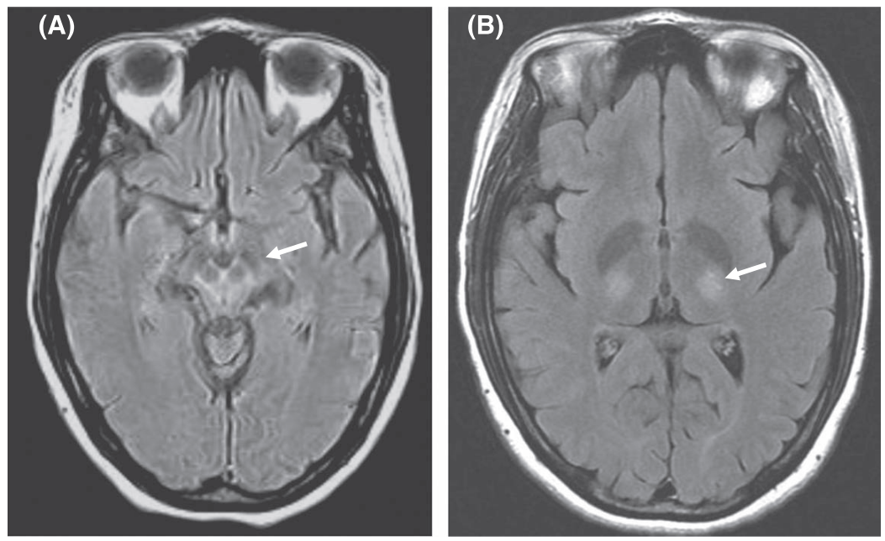
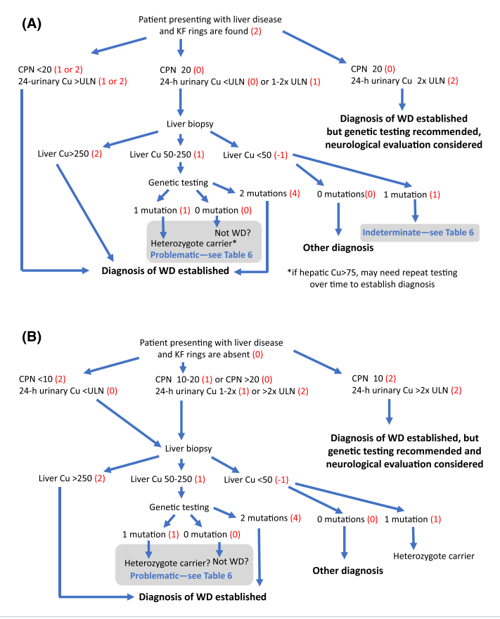
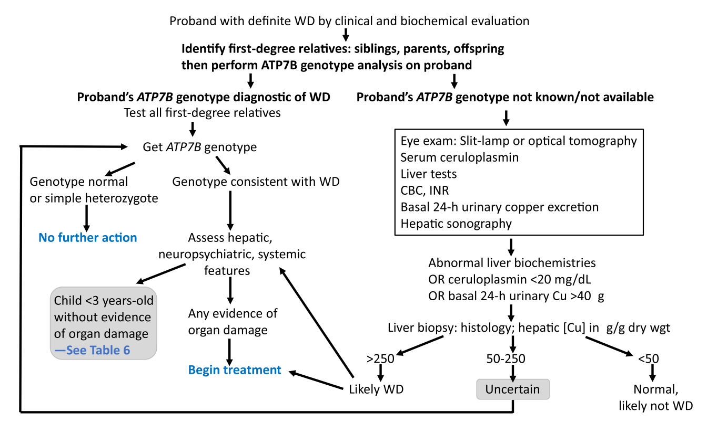

  

    

      
Leipzig ≥ 4

      
Chẩn đoán xác định bệnh Wilson (Highly Likely)

    

    

      
ALP/TBil &lt; 4 &amp; AST/ALT &gt; 2.2

      
Độ nhạy 100%, Đặc hiệu 100% cho Wilsonian ALF

    

    

      
NWI ≥ 11

      
Tiên lượng tử vong rất cao — Chỉ định ghép gan khẩn

    

    

      
86 – 89%

      
Tỷ lệ sống sót sau ghép gan 5 năm (Khỏi bệnh hoàn toàn)

    

  

  

    

      
🎯

      

        
Tiếp Cận Đa Chuyên Khoa

        
Phối hợp chặt chẽ giữa Tiêu hóa - Thần kinh - Nhãn khoa - Di truyền - Dinh dưỡng để chẩn đoán sớm và toàn diện.

      

    

    

      
⚖️

      

        
Thải Đồng Suốt Đời &amp; An Toàn

        
Điều trị thải đồng liên tục suốt đời bằng Chelator (D-penicillamine / Trientine) và Muối Kẽm, tuyệt đối không ngưng thuốc.

      

    

    

      
🛡️

      

        
Tầm Soát Gia Đình &amp; Ghép Gan

        
Tầm soát 100% người thân thế hệ 1 qua xét nghiệm gen ATP7B; kích hoạt quy trình ghép gan khẩn cấp khi suy gan cấp hoặc NWI ≥ 11.

      

    

  

  

    <a href="#sec-1" class="quickmenu-item active">1. Sinh Lý &amp; Gen ATP7B</a>
    <a href="#sec-2" class="quickmenu-item">2. Phổ Lâm Sàng Đa Cơ Quan</a>
    <a href="#sec-3" class="quickmenu-item">3. Xét Nghiệm &amp; Thuật Toán</a>
    <a href="#sec-4" class="quickmenu-item">4. Leipzig, Korman &amp; NWI</a>
    <a href="#sec-5" class="quickmenu-item">5. Phác Đồ Chelator &amp; Kẽm</a>
    <a href="#sec-6" class="quickmenu-item">6. Tình Huống Đặc Biệt</a>
    <a href="#sec-7" class="quickmenu-item">7. Tầm Soát &amp; Giám Sát</a>
  

  <!-- ==================== SECTION 1 ==================== -->
  

    
🔬 <h2 class="sec-title">1. Sinh Lý Học Chuyển Hóa Đồng &amp; Cơ Chế Bệnh Sinh Gen ATP7B</h2>

    

      

        💡
        

          <strong>Bản chất bệnh học:</strong> Bệnh Wilson (tái biến thoái hóa bộc nhân - <em>hepatolenticular degeneration</em>) là bệnh di truyền lặn trên nhiễm sắc thể thường (autosomal recessive) do đột biến gen <em>ATP7B</em> tại nhánh ngắn nhiễm sắc thể 13 (13q14.3). Gen này mã hóa cho một loại P-type ATPase vận chuyển đồng qua màng tế bào gan, đảm nhiệm hai chức năng cốt lõi: (1) xuất thải lượng đồng dư thừa vào dịch mật và (2) gắn đồng vào apoceruloplasmin để tạo holoceruloplasmin bài tiết vào máu.
        

      

      

        

          

          

            
⚡

            
Sinh Lý Chuyển Hóa Đồng Bình Thường

          

          

            <ul style="margin-left: 1rem; line-height: 1.7;">
              <li><strong>Hấp thu &amp; Nhu cầu:</strong> Khẩu phần ăn trung bình chứa 2 – 5 mg/ngày đồng (RDA chỉ là 0.9 mg/ngày). Đồng hấp thu tích cực tại tá tràng và hỗng tràng, liên kết với albumin/histidine về gan qua tĩnh mạch cửa.</li>
              <li><strong>Con đường bài xuất chính:</strong> Gan là cơ quan điều hòa đồng chủ đạo. Đào thải đồng dư thừa qua đường mật vào phân là con đường bài tiết duy nhất có ý nghĩa sinh lý. Thận chỉ lọc một lượng vi lượng.</li>
              <li><strong>Tuần hoàn Ceruloplasmin:</strong> Mỗi phân tử ceruloplasmin gắn 6 nguyên tử đồng (holoceruloplasmin). Apoceruloplasmin không có đồng có thời gian bán hủy cực ngắn trong tuần hoàn.</li>
            </ul>
          

          
Cân bằng nội môi gan mật

        

        

          

          

            
🧬

            
Cơ Chế Bệnh Sinh Đột Biến Gen ATP7B

          

          

            <ul style="margin-left: 1rem; line-height: 1.7;">
              <li><strong>Ứ đọng đồng độc tính tại gan:</strong> Suy giảm chức năng ATP7B làm tắc nghẽn đào thải đồng vào mật, đồng tích lũy phá hủy ti thể, màng lysosome và gây peroxy hóa lipid màng tế bào gan.</li>
              <li><strong>Tràn ngập đồng tự do (NCC):</strong> Khi vượt quá sức chứa tế bào gan, đồng phóng thích ồ ạt vào máu dưới dạng không gắn ceruloplasmin (non-ceruloplasmin copper - NCC) gây tán huyết nội mạch và lắng đọng não, giác mạc, thận.</li>
              <li><strong>Dịch tễ học:</strong> Tần suất kinh điển 1:30.000 dân số (tỷ lệ mang gen dị hợp tử 1:90). Tuy nhiên, nghiên cứu di truyền quần thể gần đây ghi nhận tỷ lệ mang 2 đột biến <em>ATP7B</em> cao hơn rõ rệt (1:7.026 đến 1:20.000).</li>
            </ul>
          

          
Nhiễm độc đồng toàn thân

        

      

    

  

  <!-- ==================== SECTION 2 ==================== -->
  

    
🩺 <h2 class="sec-title">2. Phổ Biểu Hiện Lâm Sàng Đa Cơ Quan (Clinical Spectrum)</h2>

    

      

        Biểu hiện lâm sàng của bệnh Wilson vô cùng đa dạng, khởi phát kinh điển trong độ tuổi từ 3 đến 55 tuổi (tuy nhiên đã ghi nhận ca bệnh từ trẻ &lt; 2 tuổi đến người cao tuổi &gt; 70–80 tuổi). Bệnh nhân thường khởi phát bằng triệu chứng tại gan (chiếm ưu thế ở trẻ em và người trẻ) hoặc triệu chứng thần kinh/tâm thần (chiếm ưu thế ở thanh thiếu niên và người trưởng thành).
      

      

        

          

            <i class="fa-solid fa-table-list"></i> Bảng 1. Phổ Biểu Hiện Lâm Sàng Đa Cơ Quan Bệnh Wilson (AASLD Table 1)
          

          <i class="fa-solid fa-stethoscope"></i> Lâm sàng
        

        

          <table class="comparison-table">
            <thead>
              <tr>
                <th style="width:25%">Hệ Cơ Quan</th>
                <th style="width:75%">Các Biểu Hiện Lâm Sàng Chi Tiết</th>
              </tr>
            </thead>
            <tbody>
              <tr>
                <td class="source-cell"><strong>Tại Gan (Hepatic)</strong></td>
                <td>
                  <ul style="margin: 0; padding-left: 1.2rem; line-height: 1.6; font-size: 0.88rem;">
                    <li>Gan to không triệu chứng, lách to đơn độc do tăng áp cửa tiềm tàng.</li>
                    <li>Tăng kéo dài hoạt độ aminotransferase huyết thanh (AST, ALT) chưa rõ nguyên nhân.</li>
                    <li>Gan nhiễm mỡ (Steatosis / Fatty liver), tổn thương giống viêm gan tự miễn (AIH-like).</li>
                    <li>Viêm gan cấp tính ở các mức độ, tổn thương gan cấp (ALI), xơ gan còn bù hoặc mất bù.</li>
                    <li><strong>Suy gan cấp (Wilsonian ALF):</strong> Tấn công ~3% ca suy gan cấp, đặc trưng bởi thiếu máu tán huyết Coombs âm tính, suy thận cấp, bệnh não gan tiến triển nhanh và đông máu rải rác.</li>
                  </ul>
                </td>
              </tr>
              <tr>
                <td class="source-cell"><strong>Thần Kinh (Neurologic)</strong></td>
                <td>
                  <ul style="margin: 0; padding-left: 1.2rem; line-height: 1.6; font-size: 0.88rem;">
                    <li><strong>Nói khó / Thất ngôn (Dysarthria):</strong> Triệu chứng khởi phát thường gặp nhất (46–97%).</li>
                    <li>Rối loạn dáng đi / thất điệu (Ataxia: 28–75%), run tư thế (55%), run vỗ cánh (wing-beating tremor).</li>
                    <li>Loạn trương lực cơ (Dystonia: 38–69%), nụ cười gượng bất chủ (risus sardonicus), nuốt khó (50%).</li>
                    <li>Hội chứng Parkinson (12–58%), co giật (6–28%), chảy nước dãi, rối loạn giấc ngủ nặng.</li>
                  </ul>
                </td>
              </tr>
              <tr>
                <td class="source-cell"><strong>Tâm Thần (Psychiatric)</strong></td>
                <td>
                  <ul style="margin: 0; padding-left: 1.2rem; line-height: 1.6; font-size: 0.88rem;">
                    <li>Khoảng 2/3 bệnh nhân có triệu chứng tâm thần lúc khởi đầu: Trầm cảm nặng (MDD - phổ biến nhất).</li>
                    <li>Rối loạn cảm xúc lưỡng cực (18–39%), thay đổi nhân cách, hành vi hung hăng, mất ức chế.</li>
                    <li>Loạn thần (Psychosis kèm hoang tưởng/ảo giác), sa sút học tập và suy giảm chú ý ở thanh thiếu niên.</li>
                  </ul>
                </td>
              </tr>
              <tr>
                <td class="source-cell"><strong>Nhãn Khoa &amp; Khác</strong></td>
                <td>
                  <ul style="margin: 0; padding-left: 1.2rem; line-height: 1.6; font-size: 0.88rem;">
                    <li><strong>Vòng Kayser-Fleischer (KF ring):</strong> Lắng đọng đồng màng Descemet giác mạc, hiện diện ở 95% thể thần kinh và 44–62% thể gan đơn thuần (khám bằng đèn sinh hiển vi khe slit-lamp).</li>
                    <li><strong>Đục thủy tinh thể hướng dương (Sunflower cataract):</strong> Đọng đồng mặt trước thể thủy tinh.</li>
                    <li><strong>Huyết học:</strong> Thiếu máu tán huyết nội mạch Coombs âm tính; giảm tiểu cầu/bạch cầu do cường lách.</li>
                    <li><strong>Thận &amp; Cơ xương:</strong> Hội chứng Fanconi (aminoacid niệu, toan hóa ống thận), sỏi thận, loãng xương sớm.</li>
                    <li><strong>Tim mạch &amp; Sinh sản:</strong> Bệnh cơ tim, loạn nhịp tim (rung nhĩ), sảy thai tự nhiên liên tiếp, vô sinh.</li>
                  </ul>
                </td>
              </tr>
            </tbody>
          </table>
        

      

      <!-- FIGURE 1: MRI NAO -->
      

        
        

          
Figure 1. Hình ảnh MRI sọ não ở bệnh nhân nữ 32 tuổi mắc bệnh Wilson (AASLD 2022)

          (A) Chuỗi xung FLAIR cắt ngang qua não giữa thể hiện dấu hiệu điển hình <strong>"Mặt gấu trúc khổng lồ" (Face of the giant panda sign)</strong> do tín hiệu bình thường của nhân đỏ kết hợp tăng tín hiệu chất màng mái não giữa và giảm tín hiệu liềm đen. (B) Chuỗi xung T2 ghi nhận tổn thương tăng tín hiệu đối xứng hai bên tại vùng đồi thị (Thalamus).
        

      

      <!-- TABLE 2: TRIEU CHUNG THAN KINH & DIEU TRI HO TRO -->
      

        

          

            <i class="fa-solid fa-brain"></i> Bảng 2. Tổng Hợp Triệu Chứng Thần Kinh Khởi Phát &amp; Can Thiệp Hỗ Trợ (AASLD Table 2)
          

          <i class="fa-solid fa-hand-holding-medical"></i> Can thiệp hỗ trợ
        

        

          <table class="comparison-table">
            <thead>
              <tr>
                <th style="width:30%">Biểu Hiện Thần Kinh Khởi Phát</th>
                <th style="width:20%">Tỷ Lệ Gặp (%)</th>
                <th style="width:50%">Can Thiệp / Điều Trị Triệu Chứng Hỗ Trợ</th>
              </tr>
            </thead>
            <tbody>
              <tr>
                <td class="source-cell"><strong>Dysarthria (Nói khó / Thất ngôn)</strong></td>
                <td>46 – 97%</td>
                <td>Âm ngữ trị liệu (Speech therapy), thiết bị hỗ trợ phát âm giao tiếp.</td>
              </tr>
              <tr>
                <td class="source-cell"><strong>Gait abnormality / ataxia (Thất điệu / Dáng đi)</strong></td>
                <td>28 – 75%</td>
                <td>Vật lý trị liệu vận động, dụng cụ hỗ trợ thăng bằng phòng ngừa ngã.</td>
              </tr>
              <tr>
                <td class="source-cell"><strong>Dystonia (Loạn trương lực cơ)</strong></td>
                <td>38 – 69%</td>
                <td>Trihexyphenidyl, Tiêm Botulinum toxin (loạn trương lực khu trú), Clonazepam.</td>
              </tr>
              <tr>
                <td class="source-cell"><strong>Postural tremor (Run tư thế)</strong></td>
                <td>55%</td>
                <td>Primidone, Propranolol, Clonazepam.</td>
              </tr>
              <tr>
                <td class="source-cell"><strong>Dysphagia (Nuốt khó)</strong></td>
                <td>50%</td>
                <td>Tập phản xạ nuốt, dùng chất làm đặc thực phẩm, dinh dưỡng qua ống thông nếu nguy cơ sặc phổi.</td>
              </tr>
              <tr>
                <td class="source-cell"><strong>Parkinsonism (Hội chứng Parkinson)</strong></td>
                <td>12 – 58%</td>
                <td>Carbidopa/Levodopa, Thuốc đồng vận Dopamine (Pramipexole, Ropinirole).</td>
              </tr>
              <tr>
                <td class="source-cell"><strong>Chorea / athetosis (Múa vờn / Múa giật)</strong></td>
                <td>6 – 30%</td>
                <td>Thuốc chống loạn thần không điển hình, thuốc ức chế VMAT2 (Tetrabenazine).</td>
              </tr>
              <tr>
                <td class="source-cell"><strong>Seizures (Co giật / Động kinh)</strong></td>
                <td>6 – 28%</td>
                <td>Thuốc chống động kinh phổ biến (Levetiracetam, Lamotrigine; tránh Valproate vì độc gan).</td>
              </tr>
              <tr>
                <td class="source-cell"><strong>Rest tremor (Run khi nghỉ)</strong></td>
                <td>4%</td>
                <td>Carbidopa/Levodopa, đồng vận Dopamine.</td>
              </tr>
            </tbody>
          </table>
        

      

    

  

  <!-- ==================== SECTION 3 ==================== -->
  

    
🧪 <h2 class="sec-title">3. Xét Nghiệm Cận Lâm Sàng &amp; Thuật Toán Chẩn Đoán Thực Hành</h2>

    

      

        

          

            <i class="fa-solid fa-flask-vial"></i> Bảng 3. Giá Trị &amp; Ngưỡng Chẩn Đoán Các Xét Nghiệm Cận Lâm Sàng Bệnh Wilson
          

          <i class="fa-solid fa-vial"></i> Cận lâm sàng
        

        

          <table class="comparison-table">
            <thead>
              <tr>
                <th style="width:25%">Xét Nghiệm Cận Lâm Sàng</th>
                <th style="width:35%">Ngưỡng Giá Trị Lâm Sàng</th>
                <th style="width:40%">Ý Nghĩa &amp; Yếu Tố Nhiễu (AASLD Guidance)</th>
              </tr>
            </thead>
            <tbody>
              <tr>
                <td class="source-cell"><strong>Ceruloplasmin Huyết Thanh</strong></td>
                <td>
                  • Bình thường: &gt; 20 mg/dL 
                  • Vùng xám: 10 – 20 mg/dL 
                  • Gợi ý cao: &lt; 10 mg/dL (&lt; 5 mg/dL đặc hiệu rất cao)
                </td>
                <td>
                  Glycoprotein 132 kDa do gan tổng hợp gắn 6 nguyên tử Cu. <em>Yếu tố gây dương tính giả:</em> Hội chứng thận hư, bệnh ruột mất protein, xơ gan suy gan nặng, thiếu đồng tuyệt đối, hội chứng Menkes. <em>Âm tính giả:</em> Tăng giả tạo trong viêm cấp, có thai hoặc dùng estrogen.
                </td>
              </tr>
              <tr>
                <td class="source-cell"><strong>Đồng Nước Tiểu 24 Giờ (24-h Urine Copper)</strong></td>
                <td>
                  • Bình thường: &lt; 40 µg/24h (&lt; 0.6 µmol/24h) 
                  • Người có triệu chứng: &gt; 100 µg/24h (&gt; 1.6 µmol/24h) 
                  • Trẻ em &amp; không triệu chứng: &gt; 40 µg/24h
                </td>
                <td>
                  Phản ánh trực tiếp lượng đồng không gắn ceruloplasmin (NCC) trong máu bài tiết qua thận. Bắt buộc thu thập mẫu nước tiểu 24 giờ đúng quy cách trong bình chứa không nhiễm kim loại vi lượng.
                </td>
              </tr>
              <tr>
                <td class="source-cell"><strong>Nồng Độ Đồng Mô Gan (Hepatic Copper)</strong></td>
                <td>
                  • Bình thường: &lt; 50 µg/g trọng lượng khô 
                  • Ngưỡng chẩn đoán vàng: <strong>&gt; 250 µg/g trọng lượng khô</strong> 
                  • Ngưỡng tăng độ nhạy: &gt; 75 µg/g
                </td>
                <td>
                  Tiêu chuẩn chẩn đoán vàng nếu sinh hóa không rõ ràng. Cần mẫu sinh thiết gan dài tối thiểu 1–2 cm hoặc trọng lượng khô ≥ 3 mg. Đo chuẩn bằng phổ khối plasma ghép cặp cảm ứng (ICP-MS).
                </td>
              </tr>
              <tr>
                <td class="source-cell"><strong>Mô Bệnh Học &amp; Kính Hiển Vi Điện Tử</strong></td>
                <td>
                  • Nhuộm Rhodanine, Timm's 
                  • Biến đổi siêu cấu trúc ti thể
                </td>
                <td>
                  Đọng đồng lysosome tế bào gan. Trên kính hiển vi điện tử (đặc biệt ở trẻ em): Mở rộng khoảng không gian giữa các mào ti thể (cristae widening) tạo hình ảnh dạng nang đặc trưng.
                </td>
              </tr>
              <tr>
                <td class="source-cell"><strong>Phân Tích Gen ATP7B (Genetic Testing)</strong></td>
                <td>Xác định 2 đột biến gây bệnh trên 2 alen khác nhau (đột biến <em>trans</em>)</td>
                <td>
                  Gen chứa 21 exon với hơn 700 biến thể. Khẳng định chắc chắn 100% chẩn đoán. Đột biến p.H1069Q phổ biến nhất ở Châu Âu; đột biến p.Arg778Leu và p.P992L phổ biến nhất ở Châu Á.
                </td>
              </tr>
            </tbody>
          </table>
        

      

      <!-- FIGURE 2: THUAT TOAN CHAN DOAN -->
      

        
        

          
Figure 2. Thuật toán tiếp cận chẩn đoán bệnh Wilson ở bệnh nhân có tổn thương gan chưa rõ nguyên nhân (AASLD Figure 2)

          Quy trình phân nhánh bắt đầu bằng khám mắt tìm vòng Kayser-Fleischer (KF). Nếu có vòng KF kết hợp Ceruloplasmin &lt; 20 mg/dL và đồng nước tiểu 24h &gt; ULN (40 µg/24h) → Khẳng định chẩn đoán (Leipzig ≥ 4). Nếu không có vòng KF, đòi hỏi Ceruloplasmin &lt; 10 mg/dL và đồng nước tiểu &gt; 2x ULN; trường hợp nằm trong vùng xám (Gray zone) bắt buộc tiến hành đo đồng gan (&gt; 250 µg/g) và phân tích giải trình tự gen <em>ATP7B</em>.
        

      

    

  

  <!-- ==================== SECTION 4 ==================== -->
  

    
📐 <h2 class="sec-title">4. Thang Điểm Leipzig, Tiêu Chuẩn Suy Gan Cấp Korman &amp; Thang Điểm NWI</h2>

    

      <!-- LEIPZIG SCORE TABLE -->
      

        

          

            <i class="fa-solid fa-calculator"></i> Bảng 4. Thang Điểm Chẩn Đoán Leipzig 2001 (AASLD Table 7)
          

          <i class="fa-solid fa-square-check"></i> Tiêu chuẩn vàng chẩn đoán
        

        

          <table class="diagnostic-table">
            <thead>
              <tr>
                <th style="width:30%">Thông Số Khảo Sát</th>
                <th style="width:50%">Biểu Hiện Lâm Sàng / Kết Quả Xét Nghiệm</th>
                <th style="width:20%">Điểm Số Quy Định</th>
              </tr>
            </thead>
            <tbody>
              <tr>
                <td class="source-cell"><strong>Vòng Kayser-Fleischer</strong></td>
                <td>
                  • Hiện diện (khám đèn khe slit-lamp) 
                  • Vắng mặt
                </td>
                <td>
                  +2 
                  0
                </td>
              </tr>
              <tr>
                <td class="source-cell"><strong>Triệu Chứng Thần Kinh / Tâm Thần</strong></td>
                <td>
                  • Có triệu chứng thần kinh nặng (hoặc hình ảnh MRI não điển hình) 
                  • Triệu chứng nhẹ 
                  • Vắng mặt
                </td>
                <td>
                  +2 
                  +1 
                  0
                </td>
              </tr>
              <tr>
                <td class="source-cell"><strong>Thiếu Máu Tán Huyết Coombs Âm Tính</strong></td>
                <td>
                  • Có hiện diện (kèm đồng huyết thanh tự do cao) 
                  • Vắng mặt
                </td>
                <td>
                  +1 
                  0
                </td>
              </tr>
              <tr>
                <td class="source-cell"><strong>Đồng Nước Tiểu 24 Giờ</strong> (khi không viêm gan cấp)</td>
                <td>
                  • Bình thường (&lt; 40 µg/ngày) 
                  • 1 – 2 × ULN (40 – 80 µg/ngày) 
                  • &gt; 2 × ULN (&gt; 80 µg/ngày) 
                  • Bình thường nhưng &gt; 500 µg/ngày sau thử thách Penicillamine
                </td>
                <td>
                  0 
                  +1 
                  +2 
                  +2
                </td>
              </tr>
              <tr>
                <td class="source-cell"><strong>Nồng Độ Đồng Trong Gan</strong></td>
                <td>
                  • Bình thường (&lt; 50 µg/g trọng lượng khô) 
                  • Tăng nhẹ (50 – 250 µg/g) 
                  • Tăng cao (&gt; 250 µg/g) 
                  • Nhuộm Rhodanine dương tính (khi không định lượng được)
                </td>
                <td>
                  -1 
                  +1 
                  +2 
                  +1
                </td>
              </tr>
              <tr>
                <td class="source-cell"><strong>Ceruloplasmin Huyết Thanh</strong></td>
                <td>
                  • Bình thường (&gt; 20 mg/dL) 
                  • 10 – 20 mg/dL 
                  • &lt; 10 mg/dL
                </td>
                <td>
                  0 
                  +1 
                  +2
                </td>
              </tr>
              <tr>
                <td class="source-cell"><strong>Phân Tích Đột Biến Gen ATP7B</strong></td>
                <td>
                  • Phát hiện đột biến gây bệnh trên cả 2 alen (trans) 
                  • Phát hiện đột biến gây bệnh trên 1 alen 
                  • Không phát hiện đột biến
                </td>
                <td>
                  +4 
                  +1 
                  0
                </td>
              </tr>
              <tr class="total-row">
                <td colspan="2"><strong>KẾT LUẬN ĐÁNH GIÁ TỔNG ĐIỂM LEIPZIG</strong></td>
                <td><strong>≥ 4: Chẩn đoán xác định</strong></td>
              </tr>
            </tbody>
          </table>
        

      

      

        

          

          

            
🏆

            
Tổng Điểm Leipzig ≥ 4

          

          

            
<strong>Chẩn đoán Rất chắc chắn (Highly likely):</strong> Khẳng định mắc bệnh Wilson. Bắt đầu phác đồ điều trị nội khoa thải đồng ngay lập tức không cần sinh thiết thêm.

          

          
Chẩn đoán xác định

        

        

          

          

            
⚠️

            
Tổng Điểm Leipzig = 2 – 3

          

          

            
<strong>Chẩn đoán Có thể (Probable):</strong> Cần tiến hành thêm các xét nghiệm chuyên sâu (đo đồng gan mô sinh thiết hoặc giải trình tự gen <em>ATP7B</em> toàn bộ 21 exon).

          

          
Cần khảo sát thêm

        

        

          

          

            
🔍

            
Tổng Điểm Leipzig = 0 – 1

          

          

            
<strong>Ít khả năng (Unlikely):</strong> Loại trừ bệnh Wilson, cần tìm kiếm các nguyên nhân bệnh gan/thần kinh khác.

          

          
Ít khả năng

        

      

      <!-- KORMAN CRITERIA FOR WILSONIAN ALF -->
      

        🚨
        

          <strong>b) Tiêu chuẩn Chẩn đoán Suy Gan Cấp do Bệnh Wilson (Korman Criteria):</strong>
          

            Trong bối cảnh suy gan cấp (ALF), các chỉ số xét nghiệm chuyển hóa đồng truyền thống thường bị sai lệch do giải phóng đồng ồ ạt từ hoại tử mô gan. Việc phối hợp 2 tỷ lệ sinh hóa chuẩn sau đây đạt <strong>độ nhạy 100% và độ đặc hiệu 100%</strong> trong chẩn đoán suy gan cấp do bệnh Wilson ở người lớn:
          

          <ol style="margin: 0.35rem 0 0 1.2rem; font-size: 0.9rem; line-height: 1.7;">
            <li><strong>Tỷ lệ Alkaline Phosphatase (ALP) / Total Bilirubin &lt; 4.0</strong> (Độ nhạy 94%, Độ đặc hiệu 96%).</li>
            <li><strong>Tỷ lệ AST / ALT &gt; 2.2</strong> (Độ nhạy 94%, Độ đặc hiệu 86%).</li>
          </ol>
        

      

      <!-- NWI PROGNOSTIC SCORE -->
      

        

          

            <i class="fa-solid fa-triangle-exclamation"></i> Bảng 5. Thang Điểm Tiên Lượng Suy Gan New Wilson Index (NWI Score - AASLD Table 8)
          

          <i class="fa-solid fa-procedures"></i> Tiên lượng ghép gan
        

        

          <table class="score-table">
            <thead>
              <tr>
                <th style="width:25%">Thông Số Khảo Sát</th>
                <th style="width:15%">0 Điểm</th>
                <th style="width:15%">1 Điểm</th>
                <th style="width:15%">2 Điểm</th>
                <th style="width:15%">3 Điểm</th>
                <th style="width:15%">4 Điểm</th>
              </tr>
            </thead>
            <tbody>
              <tr>
                <td class="source-cell"><strong>Bilirubin toàn phần (mg/dL)</strong></td>
                <td>0 – 5.8</td>
                <td>5.9 – 8.7</td>
                <td>8.8 – 11.7</td>
                <td>11.8 – 17.5</td>
                <td>&gt; 17.5</td>
              </tr>
              <tr>
                <td class="source-cell"><strong>INR</strong></td>
                <td>0 – 1.29</td>
                <td>1.3 – 1.6</td>
                <td>1.7 – 1.9</td>
                <td>2.0 – 2.4</td>
                <td>≥ 2.5</td>
              </tr>
              <tr>
                <td class="source-cell"><strong>AST (IU/L)</strong></td>
                <td>0 – 100</td>
                <td>101 – 150</td>
                <td>151 – 200</td>
                <td>201 – 300</td>
                <td>&gt; 300</td>
              </tr>
              <tr>
                <td class="source-cell"><strong>Bạch cầu (WBC, × 10³/µL)</strong></td>
                <td>0 – 6.7</td>
                <td>6.8 – 8.3</td>
                <td>8.4 – 10.3</td>
                <td>10.4 – 15.3</td>
                <td>≥ 15.4</td>
              </tr>
              <tr>
                <td class="source-cell"><strong>Albumin (g/dL)</strong></td>
                <td>&gt; 4.5</td>
                <td>3.4 – 4.4</td>
                <td>2.5 – 3.3</td>
                <td>2.1 – 2.4</td>
                <td>≤ 2.0</td>
              </tr>
              <tr class="total-row">
                <td colspan="3"><strong>NGƯỠNG TIÊN LƯỢNG NGUY KỊCH</strong></td>
                <td colspan="3"><strong>NWI ≥ 11: Tử vong &gt; 95% nếu không ghép gan khẩn</strong></td>
              </tr>
            </tbody>
          </table>
        

      

      

        ⚠️
        

          <strong>Ngưỡng quyết định can thiệp: Điểm NWI ≥ 11</strong> dự báo tỷ lệ tử vong &gt; 95% nếu chỉ điều trị nội khoa thông thường. Đây là chỉ định bắt buộc đưa bệnh nhân vào danh sách <strong>Ghép gan khẩn cấp (Emergency Liver Transplantation - Status 1A)</strong>.
        

      

    

  

  <!-- ==================== SECTION 5 ==================== -->
  

    
💊 <h2 class="sec-title">5. Chiến Lược Điều Trị Nội Khoa: Chelator, Muối Kẽm &amp; Dinh Dưỡng Tiết Chế</h2>

    

      

        💡
        

          <strong>Nguyên tắc điều trị bất di bất dịch:</strong> Mọi bệnh nhân đã chẩn đoán bệnh Wilson bắt buộc phải duy trì điều trị chống tích tụ đồng <strong>liên tục suốt đời</strong>. Việc tự ý ngưng thuốc sẽ dẫn đến bùng phát hoại tử gan cấp tính tử vong trong vòng vài tuần đến vài tháng.
        

      

      

        

          

            <i class="fa-solid fa-pills"></i> Bảng 6. Phác Đồ Điều Trị Nội Khoa: Thuốc Thải Đồng, Kẽm &amp; Dinh Dưỡng Tiết Chế
          

          <i class="fa-solid fa-prescription-bottle-medical"></i> Phác đồ điều trị
        

        

          <table class="regimen-table">
            <thead>
              <tr>
                <th style="width:20%">Nhóm Thuốc / Can Thiệp</th>
                <th style="width:40%">Cơ Chế &amp; Phác Đồ Liều Dùng Chuẩn</th>
                <th style="width:40%">Lưu Ý Lâm Sàng, Độc Tính &amp; Theo Dõi</th>
              </tr>
            </thead>
            <tbody>
              <tr>
                <td class="source-cell">
                  Đầu tay (Chelator)
                  <strong>D-Penicillamine</strong>
                </td>
                <td>
                  <ul style="margin: 0; padding-left: 1.2rem; line-height: 1.6; font-size: 0.88rem;">
                    <li><strong>Cơ chế:</strong> Gắn sulfhydryl tự do với đồng tạo phức hợp bài xuất qua nước tiểu.</li>
                    <li><strong>Khởi đầu:</strong> 250 – 500 mg/ngày, tăng dần mỗi 4–7 ngày đến liều tấn công 1.000 – 1.500 mg/ngày (15 – 20 mg/kg/ngày, tối đa 2.000 mg/ngày) chia 2–4 lần.</li>
                    <li><strong>Duy trì:</strong> 750 – 1.000 mg/ngày (10 – 15 mg/kg/ngày).</li>
                    <li><strong>Bắt buộc:</strong> Bổ sung Pyridoxine (Vitamin B6) 25 – 50 mg/ngày. Uống cách xa bữa ăn (trước ăn 1h hoặc sau ăn 2h).</li>
                  </ul>
                </td>
                <td>
                  

                    Tác dụng phụ gặp ở ~30%: Dị ứng sốt, phát ban, giảm bạch cầu/tiểu cầu, hội chứng thận hư, phản ứng giả Lupus. <strong>Hiện tượng trầm trọng thêm triệu chứng thần kinh (Paradoxical Neurological Worsening)</strong> xảy ra ở 10–50% bệnh nhân khi mới khởi đầu chelator.
                  

                </td>
              </tr>
              <tr>
                <td class="source-cell">
                  Lựa chọn thay thế
                  <strong>Trientine Dihydrochloride / Tetrahydrochloride</strong>
                </td>
                <td>
                  <ul style="margin: 0; padding-left: 1.2rem; line-height: 1.6; font-size: 0.88rem;">
                    <li><strong>Cơ chế:</strong> Phức hợp đa amin tạo cấu trúc phẳng liên kết đồng qua 4 nguyên tử nitơ.</li>
                    <li><strong>Liều khởi đầu:</strong> 15 – 20 mg/kg/ngày (tối đa 2.000 mg/ngày) chia 2–3 lần.</li>
                    <li><strong>Liều duy trì:</strong> 10 – 15 mg/kg/ngày (750 – 1.000 mg/ngày). Uống trước ăn 1h.</li>
                  </ul>
                </td>
                <td>
                  

                    Dung nạp tốt hơn D-penicillamine, độc tính trên thận rất thấp, tỷ lệ xấu đi triệu chứng thần kinh thấp hơn rõ rệt. Là lựa chọn ưu tiên cho bệnh nhân có biểu hiện thần kinh hoặc không dung nạp D-penicillamine.
                  

                </td>
              </tr>
              <tr>
                <td class="source-cell">
                  Đầu tay (Không triệu chứng)
                  <strong>Muối Kẽm (Zinc Salts: Acetate / Sulfate / Gluconate)</strong>
                </td>
                <td>
                  <ul style="margin: 0; padding-left: 1.2rem; line-height: 1.6; font-size: 0.88rem;">
                    <li><strong>Cơ chế:</strong> Kích thích tế bào niêm mạc ruột tổng hợp Metallothionein, giữ chặt đồng trong ruột và đào thải theo phân.</li>
                    <li><strong>Liều tính theo Kẽm nguyên tố (elemental zinc):</strong>
                       - Người lớn &amp; Trẻ ≥ 50 kg: <strong>150 mg/ngày</strong> chia 3 lần.
                       - Trẻ em &lt; 50 kg: <strong>75 mg/ngày</strong> chia 3 lần.
                       - Trẻ &lt; 5 tuổi: <strong>50 mg/ngày</strong> chia 2 lần.
                    </li>
                    <li>Uống xa bữa ăn ít nhất 1 giờ.</li>
                  </ul>
                </td>
                <td>
                  

                    Lựa chọn số 1 cho bệnh nhân không triệu chứng (phát hiện qua tầm soát gia đình), điều trị duy trì sau khi đạt cân bằng đồng bằng chelator, hoặc phụ nữ mang thai. Tác dụng phụ thường gặp: Kích ứng dạ dày (20–30%).
                  

                </td>
              </tr>
              <tr>
                <td class="source-cell">
                  Nghiên cứu pha III
                  <strong>Tetrathiomolybdate (Bis-choline TTM)</strong>
                </td>
                <td>
                  Tạo phức hợp ba phân tử bền vững (TTM-albumin-copper) trong máu và ức chế trực tiếp hấp thu đồng tại ruột.
                </td>
                <td>
                  Đang trong thử nghiệm lâm sàng đối chứng pha III, hứa hẹn khả năng kiểm soát nhanh triệu chứng thần kinh mà không gây biến chứng xấu đi ban đầu.
                </td>
              </tr>
              <tr>
                <td class="source-cell">
                  Tiết chế
                  <strong>Chế Độ Ăn Giảm Đồng</strong>
                </td>
                <td>
                  Mục tiêu lượng đồng trong khẩu phần <strong>&lt; 0.9 mg/ngày</strong> (đặc biệt khắt khe trong năm đầu tiên điều trị).
                </td>
                <td>
                  Tránh tuyệt đối: Nội tạng động vật (gan, thận), hải sản có vỏ (sò, ốc, tôm, cua), sô-cô-la/ca-cao, nấm, các loại hạt (óc chó, hạnh nhân) và chế phẩm từ đậu nành. Kiểm tra nguồn nước sinh hoạt (&lt; 100 µg/L Cu).
                </td>
              </tr>
            </tbody>
          </table>
        

      

    

  

  <!-- ==================== SECTION 6 ==================== -->
  

    
🚨 <h2 class="sec-title">6. Quản Lý Các Tình Huống Lâm Sàng Đặc Biệt: Suy Gan Cấp, Xơ Gan Mất Bù, Ghép Gan &amp; Thai Kỳ</h2>

    

      

        

          

          

            
⚡

            
Suy Gan Cấp do Bệnh Wilson (Wilsonian ALF)

          

          

            

              Điều trị nội khoa thuần túy thất bại với tỷ lệ tử vong 80–99%. <strong>Ghép gan khẩn cấp (Status 1A)</strong> là biện pháp duy nhất giúp cứu sống người bệnh.
            

            

              <strong>Bắc cầu chờ ghép:</strong> Thay huyết tương (Plasma exchange / Plasmapheresis) thể tích cao, chạy thận nhân tạo hoặc hệ thống hấp phụ phân tử tái tuần hoàn (MARS) để loại bỏ khẩn cấp đồng tự do độc tính, giảm tán huyết và bảo vệ chức năng thận.
            

          

          
Chỉ định ghép gan khẩn cấp

        

        

          

          

            
⚖️

            
Xơ Gan Mất Bù (Decompensated Cirrhosis)

          

          

            

              Phác đồ nội khoa tăng cường phối hợp <strong>Chelator (Trientine hoặc D-penicillamine) kết hợp Muối Kẽm</strong>.
            

            

              <strong>Quy tắc thời gian cốt tử:</strong> Phải uống Chelator và Kẽm cách nhau <strong>ít nhất 4–5 giờ</strong> (chia 4 cữ uống riêng biệt trong ngày) để tránh chelator tạo phức gắn trực tiếp với kẽm trong đường tiêu hóa làm triệt tiêu tác dụng của nhau.
            

          

          
Phối hợp cách cữ 4–5 giờ

        

      

      <!-- GHEP GAN VA THAI KY -->
      

        

          

          

            
🏥

            
Kết Cục Ghép Gan (AASLD Table 11)

          

          

            

              Ghép gan thay thế toàn bộ mô gan đột biến bằng mảnh ghép khỏe mạnh có hoạt tính ATP7B bình thường, điều chỉnh hoàn toàn rối loạn chuyển hóa đồng.
            

            <ul style="margin-left: 1rem; line-height: 1.6; font-size: 0.88rem; margin-top: 0.35rem;">
              <li><strong>Tỷ lệ sống sót 1 năm:</strong> 88 – 100%.</li>
              <li><strong>Tỷ lệ sống sót 5 năm:</strong> 75 – 89% (trẻ em đạt 89%).</li>
              <li><strong>Tỷ lệ sống sót 10 năm:</strong> 60 – 87%.</li>
              <li>Sau ghép gan thành công, <strong>ngừng hoàn toàn mọi thuốc điều trị bệnh Wilson</strong>.</li>
            </ul>
          

          
Khỏi bệnh chuyển hóa

        

        

          

          

            
👶

            
Quản Lý Thai Kỳ (Pregnancy &amp; Lactation)

          

          

            

              <strong>Bắt buộc duy trì điều trị trong thai kỳ:</strong> Ngưng thuốc sẽ dẫn đến suy gan cấp bùng phát gây tử vong cho cả mẹ và thai nhi.
            

            <ul style="margin-left: 1rem; line-height: 1.6; font-size: 0.88rem; margin-top: 0.35rem;">
              <li><strong>Nếu dùng Chelator:</strong> Giảm liều 25 – 50% so với trước mang thai (đặc biệt trong 3 tháng đầu và 3 tháng cuối để tránh ảnh hưởng tạo cơ quan và liền sẹo vết mổ đẻ).</li>
              <li><strong>Nếu dùng Muối Kẽm:</strong> Giữ nguyên liều, kẽm an toàn tuyệt đối cho thai nhi.</li>
              <li>Khuyên không nên cho con bú nếu đang dùng chelator do thuốc bài tiết qua sữa mẹ.</li>
            </ul>
          

          
Duy trì điều trị giảm liều

        

      

    

  

  <!-- ==================== SECTION 7 ==================== -->
  

    
📋 <h2 class="sec-title">7. Tầm Soát Gia Đình Thế Hệ Thứ Nhất &amp; Bảng Kiểm Giám Sát Điều Trị</h2>

    

      <!-- FIGURE 3: TAM SOAT NGUOI THAN -->
      

        
        

          
Figure 3. Chiến lược tầm soát bệnh Wilson ở người thân thế hệ thứ nhất của ca bệnh chỉ điểm (AASLD Figure 4)

          Mọi người thân thế hệ 1 (anh chị em ruột, con cái, cha mẹ) của ca bệnh chỉ điểm (Proband) đều có nguy cơ cao. Nếu ca bệnh chỉ điểm đã xác định được 2 đột biến <em>ATP7B</em>, phân tích di truyền mục tiêu là chiến lược tối ưu nhất. Nếu không có thông tin di truyền, bắt buộc thực hiện đánh giá toàn diện: Khám mắt bằng đèn khe, Ceruloplasmin, AST, ALT, Bilirubin, INR, CBC, đồng nước tiểu 24h và siêu âm gan.
        

      

      <!-- TABLE 10: MUC TIEU GIAM SAT & QUA LIEU / THAT BAI -->
      

        

          

            <i class="fa-solid fa-clock-rotate-left"></i> Bảng 7. Mục Tiêu Giám Sát Lâm Sàng &amp; Dấu Hiệu Quá Liều / Thất Bại Điều Trị (AASLD Table 10)
          

          <i class="fa-solid fa-chart-line"></i> Giám sát điều trị
        

        

          <table class="regimen-table">
            <thead>
              <tr>
                <th style="width:18%">Thuốc Điều Trị</th>
                <th style="width:20%">Giai Đoạn Khởi Đầu</th>
                <th style="width:26%">Mục Tiêu Duy Trì</th>
                <th style="width:18%">Dấu Hiệu Quá Liều (Overtreatment)</th>
                <th style="width:18%">Dấu Hiệu Thất Bại / Không Tuân Thủ</th>
              </tr>
            </thead>
            <tbody>
              <tr>
                <td class="source-cell"><strong>D-Penicillamine</strong></td>
                <td>Đồng nước tiểu 24h tăng vọt (&gt; 1.000 µg/24h)</td>
                <td>
                  • Đồng nước tiểu: <strong>200 – 500 µg/24h</strong> (3 – 8 µmol/24h) 
                  • NCC: 5 – 15 µg/dL 
                  • AST/ALT, INR, Bilirubin về bình thường
                </td>
                <td>
                  • Đồng nước tiểu &lt; 100 µg/24h 
                  • NCC &lt; 5 µg/dL 
                  • Thiếu máu nhược sắc thiếu đồng/sideroblastic, giảm bạch cầu
                </td>
                <td>
                  • Đồng nước tiểu &gt; 500 µg/24h sau khi đã ổn định 
                  • Men gan tăng trở lại 
                  • NCC &gt; 15 – 25 µg/dL
                </td>
              </tr>
              <tr>
                <td class="source-cell"><strong>Trientine</strong></td>
                <td>Đồng nước tiểu 24h tăng vọt (&gt; 1.000 µg/24h)</td>
                <td>
                  • Đồng nước tiểu: <strong>150 – 500 µg/24h</strong> (2.4 – 8 µmol/24h) 
                  • NCC: 5 – 15 µg/dL 
                  • Men gan, INR bình thường
                </td>
                <td>
                  • Đồng nước tiểu &lt; 100 µg/24h 
                  • NCC &lt; 5 µg/dL 
                  • Thiếu máu, giảm bạch cầu hạt
                </td>
                <td>
                  • Đồng nước tiểu &gt; 500 µg/24h 
                  • Men gan tăng tái phát 
                  • Vòng KF tiến triển đậm hơn
                </td>
              </tr>
              <tr>
                <td class="source-cell"><strong>Muối Kẽm (Zinc)</strong></td>
                <td>Bài tiết đồng nước tiểu giảm dần về bình thường</td>
                <td>
                  • Đồng nước tiểu: <strong>&lt; 100 µg/24h</strong> (&lt; 1.6 µmol/24h) 
                  • NCC: 5 – 15 µg/dL 
                  • Kẽm nước tiểu: &gt; 1 – 2 mg/24h 
                  • Kẽm huyết thanh: &gt; 125 µg/dL
                </td>
                <td>
                  • Đồng nước tiểu &lt; 20 µg/24h 
                  • Thiếu máu thiếu đồng, giảm bạch cầu, mất điều hòa thất điệu
                </td>
                <td>
                  • Đồng nước tiểu tăng ngược trở lại &gt; 100 µg/24h 
                  • Men gan AST/ALT tăng trở lại
                </td>
              </tr>
            </tbody>
          </table>
        

      

      

        ✅
        

          <strong>Lịch Trình Tái Khám Khuyến Cáo (Monitoring Schedule):</strong>
          <ul style="margin: 0.5rem 0 0 1.2rem; line-height: 1.6;">
            <li><strong>Giai đoạn khởi đầu (1–3 tháng đầu):</strong> Tái khám mỗi 1–2 tuần; kiểm tra công thức máu, tổng phân tích nước tiểu, men gan, chức năng thận để phát hiện phản ứng quá mẫn sớm và điều chỉnh liều.</li>
            <li><strong>Giai đoạn duy trì ổn định:</strong> Tái khám định kỳ <strong>tối thiểu 2 lần/năm (mỗi 6 tháng)</strong>; kiểm tra lâm sàng thần kinh, men gan, INR, albumin, đồng nước tiểu 24 giờ, tính toán chỉ số NCC (Non-ceruloplasmin copper) và đánh giá độ tuân thủ điều trị.</li>
            <li><strong>Khám mắt định kỳ:</strong> Soi đèn khe mỗi 12 tháng; vòng KF sẽ mờ dần và biến mất sau 1–3 năm điều trị hiệu quả và có thể xuất hiện lại nếu bệnh nhân bỏ thuốc.</li>
          </ul>
        

      

    

  

  <!-- CITATION BOX -->
  

    <strong>Tài liệu khuyến cáo gốc (AMA Reference):</strong> Schilsky ML, Roberts EA, Bronstein JM, Dhawan A, Hamilton JP, Rivard AM, Washington MK, Weiss KH, Zimbrean PC. A multidisciplinary approach to the diagnosis and management of Wilson disease: 2022 Practice Guidance on Wilson disease from the American Association for the Study of Liver Diseases. <em>Hepatology</em>. 2023;77(2):628-657. doi:10.1002/hep.32805.
  

<!-- BOTTOM NAV -->

  

    <a href="#/ebm/kho-guidelines" class="btn btn-primary">
      <i class="fa-solid fa-arrow-left"></i> Quay lại Kho Guidelines
    </a>
    <a href="#sec-1" class="btn">
      <i class="fa-solid fa-arrow-up"></i> Lên đầu trang
    </a>
  

